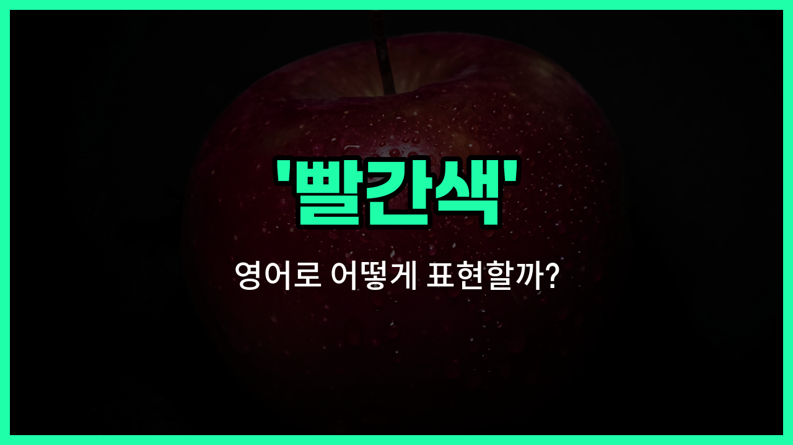

## 🌟 영어 표현 - red

안녕하세요 👋 오늘은 우리가 일상에서 자주 쓰는 색깔 중 하나인 '**빨간색**'을 영어로 어떻게 표현하는지 알아보려고 해요. 바로 '**red**'라는 단어를 사용해요.

'**red**'는 사과, 장미, 신호등 등 다양한 곳에서 볼 수 있는 색이에요. 이 단어는 색깔을 나타낼 때 가장 기본적으로 쓰이는 영어 표현 중 하나예요!

예를 들어, 빨간 사과를 영어로 말하고 싶을 때는 'a red apple'이라고 해요. 또, 신호등의 빨간 불을 'red [light](/blog/in-english/1373.light/)'라고 표현할 수 있어요.

'**red**'는 형용사로도, 명사로도 사용할 수 있어서 정말 다양하게 활용할 수 있어요. 형용사로는 '빨간', 명사로는 '빨간색'이라는 뜻이에요.

## 📖 예문

1. "나는 빨간색을 좋아해요."

   "I like red."

2. "그녀는 빨간 드레스를 입고 있어요."

   "She is wearing a red dress."

## 💬 연습해보기

<ul data-interactive-list>

  <li data-interactive-item>
    어제 빨간 재킷을 샀는데, 나한테 진짜 잘 어울려요.
    I bought a red jacket yesterday and it looks great on me.
  </li>

  <li data-interactive-item>
    그 빨간 불은 조심해야 해요; 멈추라는 뜻이에요.
    Be careful with that red light; it <a href="/blog/in-english/1214.mean/">means</a> <a href="/blog/in-english/1240.stop/">stop</a>.
  </li>

  <li data-interactive-item>
    그녀는 방을 좀 더 따뜻하게 느끼게 하려고 빨간색으로 칠했어요.
    She painted her room red to make it <a href="/blog/in-english/1096.feel/">feel</a> warmer.
  </li>

  <li data-interactive-item>
    그 남자는 회의에서 좀 더 자신 있어 보이려고 빨간 넥타이를 매고 갔어요.
    He wore a red tie to the meeting to look more <a href="/blog/in-english/420.confident/">confident</a>.
  </li>

  <li data-interactive-item>
    바구니에 있는 빨간 사과들이 신선하고 맛있어 보여요.
    The red apples in the basket look fresh and tasty.
  </li>

  <li data-interactive-item>
    내 차는 빨간색이라 주차장에서 쉽게 찾을 수 있어요.
    My car is red, so it's easy to spot in the parking lot.
  </li>

  <li data-interactive-item>
    우리는 파티를 위해 집을 빨간 풍선으로 장식했어요.
    We decorated the <a href="/blog/in-english/1088.house/">house</a> with red balloons for the party.
  </li>

  <li data-interactive-item>
    빨간 경고 표지가 내 시선을 확 사로잡았어요.
    The red warning sign caught my attention immediately.
  </li>

  <li data-interactive-item>
    화이트 셔츠에 빨간 와인을 실수로 엎질렀어요.
    I spilled red wine on my <a href="/blog/in-english/1236.white/">white</a> shirt by accident.
  </li>

  <li data-interactive-item>
    가을의 빨간 단풍잎이 여기 정말 아름다워요.
    The red maple leaves in the fall are so beautiful here.
  </li>

</ul>

## 🤝 함께 알아두면 좋은 표현들

### scarlet (주홍색)

'scarlet'은 '빨간색'보다 좀 더 밝고 선명한 주홍색을 의미해요. 강렬하고 눈에 띄는 색깔로, 종종 열정이나 경고를 나타낼 때 사용돼요.

- "She wore a beautiful scarlet dress to the party."
- "그녀는 파티에 아름다운 주홍색 드레스를 입고 갔어요."

### crimson (진홍색)

'crimson'은 깊고 어두운 빨간색을 뜻해요. 보통 고급스럽고 우아한 느낌을 줄 때 쓰이며, 때로는 피의 색깔을 연상시키기도 해요.

- "The sunset painted the sky in shades of crimson and orange."
- "노을이 하늘을 진홍색과 주황색으로 물들였어요."

### blue (파란색)

'blue'는 빨간색의 반대되는 색으로, 차분하고 시원한 느낌을 줘요. 종종 안정감이나 슬픔을 표현할 때 사용돼요.

- "He felt blue after hearing the bad news."
- "그는 나쁜 소식을 듣고 우울해했어요."

---

오늘은 '**빨간색**', '**붉은**', '**적색**'이라는 뜻을 가진 영어 표현 '**red**'에 대해 알아봤어요. 주변에서 빨간색을 볼 때마다 이 단어를 떠올려 보세요 😊

오늘 배운 표현과 예문들을 꼭 최소 3번씩 소리 내서 읽어보세요. 다음에도 더 재미있고 유익한 영어 표현으로 찾아올게요! 감사합니다!

