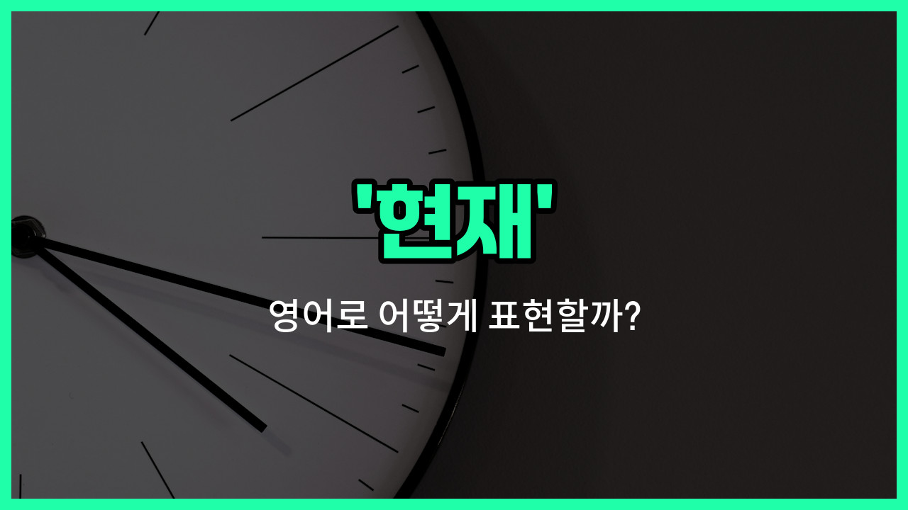

## 🌟 영어 표현 - current

안녕하세요 👋 오늘은 '현재', '지금', '현시점'이라는 뜻을 가진 영어 표현을 소개해드릴게요. 바로 '**current**'라는 단어예요.

'**current**'는 우리가 지금 살고 있는 이 순간, 즉 **현재의 상태나 상황**을 나타낼 때 자주 쓰이는 단어예요. 예를 들어, 현재의 주소, 현재의 직업, 현재의 상황 등 다양한 맥락에서 자연스럽게 사용할 수 있어요.

이 단어는 주로 형용사로 쓰여서, 명사 앞에 붙어서 '현재의 ~'라는 의미를 만들어줘요. 예를 들어, 'current address(현재 주소)', 'current job(현재 직업)', 'current situation(현재 상황)'처럼 말이에요.

## 📖 예문

1. "현재 주소를 알려주세요."

   "Please tell me your current address."

2. "현재 상황이 어떻게 되고 있나요?"

   "What is the current situation?"

## 💬 연습해보기

<ul data-interactive-list>

  <li data-interactive-item>
    요즘 기술 트렌드를 따라가려고 노력하고 있는데, 가끔 업데이트가 힘들어.
    I'm <a href="/blog/in-english/1265.try/">trying</a> to keep up with the current trends in technology. It's <a href="/blog/in-english/1219.hard/">hard</a> to stay up to date sometimes.
  </li>

  <li data-interactive-item>
    현재 직장이 꽤 스트레스가 쌓여, 그래도 잘 견디고 있어.
    The current situation at work is pretty stressful, but we're managing.
  </li>

  <li data-interactive-item>
    요즘 기름값 봤어? 최근에 많이 올랐더라구.
    Have you seen the current prices for gas? They've gone up a lot recently.
  </li>

  <li data-interactive-item>
    지금 계획은 다음 주 금요일까지 프로젝트를 마치는 거야.
    Right now, the current plan is to finish the project by next Friday.
  </li>

  <li data-interactive-item>
    현재 날씨가 소풍 가기에 너무 좋아, 맑고 따뜻해.
    The current weather is <a href="/blog/in-english/413.perfect/">perfect</a> for a picnic, sunny and warm.
  </li>

  <li data-interactive-item>
    요즘 경제 상황이 별로 안좋은 것 같아서 불안해.
    I'm not happy with the current state of the economy, it <a href="/blog/in-english/1096.feel/">feels</a> uncertain.
  </li>

  <li data-interactive-item>
    이번 시즌 드라마가 정말 재밌어, 예상치 못한 반전이 많아.
    The current season of the show is really exciting, lots of unexpected twists.
  </li>

  <li data-interactive-item>
    회의에서 현재 이슈들을 언급하고 해결책을 제안했어.
    He addressed the current issues during the meeting and suggested some solutions.
  </li>

  <li data-interactive-item>
    현재 소프트웨어 버전에 몇 가지 문제가 있는데, 지금 수정 중이야.
    The current version of the software has some bugs, but they're fixing them.
  </li>

  <li data-interactive-item>
    우린 새로운 계획을 세우기 전에 현재 목표에 집중해야 해.
    We need to focus on our current goals before planning anything new.
  </li>

</ul>

## 🤝 함께 알아두면 좋은 표현들

### present

'present'는 '현재의'라는 뜻으로, 지금 이 순간이나 현재 시점을 나타낼 때 사용해요. 'current'와 비슷하게 현재 상태나 상황을 말할 때 자주 쓰여요.

- "The present situation requires immediate attention."
- "현재 상황은 즉각적인 주의가 필요해요."

### up-to-date

'up-to-date'는 '최신의' 또는 '현대적인'이라는 뜻으로, 최신 정보나 상태를 반영하고 있음을 강조할 때 사용해요. 'current'와 비슷하지만 좀 더 최신성을 강조해요.

- "Make sure your software is up-to-date to [avoid](/blog/in-english/924.avoid/) security risks."
- "보안 위험을 피하려면 소프트웨어가 최신 상태인지 확인해야 해요."

### outdated

'[outdated](/blog/in-english/758.outdated/)'는 '구식의' 또는 '시대에 뒤떨어진'이라는 뜻으로, 현재와 반대되는 의미예요. 더 이상 현대적이지 않거나 현재 상황에 맞지 않는 것을 나타낼 때 사용해요.

- "The company's outdated [policies](/blog/in-english/623.policy/) need to be revised."
- "그 회사의 구식 정책들은 개정될 필요가 있어요."

---

오늘은 '현재', '지금', '현시점'이라는 뜻을 가진 영어 표현 '**current**'에 대해 알아봤어요. 일상에서 내 상태나 정보를 말할 때 이 표현을 활용해보면 좋을 것 같아요 😊

오늘 배운 표현과 예문들을 꼭 소리 내서 여러 번 읽어보세요. 다음에도 더 유익한 영어 표현으로 찾아올게요! 감사합니다!

