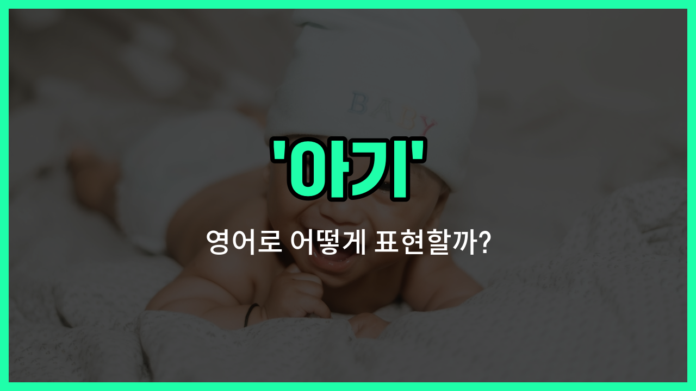

## 🌟 영어 표현 - baby

안녕하세요 👋 오늘은 '아기'라는 뜻을 가진 영어 표현을 소개해드릴게요. 바로 '**baby**'라는 단어예요. 'baby'는 태어난 지 얼마 안 된 아주 어린 아이, 즉 **아기**를 의미해요.

이 단어는 일상 대화에서 정말 자주 쓰이는 단어예요. 예를 들어, 친구가 아기를 낳았다고 할 때 "She had a baby!"라고 말할 수 있어요. 또, 'baby'는 사랑스럽고 귀여운 느낌을 줄 때도 많이 사용돼요.

'갓난아이', '유아'와 같은 뜻으로도 쓰이기 때문에, 어린아이를 부를 때 자연스럽게 사용할 수 있어요. 상황에 따라 'newborn'이나 'infant' 같은 단어도 있지만, 가장 기본적이고 널리 쓰이는 표현이 바로 'baby'예요!

## 📖 예문

1. "아기가 정말 귀여워요."

   "The baby is so cute."

2. "그들은 지난주에 아기를 낳았어요."

   "They had a baby last week."

## 💬 연습해보기

<ul data-interactive-list>

  <li data-interactive-item>
    오늘 공원에서 진짜 귀여운 아기를 봤어요. 덕분에 기분이 좋아졌어요.
    I just <a href="/blog/in-english/1371.saw/">saw</a> the cutest baby at the park today. It totally made my <a href="/blog/in-english/1067.day/">day</a> better.
  </li>

  <li data-interactive-item>
    우리 언니가 아기를 낳았는데, 우리 다들 그 아기를 만나고 싶어서 완전 신나요.
    My sister just had a baby, so we're all super excited to meet the <a href="/blog/in-english/1085.little/">little</a> one.
  </li>

  <li data-interactive-item>
    아기가 웃는 소리를 들으면 그때마다 기분이 확 좋아져요.
    Whenever I hear a baby laughing, it instantly cheers me up.
  </li>

  <li data-interactive-item>
    아기 당근이 사실 당근이 아니라는 거 아세요? 그냥 작은 조각일 뿐이에요!
    Did you know that baby carrots aren't actually carrots? They're just smaller cuts!
  </li>

  <li data-interactive-item>
    그 여자는 아기를 쉬지 않고 아침 내내 돌보고 있어요.
    She's been <a href="/blog/in-english/330.take-care-of/">taking care of</a> her baby all morning without a break.
  </li>

  <li data-interactive-item>
    그 아기는 주위가 시끄러워도 정말 차분해요.
    That baby is so calm, even with all the noise around here.
  </li>

  <li data-interactive-item>
    가게 닫기 전에 아기 젖을 사야 해요.
    We need to buy some baby formula before the store closes.
  </li>

  <li data-interactive-item>
    내가 보니 둥지에서 떨어진 아기 새를 발견했어요.
    I found a baby bird that must have fallen out of its nest.
  </li>

  <li data-interactive-item>
    내일 가족 저녁에 아기 데려가나요?
    Are you bringing the baby to the family <a href="/blog/in-english/1293.dinner/">dinner</a> tomorrow?
  </li>

  <li data-interactive-item>
    아기들은 진짜 금방 자라서 매일매일 변화하는 것 같아요.
    Babies grow up so fast, it <a href="/blog/in-english/1096.feel/">feels</a> like they're changing every day.
  </li>

</ul>

## 🤝 함께 알아두면 좋은 표현들

### infant

'infant'는 '아기' 또는 '갓난아기'를 의미해요. 보통 생후 1년 미만의 아주 어린 아기를 가리킬 때 사용하며, 좀 더 공식적이고 의학적인 상황에서 자주 쓰여요.

- "The infant was sleeping peacefully in the crib."
- "그 아기는 아기 침대에서 평화롭게 자고 있었어요."

### toddler

'toddler'는 '걸음마를 시작한 아기'를 뜻해요. 보통 1~3세 사이의 어린 아이를 가리키며, 이제 막 걷기 시작하는 시기의 아기를 말해요.

- "The toddler [took](/blog/in-english/1237.took/) his first steps today."
- "그 아기가 오늘 첫 걸음을 뗐어요."

### adult

'adult'는 '성인'을 의미해요. 'baby'의 반대말로, 성장하여 어른이 된 사람을 가리킬 때 사용해요.

- "Unlike a baby, an adult can take care of themselves."
- "아기와 달리 성인은 스스로를 돌볼 수 있어요."

---

오늘은 '아기', '갓난아이', '유아'라는 뜻을 가진 영어 표현 'baby'에 대해 알아봤어요. 주변에 아기가 태어났을 때 이 표현을 꼭 써보세요! 😊

오늘 배운 표현과 예문들을 꼭 최소 3번씩 소리 내서 읽어보세요. 다음에도 더 재미있고 유익한 영어 표현으로 찾아올게요! 감사합니다!

