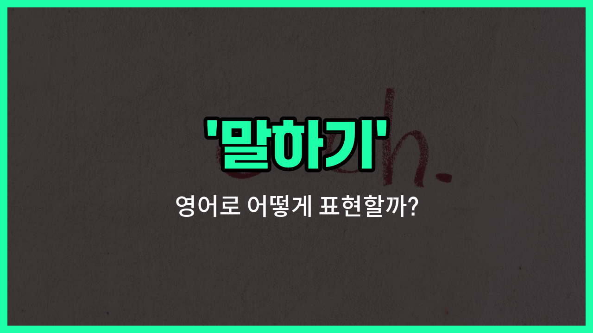

## 🌟 영어 표현 - talking

안녕하세요 👋 오늘은 영어로 '**말하기**'를 어떻게 표현하는지 알아보려고 해요. 바로 '**talking**'이라는 단어를 사용할 수 있어요. 이 단어는 우리가 누군가와 말을 주고받거나, 자신의 생각을 소리 내어 표현하는 상황에서 자주 쓰여요.

'**talking**'은 일상 대화, 친구와의 수다, 중요한 회의 등 다양한 상황에서 자연스럽게 사용할 수 있는 표현이에요. 예를 들어, 친구와 대화할 때 "We were talking about our weekend plans."라고 할 수 있어요. 이 문장은 "우리는 주말 계획에 대해 이야기하고 있었어요."라는 뜻이에요.

또한, 누군가 계속 말을 할 때 "He keeps talking during the movie."라고 하면 "그는 영화 보는 동안 계속 말하고 있어요."라는 의미가 돼요.

## 📖 예문

1. "그녀는 항상 새로운 사람들과 말하기를 좋아해요."

   "She always enjoys talking to new people."

2. "수업 시간에 말하기는 중요해요."

   "Talking in [class](/blog/in-english/1262.class/) is important."

## 💬 연습해보기

<ul data-interactive-list>

  <li data-interactive-item>
    저녁 먹기 전에 주말 계획에 대해 이야기하고 있었어.
    We were just talking about our plans for the weekend before dinner.
  </li>

  <li data-interactive-item>
    그가 운전하면서 전화 통화 하는 걸 봤는데, 그건 안전하지 않아.
    I caught him talking on the phone while driving, which isn't safe.
  </li>

  <li data-interactive-item>
    회의 중에 아무도 관심이 없는데도 계속 이야기했어.
    During the meeting, she kept talking even though no one was paying attention.
  </li>

  <li data-interactive-item>
    그들은 지난 금요일에 개봉한 새 영화에 대해 이야기하고 있었어.
    They were talking about the new movie that just came out last Friday.
  </li>

  <li data-interactive-item>
    어릴 때 부모님이 나 혼잣말 많이 한다고 하셨었어.
    When I was young, my parents said I was always talking to myself.
  </li>

  <li data-interactive-item>
    그는 발표할 때 긴장해서 너무 빨리 말하는 경향이 있어.
    He <a href="/blog/in-english/259.tend-to/">tends to</a> get nervous and talking too fast when he's presenting.
  </li>

  <li data-interactive-item>
    그들이 그녀를 위해 계획한 서프라이즈 파티에 대해 이야기하는 걸 엿들었어.
    I overheard them talking about the surprise party they planned for her.
  </li>

  <li data-interactive-item>
    매니저와 스케줄 변경에 대해 이야기하고 나서 잠시 멈췄어.
    She paused briefly after talking to the manager about the schedule change.
  </li>

  <li data-interactive-item>
    할머니와 이야기하는 게 너무 좋아, 할머니는 최고의 이야기를 해주시거든.
    I <a href="/blog/in-english/1074.love/">love</a> talking with my grandmother because she tells the <a href="/blog/in-english/1073.best/">best</a> <a href="/blog/in-english/537.story/">stories</a>.
  </li>

  <li data-interactive-item>
    몇 시간 동안 이야기한 끝에 드디어 여름휴가 갈 곳에 합의했어.
    After talking for <a href="/blog/in-english/1339.hour/">hours</a>, we finally agreed on where to go for vacation.
  </li>

</ul>

## 🤝 함께 알아두면 좋은 표현들

### speaking (말하기)

'speaking'은 '말하기'와 거의 같은 의미로, 일상 대화나 공식적인 상황에서 자신의 생각이나 의견을 표현하는 행위를 말해요. 'talking'보다 조금 더 격식 있는 느낌을 줄 때 사용해요.

- "She is speaking at the conference about climate change."
- "그녀는 기후 변화에 대해 회의에서 말하고 있어요."

### listening (듣기)

'listening'은 '듣기'라는 뜻으로, 'talking'의 반대 개념이에요. 다른 사람이 말하는 내용을 주의 깊게 듣는 행위를 의미해요. 효과적인 의사소통을 위해서는 말하기뿐만 아니라 듣기도 중요해요.

- "Good communication requires both talking and listening."
- "좋은 의사소통은 말하기와 듣기 모두를 필요로 해요."

### silent (조용한, 말하지 않는)

'silent'는 '조용한' 또는 '말하지 않는'이라는 뜻으로, 'talking'의 반대 개념이에요. 말을 하지 않고 침묵을 지키는 상태를 나타내요. 때로는 생각을 정리하거나 상황을 관찰할 때 침묵이 필요할 수 있어요.

- "He [remained](/blog/in-english/1026.remain/) silent during the entire meeting."
- "그는 회의 내내 조용히 있었어요."

---

오늘은 '**말하기**'라는 뜻을 가진 영어 표현 '**talking**'에 대해 알아봤어요. 일상에서 대화하거나 자신의 생각을 표현할 때 이 단어를 떠올려 보세요 😊

오늘 배운 표현과 예문들을 꼭 최소 3번씩 소리 내서 읽어보세요. 다음에도 더 재미있고 유익한 영어 표현으로 찾아올게요! 감사합니다!

