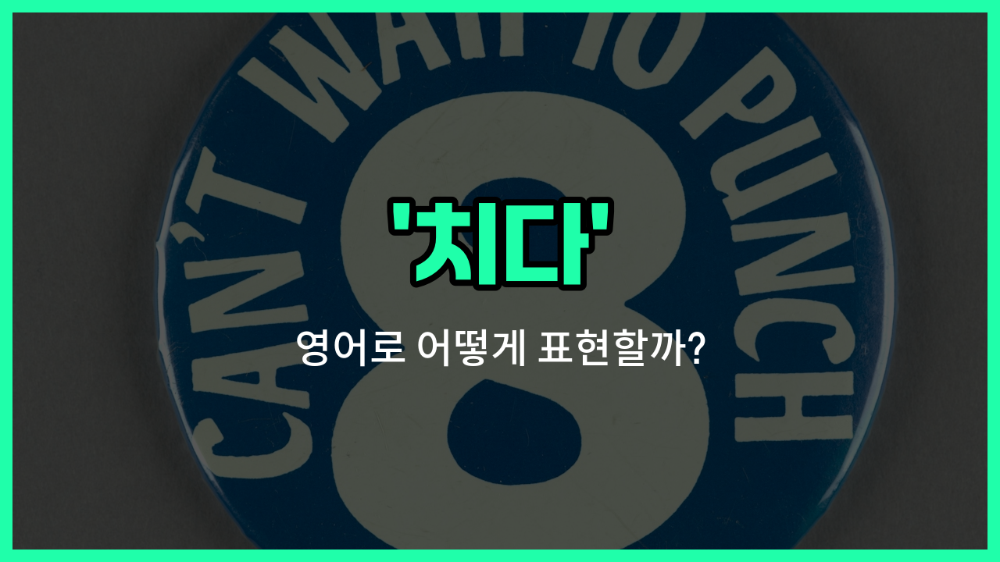

## 🌟 영어 표현 - hit

안녕하세요 👋 오늘은 일상에서 자주 쓰이는 동사 '**치다**'의 영어 표현 '**hit**'에 대해 알아보려고 해요.

'**hit**'는 무언가를 손이나 도구로 세게 치거나, 어떤 대상에 부딪히는 상황을 표현할 때 사용해요. 즉, **때리다** 또는 **부딪치다**라는 의미로도 자주 쓰여요!

이 단어는 스포츠, 사고, 일상 대화 등 다양한 상황에서 자연스럽게 활용할 수 있어요. 예를 들어, 야구에서 공을 방망이로 칠 때 "He hit the ball with the bat."라고 할 수 있어요.

또는, 자동차가 벽에 부딪혔을 때 "The car hit the wall."라고 표현해요.

'**hit**'는 동사로 가장 많이 쓰이지만, 명사로도 '타격'이라는 뜻이 있으니 참고해 주세요!

## 📖 예문

1. "그는 공을 세게 쳤어요."

   "He hit the ball [hard](/blog/in-english/1219.hard/)."

2. "나는 머리를 문에 부딪쳤어요."

   "I hit my head on the door."

## 💬 연습해보기

<ul data-interactive-list>

  <li data-interactive-item>
    너무 놀라서 테이블을 실수로 쳤어요.
    I was so surprised that I hit the table by accident.
  </li>

  <li data-interactive-item>
    스트레스를 받을 때마다 체육관에서 펀치백을 쳐요.
    Whenever I'm stressed, I hit the punching bag at the <a href="/blog/in-english/431.gym/">gym</a>.
  </li>

  <li data-interactive-item>
    브레이크를 너무 세게 밟지 마세요, 그러면 차가 미끄러질 수 있어요.
    Don't hit the brakes too hard or the car might skid.
  </li>

  <li data-interactive-item>
    희귀한 수집품을 찾아서 대박이 났어요.
    He hit the jackpot when he found that rare collectible.
  </li>

  <li data-interactive-item>
    어젯밤에 그녀가 연락해서 나랑 놀고 싶냐고 물어봤어.
    She hit me up last night to see if I <a href="/blog/in-english/1060.want/">wanted</a> to hang out.
  </li>

  <li data-interactive-item>
    파도가 너무 세서 바위에 세게 부딪혔어요.
    The waves were strong enough to hit the rocks with a <a href="/blog/in-english/311.loud/">loud</a> crash.
  </li>

  <li data-interactive-item>
    슛을 놓친 후 다음 시도에서 공을 더 세게 쳤어요.
    After <a href="/blog/in-english/339.miss/">missing</a> the shot, he hit the ball with extra force on the next <a href="/blog/in-english/1265.try/">try</a>.
  </li>

  <li data-interactive-item>
    로드 트립 중에 도로에 차질이 있었지만 큰 문제는 아니었어요.
    We hit a bump in the road during our road trip, but it was nothing serious.
  </li>

  <li data-interactive-item>
    그들의 새로운 제품 라인이 지난주에 매장에 진열되었어요.
    They hit the shelves last week with their new product <a href="/blog/in-english/1234.line/">line</a>.
  </li>

  <li data-interactive-item>
    오늘 아침에 일어나기 전에 알람 스누즈를 세 번 눌렀어요.
    I hit the snooze button three times this morning before getting up.
  </li>

</ul>

## 🤝 함께 알아두면 좋은 표현들

### strike

'strike'는 '강하게 치다' 또는 '때리다'라는 뜻이에요. 'hit'와 비슷하게 물리적으로 무언가를 때리는 동작을 나타내지만, 좀 더 강한 힘이나 의도를 내포할 때 자주 사용돼요.

- "He struck the punching bag with all his strength."
- "그는 온 힘을 다해 권투 가방을 쳤어요."

### miss

'miss'는 '놓치다' 또는 '빗나가다'라는 뜻으로, 'hit'의 반대 의미예요. 목표물을 치지 못하거나 맞추지 못하는 상황을 나타낼 때 사용해요.

- "She swung the bat but missed the ball."
- "그녀는 방망이를 휘둘렀지만 공을 치지 못했어요."

### tap

'tap'은 '가볍게 톡톡 치다'라는 뜻이에요. 'hit'보다 훨씬 부드럽고 약한 힘으로 살짝 치는 동작을 나타낼 때 쓰여요.

- "He tapped his friend on the shoulder to get his attention."
- "그는 친구의 어깨를 가볍게 톡톡 쳐서 주의를 끌었어요."

---

오늘은 '**치다**', '**때리다**', '**부딪치다**'라는 뜻을 가진 영어 표현 '**hit**'에 대해 알아봤어요. 일상에서 무언가를 칠 때나 부딪힐 때 이 표현을 떠올려 보세요 😊

오늘 배운 표현과 예문들을 꼭 최소 3번씩 소리 내서 읽어보세요. 다음에도 더 재미있고 유익한 영어 표현으로 찾아올게요! 감사합니다!

