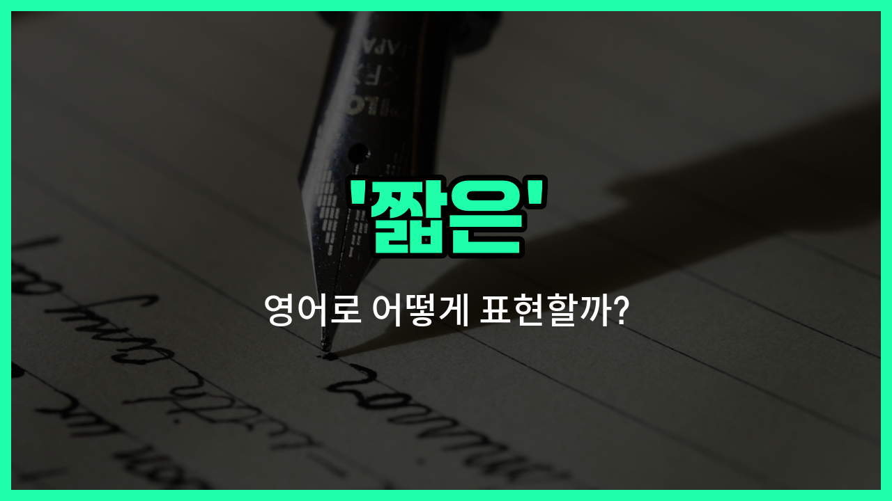

## 🌟 영어 표현 - short

안녕하세요 👋 오늘은 영어로 '짧은'이라는 뜻을 가진 표현 '**short**'에 대해 알아보려고 해요.

'**short**'는 길이나 시간, 키 등 여러 가지가 '길지 않다'는 의미를 담고 있어요. 예를 들어, 머리카락이 짧거나, 시간이 짧거나, 누군가의 키가 작을 때 모두 사용할 수 있는 단어예요.

또한, '간결한'이라는 뜻으로도 쓰여서, 말이나 글이 길지 않고 간단할 때도 '**short**'를 사용할 수 있어요.

예를 들어, '짧은 머리', '짧은 시간', '짧은 문장', '키가 작은 사람' 등 다양한 상황에서 자연스럽게 쓸 수 있답니다!

## 📖 예문

1. "나는 짧은 머리를 좋아해요."

   "I like short hair."

2. "오늘 회의는 아주 짧았어요."

   "The meeting was very short today."

3. "그는 키가 작아요."

   "He is short."

## 💬 연습해보기

<ul data-interactive-list>

  <li data-interactive-item>
    이 행사는 하루 종일 진행될 예정이었는데 예상외로 짧게 끝났어요.
    This event was supposed to last all <a href="/blog/in-english/1067.day/">day</a> but it ended up being surprisingly short.
  </li>

  <li data-interactive-item>
    저는 짧은 회의를 선호해요. 사람들이 집중하고 생산적으로 일할 수 있거든요.
    I prefer short meetings because they keep everyone focused and productive.
  </li>

  <li data-interactive-item>
    그녀의 머리가 지금 너무 짧아요; 최근에 머리를 잘랐나 봐요.
    Her hair is so short now; she must have gotten a recent haircut.
  </li>

  <li data-interactive-item>
    영화가 조금 짧았어요, 몇 분 더 보고 싶었거든요.
    The movie was a bit too short, I <a href="/blog/in-english/1060.want/">wanted</a> it to go on for a few more <a href="/blog/in-english/1365.minutes/">minutes</a>.
  </li>

  <li data-interactive-item>
    저는 다시 일하기 전에 짧은 휴식만 필요해요.
    I only need a short break before getting back to work.
  </li>

  <li data-interactive-item>
    그 셔츠가 정말 잘 어울려요, 특히 여름에 짧은 소매가 멋져요.
    That shirt looks great on you, especially with the short sleeves for summer.
  </li>

  <li data-interactive-item>
    발표는 짧았지만 유용한 정보로 가득했어요.
    The presentation was short but <a href="/blog/in-english/301.pack/">packed</a> with useful information.
  </li>

  <li data-interactive-item>
    비가 오기 시작해서 공원 주위를 짧게 산책했어요.
    We took a short walk around the park since it started raining.
  </li>

  <li data-interactive-item>
    그는 성격이 좀 급해서 말 조심해야 해요.
    He has a short temper, so be careful what you say.
  </li>

  <li data-interactive-item>
    이 이야기는 짧고 달콤해서 잠자리에서 읽기 완벽해요.
    The <a href="/blog/in-english/537.story/">story</a> was short and sweet, <a href="/blog/in-english/413.perfect/">perfect</a> for bedtime reading.
  </li>

</ul>

## 🤝 함께 알아두면 좋은 표현들

### brief

'brief'는 '짧은'이라는 뜻으로, 시간이나 길이가 짧음을 나타낼 때 주로 사용해요. 'short'보다 좀 더 공식적이고 간결한 느낌을 줄 때 쓰여요.

- "She gave a brief summary of the meeting."
- "그녀는 회의에 대해 간단한 요약을 해줬어요."

### long

'[long](/blog/in-english/1077.long/)'은 '긴'이라는 뜻으로, 'short'의 반대말이에요. 시간이나 길이가 길 때 사용하며, 어떤 것이 짧지 않고 길다는 것을 강조할 때 쓰여요.

- "The movie was too long for my taste."
- "그 영화는 내 취향에는 너무 길었어요."

### concise

'concise'는 '간결한'이라는 뜻으로, 불필요한 부분을 빼고 핵심만 짧고 명확하게 표현할 때 사용해요. 'short'와 비슷하지만, 내용이 명확하고 이해하기 쉽게 짧다는 뉘앙스를 줘요.

- "Please write a concise report for the project."
- "프로젝트에 대해 간결한 보고서를 작성해 주세요."

---

오늘은 '짧은'이라는 뜻을 가진 영어 표현 '**short**'에 대해 알아봤어요. 일상에서 길이나 시간, 키 등 다양한 상황에 맞게 활용해 보세요 😊

오늘 배운 표현과 예문들을 꼭 소리 내서 여러 번 읽어보세요. 다음에도 더 유익한 영어 표현으로 찾아올게요! 감사합니다!

