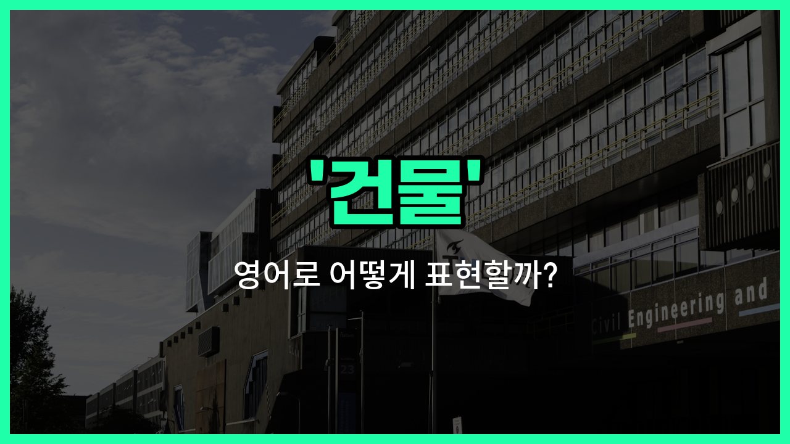

## 🌟 영어 표현 - building

안녕하세요 👋 오늘은 우리가 일상에서 자주 보는 '건물'을 영어로 어떻게 표현하는지 알아볼게요. 바로 '**building**'이라는 단어를 사용해요.

'**building**'은 땅 위에 세워진 구조물을 의미해요. 즉, 사람들이 살거나 일하거나, 다양한 목적으로 사용하는 모든 종류의 건물을 가리킬 때 쓸 수 있어요. 학교, 병원, 아파트, 사무실 등 모두 'building'이라고 부를 수 있답니다.

또한, 'building'은 명사로 '건물', '빌딩', '구축물'이라는 뜻을 가지고 있어요. 일상 대화뿐만 아니라 공식적인 문서나 안내문에서도 자주 등장하는 단어예요.

## 📖 예문

1. "저 건물은 정말 높아요."

   "That building is really tall."

2. "새로운 사무실 건물이 시내에 지어지고 있어요."

   "A new [office](/blog/in-english/1379.office/) building is being constructed downtown."

## 💬 연습해보기

<ul data-interactive-list>

  <li data-interactive-item>
    도시 중심에 새로 지어진 건물이 시내에서 제일 높은 건물이래요.
    The new building downtown is supposed to be the tallest one in the city.
  </li>

  <li data-interactive-item>
    내 사무실 건물 로비에 무료 커피가 있어서 참 좋은 것 같아요.
    My office building has <a href="/blog/in-english/1104.free/">free</a> coffee in the lobby, which is a nice perk.
  </li>

  <li data-interactive-item>
    내년에 새 아파트 건물을 세울 계획이래요.
    They're planning on constructing a new apartment building next year.
  </li>

  <li data-interactive-item>
    우린 그 컨퍼런스가 열리는 건물을 찾다가 길을 잃었어요.
    We got lost <a href="/blog/in-english/1265.try/">trying</a> to <a href="/blog/in-english/1083.find/">find</a> the building where the conference is being held.
  </li>

  <li data-interactive-item>
    옛날 건물이 현대적인 시설로 리모델링됐어요.
    The old building was renovated to include more modern facilities.
  </li>

  <li data-interactive-item>
    비를 피하기 위해 건물 뒤에 차를 주차했어요.
    I parked my car behind the building to avoid the rain.
  </li>

  <li data-interactive-item>
    그녀는 도서관 옆 건물에서 일해요.
    She <a href="/blog/in-english/1064.work/">works</a> in the building next to the library.
  </li>

  <li data-interactive-item>
    건물 엘리베이터가 고장 나서 계단을 이용해야 했어요.
    The building's elevator was out of order, so we had to take the stairs.
  </li>

  <li data-interactive-item>
    이 건물은 벽이 두꺼워서 안은 정말 조용해요.
    This building has really thick walls, so it's very quiet inside.
  </li>

  <li data-interactive-item>
    그들은 새 공원을 만들기 위해 옛 건물을 철거하고 있어요.
    They're tearing down the old building to make space for a new park.
  </li>

</ul>

## 🤝 함께 알아두면 좋은 표현들

### structure

'structure'는 '구조물' 또는 '건축물'을 의미해요. 'building'과 비슷하게 물리적으로 세워진 것을 가리키지만, 좀 더 넓은 의미로 다리, 탑 등 다양한 형태의 인공물을 포함할 수 있어요.

- "The city is famous for its modern structures and innovative architecture."
- "그 도시는 현대적인 구조물과 혁신적인 건축물로 유명해요."

### demolition

'demolition'은 '철거' 또는 '파괴'를 뜻해요. 'building'의 반대 개념으로, 기존에 있던 건물을 허물거나 없애는 행위를 나타낼 때 사용해요.

- "The old building was scheduled for demolition to make [way](/blog/in-english/1062.way/) for a new park."
- "그 오래된 건물은 새 공원을 만들기 위해 철거될 예정이었어요."

### house

'[house](/blog/in-english/1088.house/)'는 '집'을 의미해요. 'building'이 모든 종류의 건물을 포괄하는 반면, 'house'는 사람이 거주하는 주거용 건물을 구체적으로 가리켜요.

- "They bought a new house in the suburbs last month."
- "그들은 지난달 교외에 새 집을 샀어요."

---

오늘은 '건물'이라는 뜻을 가진 영어 표현 '**building**'에 대해 알아봤어요. 주변에 있는 다양한 건물을 영어로 표현할 때 이 단어를 떠올려 보세요 😊

오늘 배운 표현과 예문들을 꼭 소리 내서 여러 번 읽어보세요. 다음에도 더 유익한 영어 표현으로 찾아올게요! 감사합니다!

