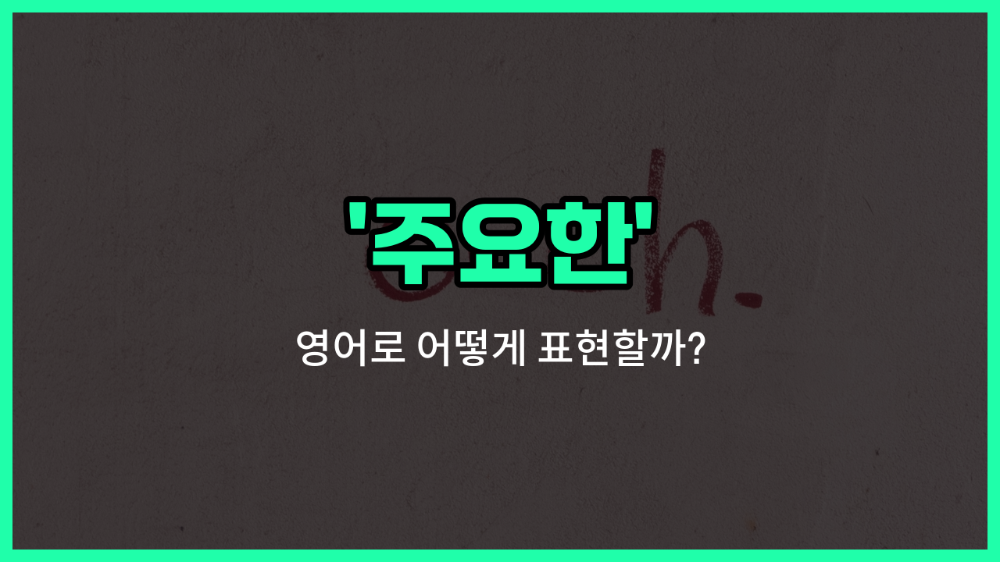

## 🌟 영어 표현 - main

안녕하세요 👋 오늘은 영어에서 '주요한', '주된', '중요한'이라는 뜻을 가진 단어 '**main**'에 대해 알아보려고 해요.

'**main**'은 어떤 것의 중심이 되거나 가장 중요한 부분을 나타낼 때 사용하는 단어예요. 예를 들어, 여러 가지 중에서 가장 핵심이 되는 것, 또는 가장 큰 역할을 하는 것을 말할 때 쓸 수 있어요.

이 단어는 일상 대화뿐만 아니라 비즈니스, 학교, 다양한 상황에서 자주 쓰여요. 예를 들어, "main [reason](/blog/in-english/1341.reason/)"이라고 하면 '주요한 이유', "main character"라고 하면 '주인공'이라는 뜻이 돼요.

또한, 'main'은 명사 앞에 붙어서 그 명사가 가장 중심이 된다는 의미를 강조해줘요. 그래서 어떤 것의 '핵심', '중심', '가장 중요한' 부분을 말할 때 자연스럽게 사용할 수 있어요.

## 📖 예문

1. "이것이 우리가 만나는 주요한 이유예요."

   "This is the main reason we are meeting."

2. "그 영화의 주요한 인물은 누구예요?"

   "Who is the main character in the movie?"

## 💬 연습해보기

<ul data-interactive-list>

  <li data-interactive-item>
    여기 온 가장 큰 이유는 오래된 친구들을 만나기 위해서야. 마지막으로 만난 지 몇 년이나 됐어.
    The main reason I came here was to see my old friends. It's been years since we last met.
  </li>

  <li data-interactive-item>
    너가 가장 집중해야 할 건 의사소통 능력을 키우는 거야. 이게 너의 경력에 큰 도움이 될 거야.
    The main thing you need to focus on is improving your communication skills. That will <a href="/blog/in-english/1084.help/">help</a> a lot in your career.
  </li>

  <li data-interactive-item>
    이번 프로젝트의 주 목표는 고객 만족도를 높이는 거야. 그 외의 건 다 뒤로 미뤄도 돼.
    Our main goal for this project is to increase customer satisfaction. Everything else is secondary.
  </li>

  <li data-interactive-item>
    주 출입구는 모퉁이만 돌아가면 되니까 길을 잃을 걱정은 하지 마.
    The main entrance is just around the corner, so don't worry about getting lost.
  </li>

  <li data-interactive-item>
    오늘 저녁의 주 요리는 구운 연어야. 해산물을 별로 안 좋아하면 다른 메뉴도 있어.
    The main dish tonight is grilled salmon, but there are other options too if you don't <a href="/blog/in-english/1053.like/">like</a> seafood.
  </li>

  <li data-interactive-item>
    그의 주 걱정은 일을 제시간에 끝낼 수 있을까 하는 거야. 나머지 세부 사항은 나중에 정리해도 돼.
    His main concern is whether he can finish the <a href="/blog/in-english/1064.work/">work</a> <a href="/blog/vocab-1/043.on-time/">on time</a>. The rest of the details can be sorted out <a href="/blog/in-english/1024.later/">later</a>.
  </li>

  <li data-interactive-item>
    회의의 주제는 내년 예산에 대한 거였어. 모두가 강한 의견을 가지고 있었지.
    The main topic at the meeting was the budget for next year. Everyone had strong opinions about it.
  </li>

  <li data-interactive-item>
    너의 최우선 사항은 큰 날 전에 충분한 잠을 자는 거야. 잘 잔 게 정말 큰 차이를 만들어.
    Your main priority should be getting enough sleep before the big day. Being well-rested <a href="/blog/in-english/1209.makes/">makes</a> a huge difference.
  </li>

  <li data-interactive-item>
    그 기사의 주된 내용은 기후 변화와 그것이 우리 지구에 미치는 영향에 대한 것이었어. 정말 많은 걸 깨닫게 해줬어.
    The main point of the article was about climate change and its impact on our planet. It really opened my eyes.
  </li>

  <li data-interactive-item>
    그들이 행사를 취소한 주 이유는 날씨 예보가 좋지 않아서야. 안전이 최우선이라고 했지.
    The main reason they canceled the event was the bad weather forecast. Safety first, they said.
  </li>

</ul>

## 🤝 함께 알아두면 좋은 표현들

### primary (주요한, 첫 번째의)

'primary'는 '가장 중요한' 또는 '첫 번째의'라는 뜻이에요. 어떤 것들 중에서 가장 우선순위가 높거나 기본적인 것을 나타낼 때 사용해요.

- "The primary goal of this project is to improve customer satisfaction."
- "이 프로젝트의 주요 목표는 고객 만족도를 향상시키는 거예요."

### secondary (부차적인, 덜 중요한)

'secondary'는 '주요한'의 반대말로, '부차적인' 또는 '덜 중요한'이라는 뜻이에요. 주된 것 다음에 오는 것들을 말할 때 쓰여요.

- "The secondary effects of the medication are usually mild."
- "그 약의 부작용은 보통 경미해요."

### chief (최고의, 주요한)

'chief'는 '가장 중요한' 또는 '주요한'이라는 뜻으로, 어떤 그룹이나 조직에서 가장 높은 위치에 있거나 가장 큰 역할을 하는 것을 나타낼 때 사용해요.

- "She is the chief engineer responsible for the new design."
- "그녀는 새로운 설계를 담당하는 주요 엔지니어예요."

---

오늘은 '주요한', '주된', '중요한'이라는 뜻을 가진 영어 표현 '**main**'에 대해 알아봤어요. 앞으로 어떤 것의 중심이나 가장 중요한 부분을 말할 때 이 단어를 떠올려 보세요 😊

오늘 배운 표현과 예문들을 꼭 소리 내서 여러 번 읽어보세요. 다음에도 더 유익한 영어 표현으로 찾아올게요! 감사합니다!

