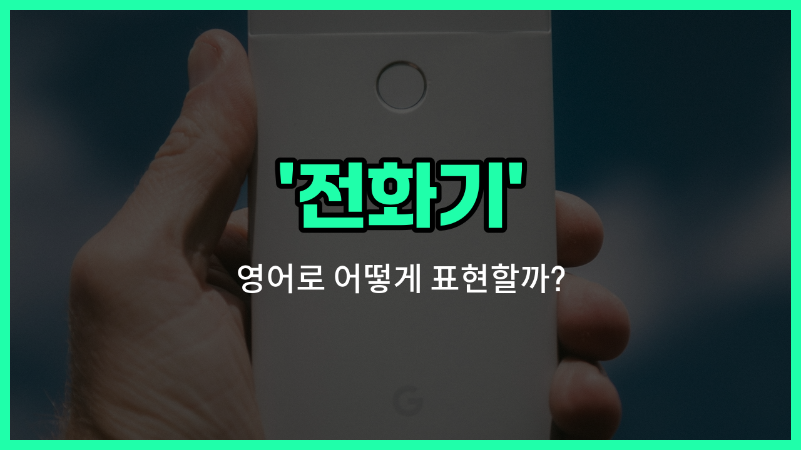

## 🌟 영어 표현 - phone

안녕하세요 👋 오늘은 일상에서 정말 자주 쓰는 물건, 바로 '**전화기**'를 영어로 어떻게 표현하는지 알아보려고 해요. 영어로 '전화기'는 '**phone**'이라고 해요. 이 단어는 집에서 쓰는 유선 전화기뿐만 아니라, 우리가 늘 들고 다니는 휴대폰, 핸드폰까지 모두 포함하는 표현이에요.

예전에는 집에 있는 전화기를 'telephone'이라고 부르기도 했지만, 요즘은 대부분 'phone'이라고 간단하게 말해요. 그리고 스마트폰, 휴대폰, 핸드폰도 모두 'phone'이라는 단어로 자연스럽게 표현할 수 있어요!

예를 들어, 친구에게 "전화해 줘"라고 말하고 싶을 때는 "Call me on my phone."이라고 할 수 있어요. 또는, "휴대폰을 잃어버렸어"는 "I lost my phone."이라고 표현해요.

## 📖 예문

1. "전화기가 울리고 있어요."

   "The phone is ringing."

2. "휴대폰을 집에 두고 왔어요."

   "I [left](/blog/in-english/1106.left/) my phone at home."

## 💬 연습해보기

<ul data-interactive-list>

  <li data-interactive-item>
    집에 전화기를 두고 와서 너에게 다시 전화를 못 했어.
    I left my phone at home and couldn't call you back.
  </li>

  <li data-interactive-item>
    내 전화기 좀 가져다 줄래? 지금 울리는 것 같아.
    Can you grab my phone? I <a href="/blog/in-english/1059.think/">think</a> it's ringing.
  </li>

  <li data-interactive-item>
    내 전화 배터리가 닳아서 너한테 문자도 못 했어.
    My phone battery died, so I couldn't text you.
  </li>

  <li data-interactive-item>
    전화가 울리자마자 그녀가 바로 받았어.
    She answered the phone right away when it rang.
  </li>

  <li data-interactive-item>
    내 전화기가 구형이라 새로 사야 해.
    I need to buy a new phone because mine is outdated.
  </li>

  <li data-interactive-item>
    회의 중에는 전화기를 진동으로 해 줘.
    Please put your phone on <a href="/blog/in-english/959.silent/">silent</a> during the meeting.
  </li>

  <li data-interactive-item>
    그가 전화기를 떨어뜨렸는데 화면이 깨졌어.
    He dropped his phone, and the screen cracked.
  </li>

  <li data-interactive-item>
    집에 도착하면 문자 좀 보내줘, 안전한지 알고 싶어.
    Text me when you get home so I know you're safe with your phone.
  </li>

  <li data-interactive-item>
    나는 비상용으로 전화기를 항상 가까이에 두고 있어.
    I always keep my phone nearby in <a href="/blog/in-english/1130.case/">case</a> of emergencies.
  </li>

  <li data-interactive-item>
    웹 서핑할 때 전화기를 쓰는 게 더 좋아, 아니면 컴퓨터가 더 나은가?
    Do you prefer using your phone or a computer for browsing?
  </li>

</ul>

## 🤝 함께 알아두면 좋은 표현들

### mobile phone

'mobile phone'은 "휴대전화"를 의미해요. 일반 전화기와 달리 언제 어디서나 휴대하며 사용할 수 있는 전화기를 가리켜요. 현대 사회에서 가장 흔히 사용하는 전화기 종류 중 하나예요.

- "She [forgot](/blog/in-english/023.forget/) her mobile phone at home and couldn't call anyone."
- "그녀는 집에 휴대전화를 두고 와서 아무에게도 전화할 수 없었어요."

### landline

'landline'은 "유선 전화"를 뜻해요. 집이나 사무실에 고정되어 있는 전통적인 전화기를 말해요. 휴대전화와는 달리 이동이 불가능하고, 주로 집 안에서 사용해요.

- "I [still](/blog/in-english/254.still/) have a landline at home for emergencies."
- "저는 여전히 비상시에 대비해 집에 유선 전화를 두고 있어요."

### ignore the phone

'ignore the phone'은 "전화를 무시하다"라는 뜻이에요. 전화가 왔을 때 받지 않거나 일부러 전화를 받지 않는 행동을 나타내요. 전화기를 사용하는 것과는 반대되는 행동이에요.

- "He [decided to](/blog/in-english/062.decide-to/) ignore the phone calls during his vacation to relax."
- "그는 휴가 동안 휴식을 위해 전화 받는 것을 무시하기로 했어요."

---

오늘은 '전화기', '휴대폰', '핸드폰'이라는 뜻을 가진 영어 표현 '**phone**'에 대해 알아봤어요. 이제 전화와 관련된 상황에서 이 표현을 자신 있게 쓸 수 있겠죠? 😊

오늘 배운 표현과 예문들을 꼭 최소 3번씩 소리 내서 읽어보세요. 다음에도 더 재미있고 유익한 영어 표현으로 찾아올게요! 감사합니다!

