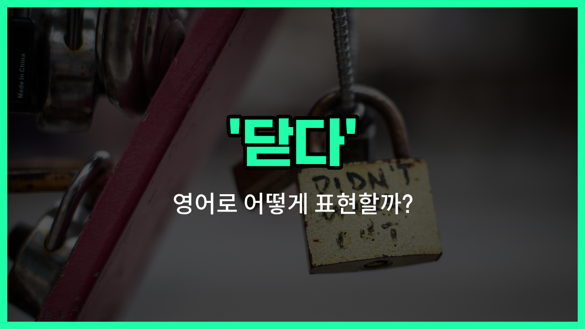

## 🌟 영어 표현 - close

안녕하세요 👋 오늘은 일상에서 정말 자주 쓰이는 영어 표현 '**close**'에 대해 알아보려고 해요. '**close**'는 가장 기본적으로 '문을 닫다'라는 뜻으로 많이 쓰이지만, 이 외에도 '마감하다', '끝내다'와 같은 다양한 의미로 활용돼요.

예를 들어, 가게 문을 닫을 때 "We close at 10 PM."이라고 할 수 있어요. 여기서 'close'는 '영업을 마감하다'라는 의미로도 쓰여요. 또한, 어떤 일을 마무리할 때도 'close'를 사용할 수 있답니다!

이처럼 'close'는 상황에 따라 '닫다', '마감하다', '끝내다' 등 여러 의미로 자연스럽게 쓸 수 있는 아주 유용한 단어예요~

## 📖 예문

1. "문 좀 닫아줄래요?"

   "Can you close the door, please?"

2. "가게가 곧 마감해요."

   "The store is closing [soon](/blog/in-english/1402.soon/)."

3. "회의를 여기서 마치겠습니다."

   "Let's close the meeting here."

## 💬 연습해보기

<ul data-interactive-list>

  <li data-interactive-item>
    창문 좀 닫아줄 수 있어요? 이젠 좀 쌀쌀해져서요.
    Could you close the window? It's getting chilly in here.
  </li>

  <li data-interactive-item>
    보통 9시쯤 가게를 닫아요.
    I usually close the store around 9 pm.
  </li>

  <li data-interactive-item>
    나갈 때 문 꼭 닫는 거 잊지 마세요.
    Don't <a href="/blog/in-english/023.forget/">forget</a> to close the door when you leave.
  </li>

  <li data-interactive-item>
    그녀는 노트북을 닫고 잠깐 쉬기로 했어요.
    She <a href="/blog/in-english/062.decide-to/">decided to</a> close her laptop and take a break.
  </li>

  <li data-interactive-item>
    앱 좀 닫아줄래요? 응답이 안 되네요.
    Can you close the app? It's not responding.
  </li>

  <li data-interactive-item>
    나가기 전에 모든 탭 다 닫는 거 꼭 확인해요.
    Before you leave, make sure to close all the tabs.
  </li>

  <li data-interactive-item>
    오늘 퍼레이드 때문에 도로를 닫아야 했어요.
    They had to close the road for the parade <a href="/blog/in-english/1132.today/">today</a>.
  </li>

  <li data-interactive-item>
    블라인드 좀 닫아주세요; 태양이 너무 쨍해요.
    Please close the blinds; the sun is too bright.
  </li>

  <li data-interactive-item>
    그가 나에게 상자를 꽉 닫아달라고 했어요.
    He <a href="/blog/in-english/1394.asked/">asked</a> me to close the box tightly.
  </li>

  <li data-interactive-item>
    눈 감으면 더 편안하게 느낄 수 있을 거예요.
    If you close your eyes, you might <a href="/blog/in-english/1096.feel/">feel</a> more relaxed.
  </li>

</ul>

## 🤝 함께 알아두면 좋은 표현들

### shut

'shut'은 '닫다'와 거의 같은 의미로, 문이나 창문 등을 완전히 닫는 것을 의미해요. 'close'보다 조금 더 강한 느낌을 줄 때 사용해요.

- "Please shut the door when you leave the room."
- "방을 나갈 때 문을 닫아 주세요."

### open

'open'은 '열다'라는 뜻으로, 'close'의 반대말이에요. 문이나 창문 등을 열 때 사용하는 기본적인 표현이에요.

- "Could you open the window? It's getting hot in here."
- "창문 좀 열어 줄래요? 여기 점점 더워지고 있어요."

### seal

'[seal](/blog/in-english/496.seal/)'은 '밀봉하다' 또는 '봉인하다'라는 뜻으로, 무언가를 완전히 닫아서 외부와 차단하는 것을 의미해요. 'close'보다 더 완전한 닫힘을 강조할 때 쓰여요.

- "Make sure to seal the envelope before sending it."
- "봉투를 보내기 전에 꼭 밀봉해 주세요."

---

오늘은 '닫다', '마감하다', '끝내다'라는 뜻을 가진 영어 표현 '**close**'에 대해 알아봤어요. 일상에서 문을 닫거나, 영업을 마감하거나, 어떤 일을 끝낼 때 이 표현을 꼭 활용해 보세요~ 😊

오늘 배운 표현과 예문들을 소리 내서 여러 번 읽어보면 더 자연스럽게 쓸 수 있을 거예요. 다음에도 더 유익한 영어 표현으로 찾아올게요! 감사합니다~

