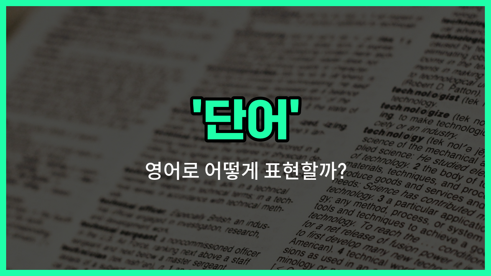

## 🌟 영어 표현 - word

안녕하세요 👋 오늘은 영어에서 '단어'를 어떻게 표현하는지 알아보려고 해요. 바로 '**word**'라는 표현을 사용해요. 'word'는 우리가 글이나 말을 할 때 사용하는 **의미 있는 최소의 언어 단위**를 뜻해요.

예를 들어, 우리가 새로운 언어를 배울 때 가장 먼저 배우는 것이 바로 단어들이에요. 영어에서도 'word'는 일상 대화, 공부, 시험 등 다양한 상황에서 자주 쓰이는 기본적인 표현이에요.

또한, 'word'는 단순히 글자들의 조합이 아니라, **의미를 가진 하나의 단위**라는 점에서 중요해요. 그래서 영어 공부를 할 때 단어를 많이 외우는 것이 실력 향상에 큰 도움이 돼요.

## 📖 예문

1. "이 단어의 뜻이 뭐예요?"

   "What does this word [mean](/blog/in-english/1214.mean/)?"

2. "나는 매일 새로운 단어를 외우고 있어요."

   "I [memorize](/blog/in-english/109.memorize/) new words every day."

## 💬 연습해보기

<ul data-interactive-list>

  <li data-interactive-item>
    어제 영화에서 '세렌디피티'라는 단어를 들었는데, 그게 뭔지 설명해줄 수 있어요?
    Can you explain the word 'serendipity' to me? I heard it in a movie yesterday.
  </li>

  <li data-interactive-item>
    이 감정을 설명할 적절한 단어가 생각이 안 나요.
    I'm struggling to <a href="/blog/in-english/1311.remember/">remember</a> the right word to describe this feeling.
  </li>

  <li data-interactive-item>
    그녀는 책에서 배운 모든 새로운 단어를 적어놨어요.
    She wrote down every new word she learned from the book.
  </li>

  <li data-interactive-item>
    저기, 아까 사용한 그 단어 뭐였죠? 되게 흥미롭게 들렸어요.
    Hey, what's that word you used earlier? It sounded interesting.
  </li>

  <li data-interactive-item>
    영어 수업에서 어려운 단어를 여러 번 연습해봤어요.
    In English class, we <a href="/blog/in-english/247.practice/">practiced</a> pronouncing a tricky word several times.
  </li>

  <li data-interactive-item>
    간판에 적힌 단어가 잘못 철자돼 있어서 혼란스러웠어요.
    The word on the sign was misspelled, so it confused me.
  </li>

  <li data-interactive-item>
    새로운 언어를 배울 때는 각 단어의 의미를 이해하는 게 중요해요.
    When learning a new language, it's <a href="/blog/in-english/318.important/">important</a> to understand the meaning of each word.
  </li>

  <li data-interactive-item>
    이 단어는 익숙해 보이는데, 어디서 들어봤는지 잘 기억이 안 나요.
    This word looks familiar but I can't quite place where I've heard it.
  </li>

  <li data-interactive-item>
    그 단어를 문장에서 사용해줄 수 있어요?
    Could you please use that word in a sentence for me?
  </li>

  <li data-interactive-item>
    저는 매일 새로운 단어 하나씩 배우면서 어휘력을 늘리려 하고 있어요.
    I'm trying to expand my vocabulary by learning one new word every day.
  </li>

</ul>

## 🤝 함께 알아두면 좋은 표현들

### term

'term'은 특정 분야나 주제에서 사용되는 전문적인 '용어'를 의미해요. 일반적인 단어보다 좀 더 공식적이고 학술적인 맥락에서 자주 쓰여요.

- "In biology, the term 'photosynthesis' refers to the [process](/blog/in-english/1140.process/) by which plants make food."
- "생물학에서 '광합성'이라는 용어는 식물이 음식을 만드는 과정을 의미해요."

### phrase

'phrase'는 두 개 이상의 단어가 모여서 하나의 의미를 이루는 '구'를 뜻해요. 단어보다는 길지만 완전한 문장은 아니에요.

- "The phrase 'break a leg' is [used to](/blog/in-english/143.used-to/) wish someone good luck."
- "'break a leg'라는 구는 누군가에게 행운을 빌 때 사용해요."

### silence

'silence'는 '말이 없는 상태' 또는 '침묵'을 의미해요. 'word'의 반대 개념으로, 말이나 단어가 전혀 없는 상황을 나타낼 때 쓰여요.

- "After the shocking news, there was complete silence in the room."
- "충격적인 소식 후에 방 안에는 완전한 침묵이 흘렀어요."

---

오늘은 '단어'라는 뜻을 가진 영어 표현 '**word**'에 대해 알아봤어요. 영어 공부할 때 이 표현을 자주 사용해 보세요 😊

오늘 배운 표현과 예문들을 꼭 소리 내서 여러 번 읽어보세요. 다음에도 더 유익한 영어 표현으로 찾아올게요! 감사합니다!

