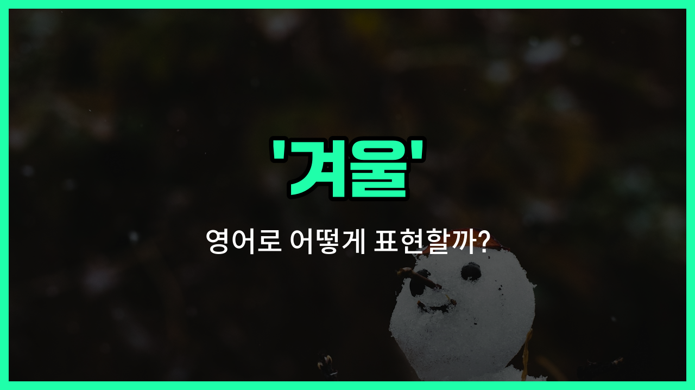

## 🌟 영어 표현 - winter

안녕하세요 👋 오늘은 계절 중 하나인 '**겨울**'을 영어로 어떻게 표현하는지 알아보려고 해요. 바로 '**winter**'라는 단어를 사용해요. 'winter'는 1년 중 가장 추운 계절을 의미해요.

'겨울'은 눈이 내리고, 날씨가 추워지는 시기죠. 영어에서도 'winter'는 이런 **추운 계절**이나 **한겨울**, **동절기**를 표현할 때 자연스럽게 쓰여요!

예를 들어, "나는 겨울에 스키 타는 걸 좋아해요."라고 말하고 싶을 때 "I [like](/blog/in-english/1053.like/) skiing in the winter."라고 할 수 있어요.

또한, '한겨울'처럼 정말 추운 겨울을 강조하고 싶을 때는 'in the middle of winter' 또는 'in the dead of winter'라는 표현도 쓸 수 있어요.

## 📖 예문

1. "겨울에는 눈이 많이 와요."

   "It snows a lot in winter."

2. "나는 겨울에 따뜻한 코코아를 마시는 걸 좋아해요."

   "I like drinking hot cocoa in winter."

3. "한겨울에는 날씨가 정말 추워요."

   "It's really [cold](/blog/in-english/1410.cold/) in the middle of winter."

## 💬 연습해보기

<ul data-interactive-list>

  <li data-interactive-item>
    뉴욕의 겨울은 진짜 추울 수 있어, 그래서 난 항상 가장 따뜻한 코트를 입어요.
    Winter in New York can be really cold, so I always wear my warmest coat.
  </li>

  <li data-interactive-item>
    올해는 겨울에 눈이 많이 와서 진입로를 치워야 했어.
    We had to shovel the driveway because winter brought a lot of snow this <a href="/blog/in-english/1065.year/">year</a>.
  </li>

  <li data-interactive-item>
    겨울에는 따뜻한 초콜릿을 마시며 불 옆에 앉는 걸 정말 좋아해요.
    I love sitting by the fire with a hot chocolate during the winter months.
  </li>

  <li data-interactive-item>
    스키나 스노보드 같은 겨울 스포츠는 여기서 정말 인기 있어요.
    Winter sports like skiing and snowboarding are super popular around here.
  </li>

  <li data-interactive-item>
    매년 겨울, 도시에서는 거리의 아름다운 크리스마스 조명을 장식해요.
    Every winter, the city decorates the streets with beautiful holiday lights.
  </li>

  <li data-interactive-item>
    갓 내린 겨울눈 뒤에 세상이 얼마나 조용해지는지가 정말 신기해요.
    It's amazing how quiet the world gets after a fresh winter snowfall.
  </li>

  <li data-interactive-item>
    길고 어두운 겨울날에는 보통 약간 우울해지곤 해요.
    I usually start feeling a <a href="/blog/in-english/1309.bit/">bit</a> down during the <a href="/blog/in-english/1077.long/">long</a>, dark winter days.
  </li>

  <li data-interactive-item>
    겨울 방학은 나에게 휴식하고 잠을 보충할 수 있는 최고의 시간이야.
    Winter break is the best time for me to relax and catch up on sleep.
  </li>

  <li data-interactive-item>
    여름이 좋나요, 겨울이 좋나요? 사실 난 겨울의 상쾌한 공기를 사랑해요.
    Do you prefer summer or winter? I actually love the crisp air in winter.
  </li>

  <li data-interactive-item>
    겨울 패션은 따뜻하게 지내기 위해 스카프, 모자, 장갑을 겹쳐 입는 거예요.
    Winter fashion <a href="/blog/in-english/1276.means/">means</a> layering up with scarves, hats, and gloves to stay cozy.
  </li>

</ul>

## 🤝 함께 알아두면 좋은 표현들

### cold season

'cold [season](/blog/in-english/1248.season/)'은 "추운 계절"이라는 뜻으로, 겨울과 비슷한 의미를 가지고 있어요. 겨울뿐만 아니라 늦가을부터 초봄까지 추운 시기를 포괄적으로 표현할 때 사용해요.

- "The cold season usually lasts from November to February in this region."
- "이 지역에서는 추운 계절이 보통 11월부터 2월까지 계속돼요."

### summer (여름)

'summer'는 겨울의 반대 계절로, "여름"을 의미해요. 겨울과는 달리 덥고 햇볕이 강한 시기를 나타내며, 계절의 대조를 보여줄 때 자주 사용돼요.

- "I prefer summer because I love going to the beach and swimming."
- "저는 해변에 가서 수영하는 걸 좋아해서 여름을 더 좋아해요."

### frosty days

'frosty days'는 "서리가 내리는 추운 날들"이라는 뜻으로, 겨울의 특징적인 날씨를 묘사할 때 쓰여요. 겨울의 차갑고 맑은 아침을 표현할 때 자주 사용돼요.

- "Frosty days make the mornings feel crisp and fresh."
- "서리가 내리는 추운 날들은 아침을 상쾌하고 신선하게 느끼게 해줘요."

---

오늘은 '**겨울**'이라는 뜻을 가진 영어 표현 '**winter**'에 대해 알아봤어요. 계절을 이야기할 때나, 추운 날씨를 묘사할 때 이 단어를 꼭 활용해 보세요! 😊

오늘 배운 표현과 예문들을 꼭 최소 3번씩 소리 내서 읽어보세요. 다음에도 더 재미있고 유익한 영어 표현으로 찾아올게요! 감사합니다!

