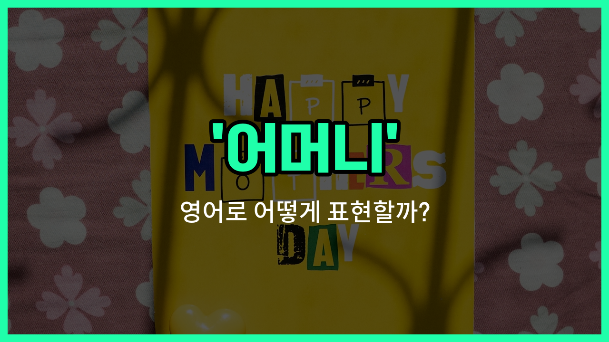

## 🌟 영어 표현 - mother

안녕하세요 👋 오늘은 가족을 이야기할 때 꼭 필요한 단어, 바로 '**어머니**'의 영어 표현에 대해 알아보려고 해요.

'**mother**'는 '어머니', '엄마', '모친'을 모두 아우르는 가장 기본적이고 격식 있는 영어 단어예요. 주로 공식적인 자리나 글에서 많이 사용돼요. 일상 대화에서는 'mom', 'mum' 등 조금 더 친근한 표현도 있지만, 오늘은 'mother'에 집중해볼게요!

'**mother**'는 가족관계를 설명할 때, 또는 누군가의 어머니를 존중해서 부를 때 자주 쓰여요. 예를 들어, "My mother is a teacher."라고 하면 "우리 어머니는 선생님이세요."라는 뜻이에요.

또한, 'mother'는 명사로만 쓰이기 때문에, 문장에서 주어, 목적어 등 다양한 역할로 활용할 수 있어요.

## 📖 예문

1. "저는 어머니를 정말 존경해요."

   "I really respect my mother."

2. "어머니께서 맛있는 저녁을 준비해주셨어요."

   "My mother prepared a delicious dinner."

## 💬 연습해보기

<ul data-interactive-list>

  <li data-interactive-item>
    엄마는 내가 기분이 안 좋을 때 항상 나를 기분 좋게 해주셔요.
    My mother always knows how to cheer me up when I'm feeling down.
  </li>

  <li data-interactive-item>
    어제 좋은 소식 전하려고 엄마한테 전화했어요.
    I called my mother yesterday to <a href="/blog/in-english/1270.tell/">tell</a> her the good news about my job.
  </li>

  <li data-interactive-item>
    어렸을 때, 엄마는 일요일 아침마다 정말 맛있는 팬케이크를 만들어주셨어요.
    When I was a kid, my mother <a href="/blog/in-english/143.used-to/">used to</a> make the best pancakes on Sunday mornings.
  </li>

  <li data-interactive-item>
    엄마는 내 인생에서 가장 큰 응원자셔요.
    My mother has been my biggest supporter throughout my entire life.
  </li>

  <li data-interactive-item>
    이번 주말에 엄마 집에 가서 청소 도와드릴 거예요.
    I'm visiting my mother this weekend to <a href="/blog/in-english/1084.help/">help</a> her <a href="/blog/in-english/523.clean/">clean</a> the <a href="/blog/in-english/1088.house/">house</a>.
  </li>

  <li data-interactive-item>
    아플 때마다 엄마는 내가 나을 때까지 보살펴 주셔요.
    Whenever I'm sick, my mother takes care of me until I feel better.
  </li>

  <li data-interactive-item>
    엄마는 내가 일곱 살 때 자전거 타는 법을 가르쳐 주셨어요.
    My mother taught me how to ride a bike when I was seven years old.
  </li>

  <li data-interactive-item>
    휴일에는 엄마가 우리 모두를 위해 푸짐한 가족 저녁을 차려 주셔요.
    During the holidays, my mother cooks a huge family dinner for all of us.
  </li>

  <li data-interactive-item>
    대학 지원에 관해 엄마한테 조언을 구했어요.
    I <a href="/blog/in-english/1394.asked/">asked</a> my mother for advice about applying to college.
  </li>

  <li data-interactive-item>
    그녀는 엄마와 똑같이 생겼는데, 같은 미소와 웃음이 있어요.
    She looks just <a href="/blog/in-english/1053.like/">like</a> her mother, with the same smile and laugh.
  </li>

</ul>

## 🤝 함께 알아두면 좋은 표현들

### mom (엄마)

'mom'은 'mother'의 친근한 표현으로, 가족이나 가까운 사이에서 주로 사용해요. 좀 더 일상적이고 따뜻한 느낌을 줘요.

- "I called my mom to tell her the good news."
- "나는 좋은 소식을 전하려고 엄마에게 전화했어요."

### stepmother (계모)

'stepmother'는 '어머니'의 반대 개념 중 하나로, 친어머니가 아닌 아버지의 재혼한 아내를 의미해요. 가족 관계에서 구분할 때 쓰여요.

- "His stepmother was very kind to him."
- "그의 계모는 그에게 매우 친절했어요."

### father (아버지)

'father'는 'mother'의 반대 개념으로, 가족에서 남성 부모를 뜻해요. 부모님을 구분할 때 자주 사용돼요.

- "My father taught me how to ride a bike."
- "아버지가 나에게 자전거 타는 법을 가르쳐 주셨어요."

---

오늘은 '어머니', '엄마', '모친'이라는 뜻을 가진 영어 표현 '**mother**'에 대해 알아봤어요. 가족을 소개하거나 어머니에 대해 이야기할 때 꼭 기억해두면 좋겠어요 😊

오늘 배운 표현과 예문들을 꼭 소리 내서 여러 번 읽어보세요. 다음에도 더 유익한 영어 표현으로 찾아올게요! 감사합니다!

