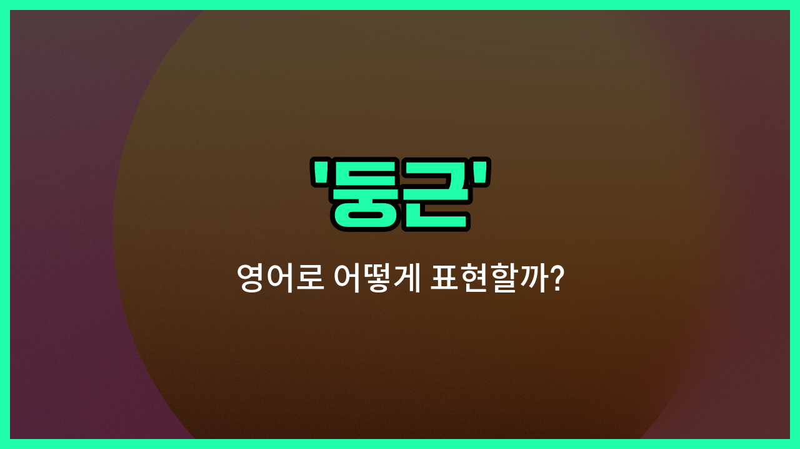

## 🌟 영어 표현 - round

안녕하세요 👋 오늘은 우리가 자주 쓰는 단어인 '**둥근**'을 영어로 어떻게 표현하는지 알아볼 거예요. 바로 '**round**'라는 단어인데요. 이 단어는 모양이 **원처럼 둥글거나 곡선이 있는 것**을 나타낼 때 사용해요.

'round'는 형용사로 '둥근', '원형의'라는 뜻이 있고, 동사로는 '둥글게 하다'라는 의미도 있어요. 그래서 공, 접시, 얼굴 등 둥근 모양을 가진 사물이나 사람을 묘사할 때 자주 쓰여요.

예를 들어, 농구공이나 지구처럼 완전히 둥근 물체를 말할 때 "The Earth is round."라고 할 수 있어요. 또, 누군가의 얼굴이 둥글 때 "She has a round [face](/blog/in-english/1252.face/)."라고 표현할 수 있답니다.

## 📖 예문

1. "이 테이블은 둥근 모양이에요."

   "This table is round."

2. "아기의 볼이 정말 둥글고 귀여워요."

   "The baby's cheeks are really round and cute."

## 💬 연습해보기

<ul data-interactive-list>

  <li data-interactive-item>
    벽에 걸린 시계는 동그랗고 방 안에서 보기 편해요.
    The clock on the wall is round and easy to read from across the room.
  </li>

  <li data-interactive-item>
    주방에 동그란 테이블을 샀어요. 네모난 것보다 공간에 더 잘 어울리더라구요.
    I picked up a round table for the kitchen; it fits <a href="/blog/in-english/1082.better/">better</a> in the space than a square one.
  </li>

  <li data-interactive-item>
    우리는 동그란 캠프파이어 주위에 앉아 밤늦도록 이야기했어요.
    We sat around a round campfire <a href="/blog/in-english/1270.tell/">telling</a> <a href="/blog/in-english/537.story/">stories</a> late into the night.
  </li>

  <li data-interactive-item>
    이 접시는 가장자리에 예쁜 꽃무늬가 있는 동그란 모양이에요.
    This plate has a round shape with a pretty floral design around the edge.
  </li>

  <li data-interactive-item>
    그녀는 반죽을 동그란 공처럼 굴린 다음, 피자를 만들기 위해 눌렀어요.
    She rolled the dough into a round ball before flattening it out for the pizza.
  </li>

  <li data-interactive-item>
    아이들이 뒷마당에서 동그란 공으로 캐ッチ 게임을 했어요.
    The kids played catch with a round ball in the backyard.
  </li>

  <li data-interactive-item>
    샌드위치를 삼각형 대신 동그란 조각으로 잘라줄 수 있어요?
    Can you cut the sandwich into round slices instead of triangles?
  </li>

  <li data-interactive-item>
    공원에 앉을 수 있는 동그란 벤치가 있어서 정말 좋아요.
    I <a href="/blog/in-english/1074.love/">love</a> how the park has those round <a href="/blog/in-english/1164.bench/">benches</a> that you can sit on from any side.
  </li>

  <li data-interactive-item>
    달은 맑은 밤하늘에서 아주 동그랗고 밝게 빛났어요.
    The moon looked perfectly round and bright in the clear night sky.
  </li>

  <li data-interactive-item>
    그는 독특한 모양을 주는 동그란 안경을 썼어요.
    He wore a pair of round glasses that gave him a quirky look.
  </li>

</ul>

## 🤝 함께 알아두면 좋은 표현들

### circular

'circular'은 '둥근'과 비슷한 의미로, 완전한 원 모양을 나타내요. 주로 도형이나 물체가 원형일 때 사용해요.

- "The table has a circular top that fits well in the small room."
- "그 탁자는 작은 방에 잘 어울리는 둥근 상판을 가지고 있어요."

### square

'square'는 '네모난'이라는 뜻으로, '둥근'의 반대말이에요. 네 개의 직각을 가진 모양을 나타낼 때 쓰여요.

- "She prefers square plates over round ones for serving [food](/blog/in-english/1308.food/)."
- "그녀는 음식을 담을 때 둥근 접시보다 네모난 접시를 더 좋아해요."

### oval

'oval'은 '타원형의'라는 뜻으로, 둥글지만 완전한 원이 아닌 길쭉한 원형을 나타내요. 둥근 모양의 변형으로 볼 수 있어요.

- "The mirror in the hallway is oval-shaped and adds elegance to the space."
- "복도의 거울은 타원형으로 공간에 우아함을 더해줘요."

---

오늘은 '둥근', '원형의', '둥글게 하다'라는 뜻을 가진 영어 표현 'round'에 대해 알아봤어요. 일상에서 둥근 모양을 설명할 때 이 단어를 떠올려 보세요 😊

오늘 배운 표현과 예문들을 꼭 소리 내서 여러 번 읽어보세요. 다음에도 더 재미있고 유익한 영어 표현으로 찾아올게요! 감사합니다!

