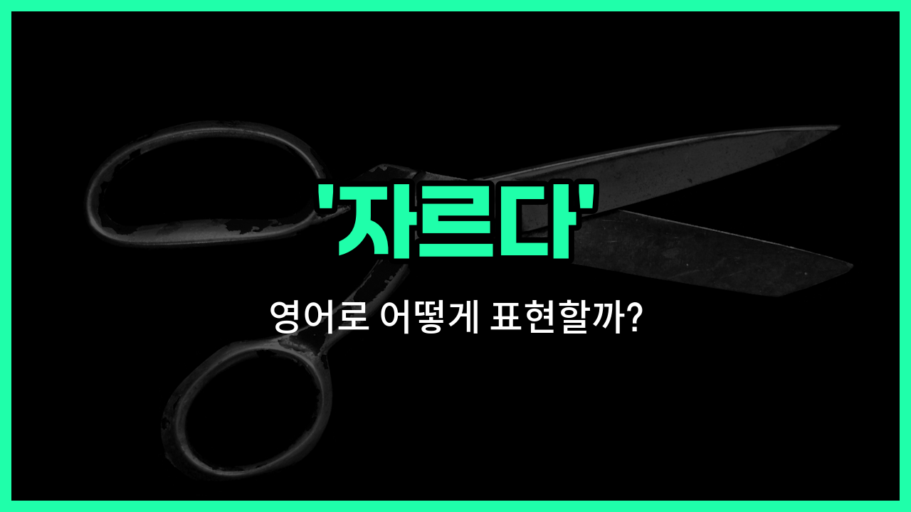

## 🌟 영어 표현 - cut

안녕하세요 👋 오늘은 일상에서 정말 자주 쓰이는 영어 표현인 '**cut**'에 대해 알아보려고 해요. '자르다', '절단하다', '베다'와 같은 의미를 가진 단어인데요, 다양한 상황에서 활용할 수 있어서 꼭 알아두면 좋은 표현이에요.

'**cut**'는 칼, 가위, 톱 등 도구를 사용해서 무언가를 두 부분 이상으로 나누거나, 끊는 행위를 말해요. 예를 들어 종이를 가위로 자르거나, 머리카락을 자를 때 모두 'cut'이라는 단어를 쓸 수 있어요.

또한, 'cut'은 물리적으로 자르는 것뿐만 아니라, 예산을 줄이거나(예: cut the budget), 줄을 서 있는 사람들 사이를 가로지르는(예: [cut in line](/blog/in-english/076.cut-in-line/)) 등 다양한 의미로도 사용돼요.

## 📖 예문

1. "나는 종이를 가위로 잘랐어요."

   "I cut the paper with scissors."

2. "그녀는 머리카락을 짧게 잘랐어요."

   "She cut her hair short."

3. "예산이 20% 줄었어요."

   "The budget was cut by 20%."

## 💬 연습해보기

<ul data-interactive-list>

  <li data-interactive-item>
    그 프로젝트를 위해 종이를 더 작은 조각으로 잘라 달라고 했어요.
    I <a href="/blog/in-english/1394.asked/">asked</a> him to cut the paper into smaller pieces for the project.
  </li>

  <li data-interactive-item>
    그녀는 건강을 유지하기 위해 보통 두 달에 한 번 머리를 잘라요.
    She usually cuts her hair once every two months to keep it healthy.
  </li>

  <li data-interactive-item>
    이번 달에는 돈을 아끼기 위해 지출을 줄여야 해요.
    We need to cut down on expenses this month to <a href="/blog/in-english/293.save/">save</a> some money.
  </li>

  <li data-interactive-item>
    모두를 위해 케이크를 똑같이 잘라줄 수 있어요?
    Can you cut the cake into equal slices for everyone?
  </li>

  <li data-interactive-item>
    어제 채소를 썰다가 실수로 손가락을 베였어요.
    He <a href="/blog/in-english/314.accidentally/">accidentally</a> cut his finger while chopping vegetables yesterday.
  </li>

  <li data-interactive-item>
    편집자가 영화의 길이를 줄이기 위해 몇몇 장면을 삭제하기로 했어요.
    The editor decided to cut several scenes from the movie to shorten its length.
  </li>

  <li data-interactive-item>
    나를 방해하고 있는 그 나쁜 습관과는 단절하고 싶어요.
    I <a href="/blog/in-english/1060.want/">want</a> to cut ties with that old habit that's been holding me back.
  </li>

  <li data-interactive-item>
    회사의 손실 때문에 예산을 10% 줄여야 했어요.
    They had to cut the budget by 10% because of the company's losses.
  </li>

  <li data-interactive-item>
    그녀는 흥미로운 기사를 잘라서 게시판에 붙였어요.
    She cut out the article she <a href="/blog/in-english/1083.find/">found</a> interesting and pinned it on the bulletin board.
  </li>

  <li data-interactive-item>
    세일 때는 좋은 딜을 빨리 잡기 위해 줄을 뚫고 들어갈 것 같아요.
    During the sale, I'll probably cut in line if it <a href="/blog/in-english/1276.means/">means</a> grabbing the best deal quickly.
  </li>

</ul>

## 🤝 함께 알아두면 좋은 표현들

### slice (얇게 자르다)

'slice'는 음식을 얇고 평평한 조각으로 자르는 것을 의미해요. 주로 빵, 고기, 과일 등을 일정한 두께로 자를 때 사용해요.

- "She sliced the bread before making sandwiches."
- "그녀는 샌드위치를 만들기 전에 빵을 얇게 잘랐어요."

### chop (잘게 썰다)

'chop'은 재료를 작고 거칠게 여러 조각으로 자르는 것을 뜻해요. 주로 요리할 때 야채나 고기를 잘게 썰 때 많이 쓰여요.

- "He chopped the onions for the stew."
- "그는 스튜를 위해 양파를 잘게 썰었어요."

### join (잇다, 연결하다)

'join'은 두 개 이상의 것을 연결하거나 붙이는 것을 의미해요. 'cut'의 반대 개념으로, 자른 것을 다시 붙이거나 연결할 때 사용해요.

- "They joined the broken pieces of the vase carefully."
- "그들은 깨진 꽃병 조각들을 조심스럽게 이어 붙였어요."

---

오늘은 '자르다', '절단하다', '베다'라는 뜻을 가진 영어 표현 '**cut**'에 대해 알아봤어요. 일상에서 무언가를 자를 때 이 표현을 자연스럽게 사용해보세요 😊

오늘 배운 표현과 예문들을 꼭 최소 3번씩 소리 내서 읽어보세요. 다음에도 더 재미있고 유익한 영어 표현으로 찾아올게요! 감사합니다!

