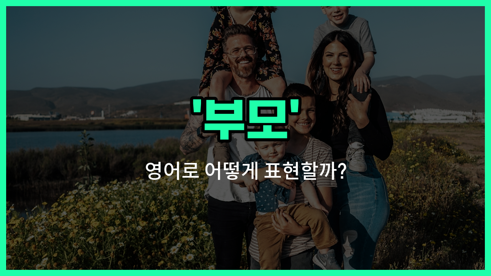

## 🌟 영어 표현 - parent

안녕하세요 👋 오늘은 '부모'라는 뜻을 가진 영어 표현을 소개해드릴게요

바로 '**parent**'라는 단어인데요 'parent'는 아버지(father)나 어머니([mother](/blog/in-english/1423.mother/))를 모두 포함하는 말로, **자녀를 돌보고 양육하는 사람**을 의미해요

일상 대화나 공식 문서, 학교 안내문 등에서 정말 자주 볼 수 있는 단어예요 예를 들어, 학교에서 "학부모님께"라는 안내문을 영어로 쓸 때 "Dear Parents"라고 시작하곤 해요

또한, 'parent'는 단수형(부모 한 명), 복수형 'parents'(부모님, 양친) 모두 자주 쓰이니 상황에 맞게 활용해보세요

## 📖 예문

1. "저는 부모님과 함께 살고 있어요."

   "I live with my parents."

2. "부모로서 아이를 키우는 것은 쉽지 않아요."

   "Being a parent is not easy."

## 💬 연습해보기

<ul data-interactive-list>

  <li data-interactive-item>
    부모님은 어떤 일이 있어도 항상 나를 지지해 주셔요.
    My parents always support me no matter what happens.
  </li>

  <li data-interactive-item>
    부모님은 자녀가 제 시간에 집에 돌아오지 않으면 많이 걱정해요.
    Parents usually worry a lot when their kids don't come home <a href="/blog/vocab-1/043.on-time/">on time</a>.
  </li>

  <li data-interactive-item>
    그녀는 부모님께 안전하게 도착했다고 전화했어요.
    She called her parents to let them know she <a href="/blog/in-english/403.arrive/">arrived</a> safely.
  </li>

  <li data-interactive-item>
    부모가 되는 것은 힘들지만 정말 보람이 있어요.
    Being a parent is tough but incredibly rewarding.
  </li>

  <li data-interactive-item>
    부모님은 나에게 다른 사람에게 존경과 친절을 베푸는 방법을 가르쳐 주셨어요.
    My parents taught me how to be respectful and kind to others.
  </li>

  <li data-interactive-item>
    부모님은 보통 일과 가정 사이에서 균형을 맞추어야 해요.
    Parents often have to juggle <a href="/blog/in-english/1064.work/">work</a> and family life at the same time.
  </li>

  <li data-interactive-item>
    궁금한 점이 있으면 부모님께 조언을 구하는 게 좋아요.
    If you have any questions, you should ask your parents for advice.
  </li>

  <li data-interactive-item>
    부모님도 가끔은 휴식이 필요하니까 너무 힘들게 하지는 마세요.
    Parents sometimes need a break too, so don't be too hard on them.
  </li>

  <li data-interactive-item>
    파티에서 친구 부모님 몇 분을 만나봤는데, 정말 친절하셨던 것 같아요.
    At the party, I met a few of my friend's parents and they seemed really nice.
  </li>

  <li data-interactive-item>
    부모는 아이의 가치관과 성격을 형성하는 데 큰 역할을 해요.
    Parents play a big role in shaping a child's values and character.
  </li>

</ul>

## 🤝 함께 알아두면 좋은 표현들

### guardian

'guardian'은 "보호자" 또는 "후견인"을 의미해요. 부모와 비슷하게 아이를 돌보고 책임지는 사람을 가리키지만, 법적으로 부모가 아닐 수도 있어요.

- "The child's legal guardian [took](/blog/in-english/1237.took/) responsibility for his education."
- "그 아이의 법적 보호자가 그의 교육에 대한 책임을 졌어요."

### childless

'childless'는 "자녀가 없는" 상태를 뜻해요. 부모와는 반대되는 의미로, 아이가 없는 사람이나 부부를 나타낼 때 사용해요.

- "They have been married for years but [remain](/blog/in-english/1026.remain/) childless."
- "그들은 결혼한 지 여러 해가 되었지만 자녀가 없어요."

### caregiver

'caregiver'는 "돌보는 사람"이라는 뜻으로, 부모뿐만 아니라 노인이나 병든 사람을 돌보는 사람도 포함해요. 부모와 비슷한 역할을 하지만 더 넓은 의미를 가지고 있어요.

- "The caregiver [helped](/blog/in-english/1084.help/) the elderly woman with her daily tasks."
- "돌보는 사람이 그 노인 여성의 일상 업무를 도와줬어요."

---

오늘은 '부모', '어버이', '보호자'라는 뜻을 가진 영어 표현 '**parent**'에 대해 알아봤어요

가족이나 보호자에 대해 이야기할 때 이 표현을 꼭 기억해두면 좋겠어요 😊

오늘 배운 표현과 예문들을 꼭 소리 내서 여러 번 읽어보세요 다음에도 더 유익한 영어 표현으로 찾아올게요! 감사합니다

