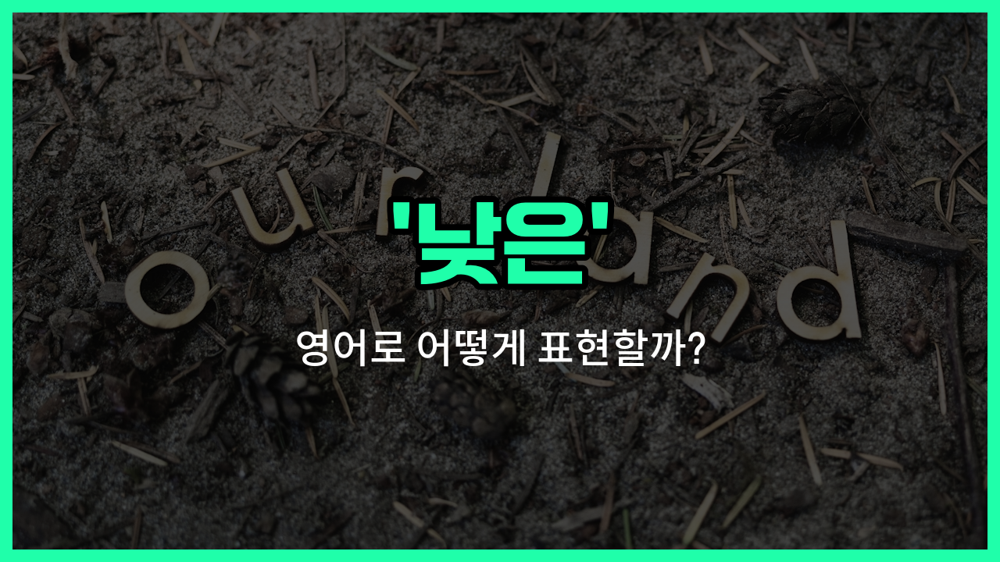

## 🌟 영어 표현 - low

안녕하세요 👋 오늘은 영어로 '낮은'이라는 뜻을 가진 표현, '**low**'에 대해 알아보려고 해요.

'**low**'는 무언가의 높이나 수준, 양, 강도 등이 '낮다', '적다', '약하다'는 의미로 자주 사용돼요. 예를 들어, 건물의 층수가 낮거나, 점수가 낮거나, 소리가 약할 때 모두 쓸 수 있는 아주 유용한 단어예요!

일상 대화뿐만 아니라 시험, 업무, 뉴스 등 다양한 상황에서 자연스럽게 쓰이니 꼭 알아두면 좋아요.

예를 들어, "오늘 기온이 낮아요."라고 할 때 "The temperature is low today."라고 표현할 수 있어요.

또는, "그 회사의 판매량이 낮아요."라고 하면 "The [company](/blog/in-english/1111.company/)'s sales are low."라고 말할 수 있답니다.

## 📖 예문

1. "그 학생의 점수가 낮아요."

   "The student's score is low."

2. "이 방의 천장이 낮아요."

   "The ceiling in this room is low."

3. "요즘 에너지가 낮아요."

   "My energy is low these days."

## 💬 연습해보기

<ul data-interactive-list>

  <li data-interactive-item>
    오늘 이 시기에는 온도가 정말 낮아요. 나가려고 할 때 자켓을 챙겨야 했어요.
    The temperature today is really low for this time of year. I had to grab a jacket before heading out.
  </li>

  <li data-interactive-item>
    그녀는 그 영화에 대한 평가가 좋지 않아서 아무한테도 추천하지 않았어요.
    She has a low opinion of the movie, so she didn't recommend it to anyone.
  </li>

  <li data-interactive-item>
    내 핸드폰 배터리가 거의 다 됐더라고요. 빨리 충전해야 해요.
    I noticed the battery on my <a href="/blog/in-english/1408.phone/">phone</a> is running low; I need to charge it soon.
  </li>

  <li data-interactive-item>
    회사의 지난 분기 수익이 생각보다 낮았어요. 판매는 괜찮았는데 말이죠.
    The company's profits were surprisingly low last quarter despite good sales.
  </li>

  <li data-interactive-item>
    그는 아무도 들리지 않게 낮은 목소리로 이야기했어요.
    He spoke in a low voice so that no one else could hear their conversation.
  </li>

  <li data-interactive-item>
    시험 공부로 늦게까지 깨어 있었더니 에너지가 많이 떨어졌어요.
    My energy was low after staying up late studying for the exam.
  </li>

  <li data-interactive-item>
    오늘 비 올 확률이 낮아서 아마 야외에서 소풍할 수 있을 거예요.
    There's a low chance of <a href="/blog/in-english/1432.rain/">rain</a> today, so we can probably have the picnic outside.
  </li>

  <li data-interactive-item>
    선반이 아이들이 쉽게 닿기에는 너무 낮게 설치됐어요.
    The shelf is set too low for the kids to reach easily.
  </li>

  <li data-interactive-item>
    안 좋은 소식을 듣고 기분이 많이 저조했어요.
    I felt my mood was pretty low after hearing the <a href="/blog/in-english/1255.bad/">bad</a> news.
  </li>

  <li data-interactive-item>
    TV 소리가 너무 낮아서 잘 들으려고 소리를 올려야 했어요.
    The sound on the TV was too low, so I had to <a href="/blog/in-english/1348.turn/">turn</a> it up to hear clearly.
  </li>

</ul>

## 🤝 함께 알아두면 좋은 표현들

### decrease (감소하다)

'decrease'는 '감소하다' 또는 '줄어들다'라는 뜻으로, 어떤 수치나 양이 낮아지는 상태를 나타내요. 'low'와 비슷하게 양이나 수준이 줄어드는 상황에서 자주 사용돼요.

- "The temperature tends to decrease at night during [winter](/blog/in-english/1421.winter/)."
- "겨울에는 밤에 기온이 낮아지는 경향이 있어요."

### high (높은)

'high'는 '높은'이라는 뜻으로, 'low'의 반대말이에요. 어떤 수치나 수준이 크거나 높은 상태를 나타낼 때 사용돼요.

- "The mountain is so high that it is covered with snow all year round."
- "그 산은 너무 높아서 일년 내내 눈으로 덮여 있어요."

### reduce (줄이다)

'reduce'는 '줄이다'라는 뜻으로, 어떤 양이나 수준을 낮추는 행위를 나타내요. 'low'와 관련된 동작을 표현할 때 자주 쓰여요.

- "We need to reduce our energy consumption to [save](/blog/in-english/293.save/) the environment."
- "우리는 환경을 보호하기 위해 에너지 소비를 줄여야 해요."

---

오늘은 '낮은', '적은', '약한'이라는 뜻을 가진 영어 표현 '**low**'에 대해 알아봤어요. 다양한 상황에서 쓸 수 있으니 꼭 기억해두세요!

오늘 배운 표현과 예문들을 소리 내서 여러 번 읽어보면 더 쉽게 익힐 수 있어요. 다음에도 더 유익한 영어 표현으로 찾아올게요! 감사합니다!

