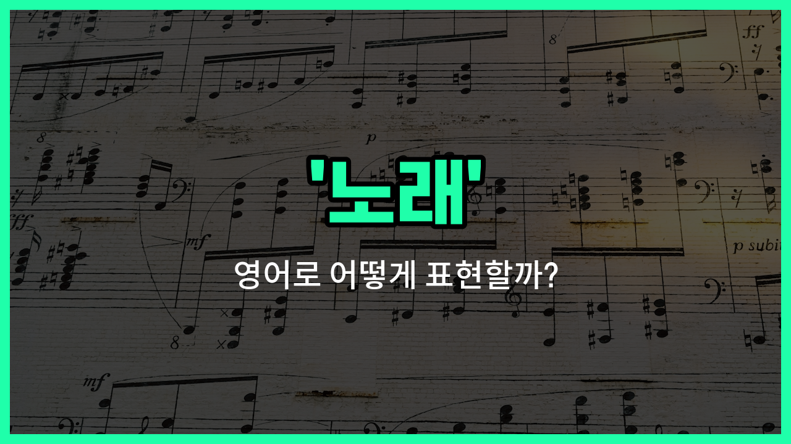

## 🌟 영어 표현 - song

안녕하세요 👋 오늘은 우리가 일상에서 자주 쓰는 단어인 '**노래**'를 영어로 어떻게 표현하는지 알아보려고 해요. 바로 '**song**'이라는 단어가 있어요.

'**song**'은 음악적으로 멜로디와 가사가 있는 곡을 의미해요. 우리가 부르는 가요, 팝송, 동요 등 모두 'song'이라고 할 수 있어요. 즉, **누군가가 부르는 음악 작품**을 말할 때 자연스럽게 쓸 수 있는 단어예요!

예를 들어, 좋아하는 가수의 신곡이 나왔을 때 "I love this new song!"이라고 말할 수 있어요. 또는 친구와 노래방에 가서 "Let's sing a song together!"라고 할 수도 있죠.

'**song**'은 명사로만 쓰이며, '곡', '가요'와 같은 의미로도 자주 사용돼요. 음악을 이야기할 때 꼭 필요한 단어이니 기억해 두면 좋아요!

## 📖 예문

1. "이 노래 정말 좋아요."

   "I really [like](/blog/in-english/1053.like/) this song."

2. "그는 자신의 첫 번째 곡을 발표했어요."

   "He released his first song."

## 💬 연습해보기

<ul data-interactive-list>

  <li data-interactive-item>
    오늘 아침에 라디오에서 정말 좋은 노래 들었는데, 머리에서 안 떨어져요.
    I heard a great song on the radio this morning, and I can't get it out of my <a href="/blog/in-english/1211.head/">head</a>.
  </li>

  <li data-interactive-item>
    그녀는 기분이 좋을 때 항상 좋아하는 노래를 부르거든요.
    She always sings her favorite song when she's feeling <a href="/blog/in-english/1322.happy/">happy</a>.
  </li>

  <li data-interactive-item>
    어젯밤에 쓴 노래 듣고 싶어?
    Do you <a href="/blog/in-english/1060.want/">want</a> to hear a song I wrote last night?
  </li>

  <li data-interactive-item>
    이 노래는 가족과 함께한 여름 휴가를 생각나게 해요.
    This song reminds me of summer vacations with my family.
  </li>

  <li data-interactive-item>
    모든 학교 집회는 국가 노래로 시작해요.
    Every <a href="/blog/in-english/1090.school/">school</a> assembly starts with the national song.
  </li>

  <li data-interactive-item>
    그가 캠프파이어에서 기타로 멋진 노래를 연주했어요.
    He played a beautiful song on his guitar at the campfire.
  </li>

  <li data-interactive-item>
    그 노래는 하루종일 머리에서 떠나질 않았어요; 진짜 매력적이에요!
    That song was stuck in my head all day; it's so catchy!
  </li>

  <li data-interactive-item>
    기분 전환할 때 자주 듣는 노래는 뭐예요?
    What's your go-to song when you need to boost your mood?
  </li>

  <li data-interactive-item>
    우린 저녁 내내 80년대의 옛 노래를 들으면서 보냈어요.
    We spent the evening listening to old songs from the '80s.
  </li>

  <li data-interactive-item>
    노래방 기계에는 다양한 노래가 가득하니까, 좋아하는 노래 골라봐요.
    The karaoke machine is loaded with all kinds of songs, so pick your favorite one.
  </li>

</ul>

## 🤝 함께 알아두면 좋은 표현들

### melody

'melody'는 '멜로디' 또는 '선율'을 의미해요. 노래의 주요한 음의 흐름이나 음악적 라인을 가리키며, 노래의 감정과 분위기를 전달하는 데 중요한 역할을 해요.

- "The melody of this song is very catchy and easy to [remember](/blog/in-english/1311.remember/)."
- "이 노래의 멜로디는 매우 귀에 쏙쏙 들어오고 기억하기 쉬워요."

### instrumental

'instrumental'은 '기악곡' 또는 '악기 연주곡'을 뜻해요. 노래와 달리 가사가 없고 오직 악기 소리만으로 이루어진 음악을 말해요. 노래의 반대 개념으로 볼 수 있어요.

- "I prefer listening to instrumental music when I study because it [helps](/blog/in-english/1084.help/) me concentrate."
- "저는 공부할 때 집중하는 데 도움이 되어서 기악곡을 듣는 것을 선호해요."

### ballad

'ballad'는 '발라드'라는 뜻으로, 감성적이고 서정적인 노래를 의미해요. 주로 느리고 부드러운 멜로디와 감정을 담은 가사가 특징이에요.

- "She sang a beautiful ballad that moved everyone to tears."
- "그녀는 모두를 눈물짓게 한 아름다운 발라드를 불렀어요."

---

오늘은 '**노래**', '**곡**', '**가요**'라는 뜻을 가진 영어 표현 '**song**'에 대해 알아봤어요. 음악을 좋아한다면 이 단어를 자주 쓰게 될 거예요 😊

오늘 배운 표현과 예문들을 꼭 최소 3번씩 소리 내서 읽어보세요. 다음에도 더 재미있고 유익한 영어 표현으로 찾아올게요! 감사합니다!

