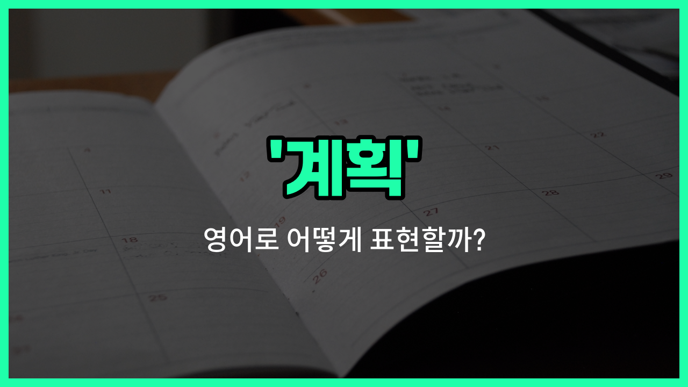

## 🌟 영어 표현 - plan

안녕하세요 👋 오늘은 우리가 자주 쓰는 단어인 '**계획**'의 영어 표현 '**plan**'에 대해 알아보려고 해요.

'**plan**'은 어떤 일을 미리 생각하고 준비하는 것을 의미해요. 즉, 앞으로 할 일이나 목표를 정하고, 그에 맞게 미리 준비하는 상황에서 자주 쓰이는 단어예요!

이 단어는 일상생활, 학교, 회사 등 다양한 상황에서 자연스럽게 사용할 수 있어요. 예를 들어, 친구와 주말에 무엇을 할지 미리 정할 때 "Let's make a plan for the weekend."라고 할 수 있어요.

또는, 회사에서 프로젝트를 시작하기 전에 "We need a detailed plan before we start."라고 말하면 "우리는 시작하기 전에 자세한 계획이 필요해요."라는 의미예요.

'**plan**'은 명사로 '계획', '설계', '예정'이라는 뜻으로 쓰이고, 동사로는 '계획하다'라는 의미로도 활용할 수 있어요. 상황에 맞게 다양하게 써보세요!

## 📖 예문

1. "내일 여행 계획이 있어요."

   "I have plans for a trip tomorrow."

2. "우리는 새로운 프로젝트를 위한 계획을 세우고 있어요."

   "We are making a plan for the new project."

## 💬 연습해보기

<ul data-interactive-list>

  <li data-interactive-item>
    주말 여행을 계획 중인데 어디로 가야 할지 아직 결정을 못 했어.
    We're <a href="/blog/in-english/1265.try/">trying</a> to plan our weekend getaway but can't decide where to go yet.
  </li>

  <li data-interactive-item>
    이번 주 식단을 계획해야 하는데, 계속 외식하는 건 피하고 싶어.
    I need to plan my meals for the week so I don't eat out all the time.
  </li>

  <li data-interactive-item>
    그녀의 생일에 서프라이즈 파티를 계획해 보자. 정말 재밌을 거야.
    Let's plan a surprise party for her birthday. It'll be so much fun.
  </li>

  <li data-interactive-item>
    다음 달 시험을 대비해서 공부 계획을 세우고 있어.
    I'm trying to plan my study schedule for the exams coming up next month.
  </li>

  <li data-interactive-item>
    연휴 쇼핑의 혼잡을 피하려면 미리 계획해야 해.
    We should plan ahead if we <a href="/blog/in-english/1060.want/">want</a> to avoid the holiday rush at the stores.
  </li>

  <li data-interactive-item>
    다음 주부터 새로운 운동 루틴을 시작할 예정이야. 좀 더 몸이 좋아지려고.
    I'm planning to start a new workout routine next week to get in better shape.
  </li>

  <li data-interactive-item>
    여름에 일을 쉬는 동안 주방을 리모델링할 계획이래.
    They plan to renovate the kitchen this summer when they're off <a href="/blog/in-english/1064.work/">work</a>.
  </li>

  <li data-interactive-item>
    졸업 후에 뭐 할지 계획해 봤어?
    Have you planned what you're going to do after graduation?
  </li>

  <li data-interactive-item>
    행사가 원활하게 진행될 수 있도록 세심하게 계획해야 돼.
    We need to plan the event carefully to make sure everything runs smoothly.
  </li>

  <li data-interactive-item>
    오래 한 자리를 비웠던 그녀가 연휴에는 가족들을 만나러 갈 예정이야.
    She plans to visit her family during the holidays after being away for so <a href="/blog/in-english/1077.long/">long</a>.
  </li>

</ul>

## 🤝 함께 알아두면 좋은 표현들

### strategy

'strategy'는 '전략' 또는 '계획'이라는 뜻으로, 목표를 달성하기 위해 체계적이고 장기적인 계획을 세우는 것을 의미해요. 보통 비즈니스나 게임, 군사 등에서 사용되며, 구체적인 실행 방안을 포함하는 경우가 많아요.

- "The [company](/blog/in-english/1111.company/) developed a new marketing strategy to increase sales."
- "그 회사는 매출을 늘리기 위해 새로운 마케팅 전략을 세웠어요."

### improvisation

'improvisation'은 '즉흥적으로 처리하기' 또는 '즉석에서 대처하기'라는 뜻으로, 미리 계획하지 않고 상황에 맞게 즉시 대응하는 것을 의미해요. 계획과는 반대되는 개념으로, 예기치 않은 상황에서 유연하게 행동할 때 사용해요.

- "When the [power](/blog/in-english/1097.power/) went out, the team had to [rely on](/blog/in-english/113.rely-on/) improvisation to finish the project."
- "정전이 되었을 때, 팀은 프로젝트를 끝내기 위해 즉흥적으로 대처해야 했어요."

### blueprint

'blueprint'는 '청사진'이라는 뜻으로, 건축이나 프로젝트 등에서 상세하고 구체적인 계획이나 설계를 의미해요. 단순한 계획보다 더 정밀하고 체계적인 계획을 나타낼 때 사용해요.

- "The architect presented the blueprint for the new building to the clients."
- "건축가는 고객들에게 새 건물의 청사진을 제시했어요."

---

오늘은 '**계획**'이라는 뜻을 가진 영어 표현 '**plan**'에 대해 알아봤어요. 앞으로 목표를 세우거나 준비할 일이 있을 때 이 표현을 떠올려보면 좋겠어요 😊

오늘 배운 표현과 예문들을 꼭 최소 3번씩 소리 내서 읽어보세요. 다음에도 더 재미있고 유익한 영어 표현으로 찾아올게요! 감사합니다!

