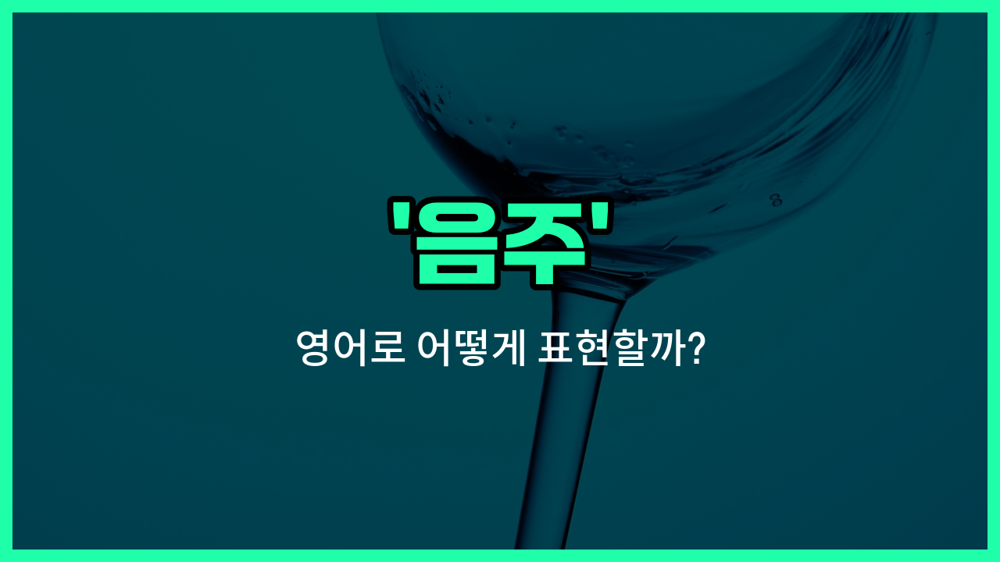

## 🌟 영어 표현 - drinking

안녕하세요 👋 오늘은 일상에서 자주 쓰이는 표현인 '**음주**'를 영어로 어떻게 말하는지 알아볼 거예요. 바로 '**drinking**'이라는 단어를 사용해요. 이 단어는 술을 마시는 행위, 즉 **술 마시기**나 **주류 섭취**를 의미해요.

'**drinking**'은 단순히 물이나 음료를 마시는 것도 포함할 수 있지만, 일상적으로는 술을 마시는 상황에서 더 자주 쓰여요. 예를 들어, 친구들과 술자리를 가질 때나 음주 습관에 대해 이야기할 때 자연스럽게 사용할 수 있어요.

또한, 'drinking'은 건강, 법, 사회적 이슈 등 다양한 맥락에서 등장해요. 예를 들어, 음주 운전이나 과음에 대한 경고 문구에서도 자주 볼 수 있답니다.

## 📖 예문

1. "그는 음주를 자주 해요."

   "He drinks frequently."

2. "음주는 건강에 해로울 수 있어요."

   "Drinking can be harmful to your health."

3. "음주 운전은 위험해요."

   "Drunk driving is dangerous."

## 💬 연습해보기

<ul data-interactive-list>

  <li data-interactive-item>
    우리는 그냥 퇴근 후에 맥주 한잔 하면서 편하게 쉬고 있었어.
    We were just casually drinking some beers after <a href="/blog/in-english/1064.work/">work</a> to unwind.
  </li>

  <li data-interactive-item>
    사실 술을 별로 안 좋아해서 파티에서는 주로 탄산음료를 마셔.
    I'm not really into drinking, so I usually <a href="/blog/vocab-1/015.stick-to/">stick to</a> soda at parties.
  </li>

  <li data-interactive-item>
    그는 음주운전으로 걸렸는데, 진짜 위험하고 불법이야.
    He was caught drinking and driving, which is really dangerous and illegal.
  </li>

  <li data-interactive-item>
    그들은 해변가에서 칵테일 마시면서 석양을 즐기며 저녁 시간을 보냈어.
    They spent the evening drinking cocktails by the beach, enjoying the sunset.
  </li>

  <li data-interactive-item>
    어제 바에서 너무 많이 마신 탓에 오늘 머리가 정말 아파.
    Drinking too much at the bar last night gave me a terrible headache today.
  </li>

  <li data-interactive-item>
    그녀는 잠 잘 자기 위해 오후에는 커피를 끊었어.
    She quit drinking coffee in the afternoon to <a href="/blog/in-english/1084.help/">help</a> with her sleep.
  </li>

  <li data-interactive-item>
    더위에 물 많이 마시고 있어? 수분 섭취가 너무 중요해.
    Are you drinking enough water during the heatwave? Staying hydrated is super <a href="/blog/in-english/318.important/">important</a>.
  </li>

  <li data-interactive-item>
    친구들이랑 술 마시는 건 재밌기도 한데, 항상 자신의 한계를 알아야 해.
    Drinking with friends can be fun, but always know your limits.
  </li>

  <li data-interactive-item>
    카페에서 혼자 술 마시는 그를 봤는데, 기분이 좀 우울해 보였어.
    I saw him drinking alone at the cafe; he looked kind of down.
  </li>

  <li data-interactive-item>
    우리는 내일 경기를 보면서 와인 좀 마실까 생각 중이야.
    We're <a href="/blog/in-english/1059.think/">thinking</a> about drinking some wine while watching the game tomorrow.
  </li>

</ul>

## 🤝 함께 알아두면 좋은 표현들

### having a drink

'having a drink'은 '한 잔 하다'라는 뜻으로, 음주를 좀 더 가볍고 일상적인 느낌으로 표현할 때 사용해요. 친구들과 편하게 술을 마실 때 자주 쓰이는 표현이에요.

- "Let's go out and have a drink after work."
- "퇴근하고 나서 나가서 한 잔 하자."

### sobriety

'sobriety'는 '금주' 또는 '술을 마시지 않는 상태'를 의미해요. 음주와는 반대되는 개념으로, 술을 끊거나 술을 전혀 마시지 않는 상태를 나타낼 때 사용해요.

- "He has maintained his sobriety for over five years now."
- "그는 지금까지 5년 넘게 금주를 유지하고 있어요."

### binge drinking

'binge drinking'은 '폭음' 또는 '단기간에 과도하게 술을 마시는 것'을 뜻해요. 건강에 해로울 수 있는 음주 습관을 지칭할 때 주로 사용돼요.

- "Binge drinking can [lead to](/blog/vocab-1/004.lead-to/) serious health [problems](/blog/in-english/1370.problem/)."
- "폭음은 심각한 건강 문제를 일으킬 수 있어요."

---

오늘은 '**음주**'라는 뜻을 가진 영어 표현 '**drinking**'에 대해 알아봤어요. 술과 관련된 상황에서 이 표현을 떠올리면 도움이 될 거예요 😊

오늘 배운 표현과 예문들을 꼭 소리 내서 여러 번 읽어보세요. 다음에도 더 유익한 영어 표현으로 찾아올게요! 감사합니다!

