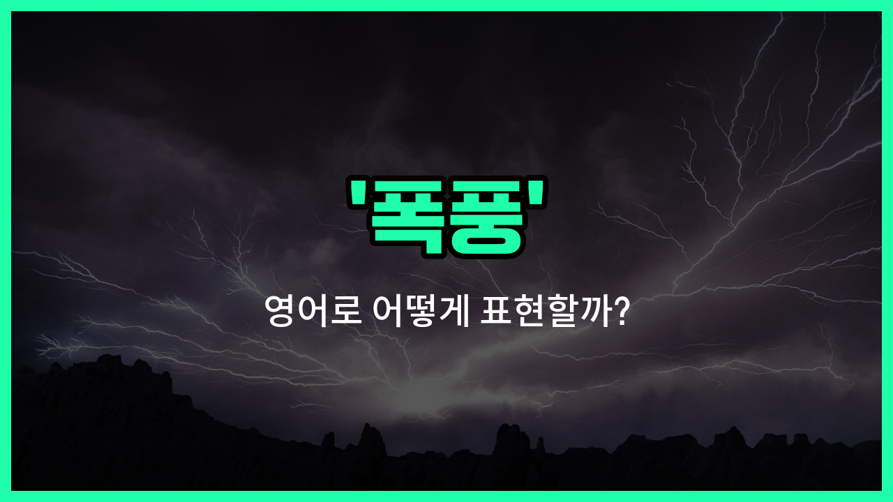

## 🌟 영어 표현 - storm

안녕하세요 👋 오늘은 자연 현상 중 하나인 '**폭풍**'을 영어로 어떻게 표현하는지 알아보려고 해요. 바로 '**storm**'이라는 단어를 사용해요. 이 단어는 '폭풍', '폭풍우', '거센 비바람'과 같은 강한 바람과 비, 천둥, 번개 등이 동반되는 기상 현상을 의미해요.

'**storm**'은 일상 대화뿐만 아니라 뉴스, 영화, 책 등 다양한 상황에서 자주 등장하는 단어예요. 예를 들어, 갑자기 날씨가 나빠져서 비바람이 몰아칠 때 "There is a storm coming."이라고 말할 수 있어요.

또한, 'storm'은 실제 날씨뿐만 아니라 감정이나 상황이 격렬하게 변할 때도 비유적으로 사용할 수 있어요. 예를 들어, "He [left](/blog/in-english/1106.left/) in a storm of anger."라고 하면 '그는 분노의 폭풍 속에서 떠났다'는 뜻이에요.

## 📖 예문

1. "어젯밤에 큰 폭풍이 불었어요."

   "There was a big storm last night."

2. "폭풍 때문에 학교가 휴교했어요."

   "The [school](/blog/in-english/1090.school/) was closed because of the storm."

## 💬 연습해보기

<ul data-interactive-list>

  <li data-interactive-item>
    오늘 밤 큰 폭풍이 온다니까, 우리 집에 있는 게 좋겠어.
    The weather report <a href="/blog/in-english/1061.said/">said</a> there's a big storm coming tonight. We should probably stay indoors.
  </li>

  <li data-interactive-item>
    하이킹 하다가 갑자기 폭풍을 만나서 완전히 옷이 젖었어.
    I got caught in a sudden storm while hiking and my clothes were completely soaked.
  </li>

  <li data-interactive-item>
    우리 동네는 그 폭풍 때문에 몇 시간 동안 전기가 나갔었어.
    The storm knocked out <a href="/blog/in-english/1097.power/">power</a> in our neighborhood for several hours.
  </li>

  <li data-interactive-item>
    폭풍이 지나간 후에는 거리마다 물이 고이고 쓰레기로 가득 차 있었어.
    After the storm passed, the streets were flooded and covered with debris.
  </li>

  <li data-interactive-item>
    그녀는 정말 속상해 보였어, 마치 마음속에서 폭풍이 일어나는 것 같았어.
    She was really upset, <a href="/blog/in-english/1053.like/">like</a> a storm was brewing inside her.
  </li>

  <li data-interactive-item>
    거세게 불어닥친 폭풍 때문에 경기가 취소됐어.
    They had to cancel the game because of the fierce storm that rolled in.
  </li>

  <li data-interactive-item>
    폭풍의 바람이 너무 세서 내 모자가 날아갈 뻔했어.
    The storm's wind was so strong it nearly blew my hat off.
  </li>

  <li data-interactive-item>
    어두운 구름이 빠르게 모여서 마치 폭풍이 올 것 같은 느낌이었어.
    It felt like a storm was coming, with dark clouds gathering quickly.
  </li>

  <li data-interactive-item>
    그 회의에서 논란이 되는 발언을 한 후, 그는 비판의 폭풍을 맞았어.
    He faced a storm of criticism after his controversial comment at the meeting.
  </li>

  <li data-interactive-item>
    폭풍 시즌 동안 이동을 피하기 위해 여행 계획을 신중하게 세웠어.
    We planned our trip carefully to avoid traveling during the storm <a href="/blog/in-english/1248.season/">season</a>.
  </li>

</ul>

## 🤝 함께 알아두면 좋은 표현들

### tempest (폭풍우)

'tempest'는 '강한 폭풍우'를 의미하는 단어로, 'storm'보다 문학적이고 격식 있는 표현이에요. 주로 시나 문학 작품에서 강력한 자연 현상을 묘사할 때 사용돼요.

- "The ship was caught in a violent tempest at sea."
- "그 배는 바다에서 거센 폭풍우에 휘말렸어요."

### calm (잔잔함)

'calm'은 '폭풍'의 반대말로, 바람이 없고 물결이 잔잔한 상태를 뜻해요. 자연의 평화롭고 고요한 상태를 나타낼 때 쓰여요.

- "After the storm passed, the sea became calm and peaceful."
- "폭풍이 지나간 후 바다는 잔잔하고 평화로워졌어요."

### hurricane (허리케인)

'hurricane'은 '폭풍'보다 훨씬 강력한 열대성 폭풍을 의미해요. 특히 북대서양과 북동태평양에서 발생하는 매우 강한 폭풍을 가리킬 때 사용돼요.

- "The hurricane [caused](/blog/in-english/1409.cause/) massive damage along the coast."
- "허리케인이 해안을 따라 엄청난 피해를 일으켰어요."

---

오늘은 '**폭풍**'이라는 뜻을 가진 영어 표현 '**storm**'에 대해 알아봤어요. 앞으로 날씨 이야기를 하거나 격렬한 상황을 묘사할 때 이 단어를 떠올려 보세요 😊

오늘 배운 표현과 예문들을 꼭 소리 내서 여러 번 읽어보세요. 다음에도 더 유익한 영어 표현으로 찾아올게요! 감사합니다!

