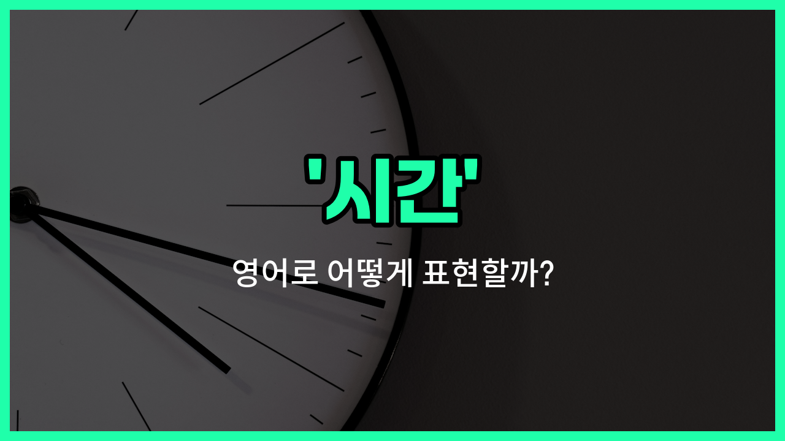

## 🌟 영어 표현 - hours

안녕하세요 👋 오늘은 일상에서 정말 자주 쓰이는 영어 단어 '**hours**'에 대해 알아보려고 해요. '시간', '시각', '근무시간' 등 다양한 의미로 활용되는 단어인데요, 어떻게 쓰이는지 함께 살펴볼게요.

'**hours**'는 기본적으로 '시간'이라는 뜻이에요. 예를 들어, "몇 시간 걸려요?"라고 물을 때 "How many hours does it take?"라고 할 수 있어요. 또한, '근무시간'이나 '영업시간'을 말할 때도 자주 사용돼요. 예를 들어, "영업시간이 어떻게 되나요?"는 "What are [your business](/blog/vocab-1/023.your-business/) hours?"라고 표현할 수 있어요.

또한, '시각'이라는 의미로도 쓰일 수 있는데요, "몇 시에 문을 열어요?"는 "What time do you open?" 또는 "What are your opening hours?"라고 할 수 있어요.

## 📖 예문

1. "이 가게의 영업시간이 어떻게 되나요?"

   "What are the store's business hours?"

2. "저는 하루에 8시간 일해요."

   "I [work](/blog/in-english/1064.work/) eight hours a day."

3. "회의가 두 시간 동안 진행됐어요."

   "The meeting lasted for two hours."

## 💬 연습해보기

<ul data-interactive-list>

  <li data-interactive-item>
    프로젝트 마감 맞추려고 열 시간 동안 쉬지 않고 일했어요.
    I worked for ten hours straight to finish the project <a href="/blog/vocab-1/043.on-time/">on time</a>.
  </li>

  <li data-interactive-item>
    매주 운동하는 시간은 몇 시간이에요?
    How many hours do you spend exercising each week?
  </li>

  <li data-interactive-item>
    영화가 약 두 시간 동안 상영되니까 간식 좀 챙겨와요.
    The movie lasts about two hours, so bring some snacks.
  </li>

  <li data-interactive-item>
    가게가 닫기 전에 몇 시간 남지 않았어요.
    We only have a couple of hours before the store closes.
  </li>

  <li data-interactive-item>
    그는 마감일 맞추려고 48시간 동안 밤새웠어요.
    He stayed up for 48 hours <a href="/blog/in-english/1265.try/">trying</a> to meet the deadline.
  </li>

  <li data-interactive-item>
    여기서 바닷가까지 가는 데 약 세 시간 걸려요.
    It takes about three hours to drive from here to the beach.
  </li>

  <li data-interactive-item>
    몇 시간 잤는데도 여전히 피곤해요.
    I slept for a few hours but still feel tired.
  </li>

  <li data-interactive-item>
    회의가 몇 시간 걸릴 예정이니까 먼저 점심 먹자.
    The meeting will last a few hours, so let's grab lunch first.
  </li>

  <li data-interactive-item>
    그녀는 리사이틀 준비를 위해 몇 시간 동안 피아노 연습했어요.
    She spent hours <a href="/blog/in-english/247.practice/">practicing</a> the piano for her recital.
  </li>

  <li data-interactive-item>
    파티 끝나고 집 청소하는 데 몇 시간이 걸렸어요.
    It <a href="/blog/in-english/1237.took/">took</a> hours to clean the <a href="/blog/in-english/1088.house/">house</a> after the party.
  </li>

</ul>

## 🤝 함께 알아두면 좋은 표현들

### minutes (분)

'minutes (분)'은 시간의 단위 중 하나로, 1시간은 60분으로 구성되어 있어요. 'hours'보다 더 짧은 시간을 나타낼 때 사용하며, 일상 대화에서 시간을 더 세밀하게 표현할 때 자주 쓰여요.

- "The meeting will last for 45 minutes."
- "회의는 45분 동안 진행될 거예요."

### days (일)

'days (일)'은 시간의 단위로, 1일은 24시간으로 구성되어 있어요. 'hours'보다 더 긴 시간을 나타내며, 주로 기간이나 일정 등을 말할 때 사용해요.

- "The project will take five days to complete."
- "그 프로젝트는 완료하는 데 5일이 걸릴 거예요."

### timeless (시간이 없는)

'timeless'는 '시간이 없는' 또는 '시간에 구애받지 않는'이라는 뜻으로, 시간의 흐름이나 제한에 영향을 받지 않는 상태를 의미해요. 'hours'와는 반대 개념으로, 시간을 특정하지 않거나 중요하지 않을 때 사용해요.

- "Her beauty is timeless and never fades."
- "그녀의 아름다움은 시간이 지나도 변하지 않아요."

---

오늘은 '시간', '시각', '근무시간'이라는 뜻을 가진 영어 표현 '**hours**'에 대해 알아봤어요. 일상에서 정말 자주 쓰이는 단어이니 꼭 기억해두면 좋겠어요 😊

오늘 배운 표현과 예문들을 소리 내서 여러 번 읽어보세요. 다음에도 더 유익한 영어 표현으로 찾아올게요! 감사합니다!

