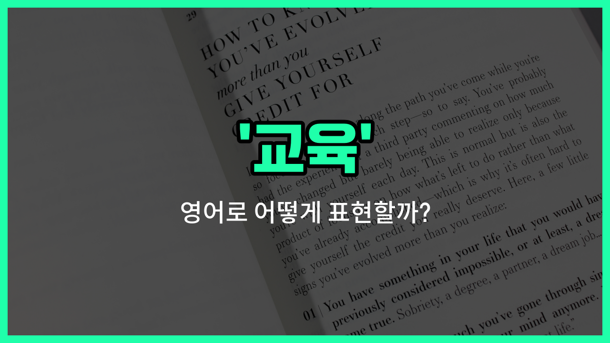

## 🌟 영어 표현 - education

안녕하세요 👋 오늘은 우리가 자주 쓰는 단어인 '**교육**'의 영어 표현 '**education**'에 대해 알아보려고 해요.

'**education**'은 사람에게 지식, 기술, 가치관 등을 가르치고 배우는 모든 과정을 의미해요. 즉, 학교에서 배우는 것뿐만 아니라, 집이나 사회에서 배우는 모든 경험도 포함돼요!

이 단어는 공식적인 학교 교육뿐만 아니라, 평생 학습이나 자기계발 등 다양한 상황에서 자연스럽게 사용돼요. 예를 들어, "좋은 교육을 받다"는 "receive a good education"이라고 할 수 있어요.

또한, "교육의 중요성"을 말할 때는 "the importance of education"이라고 표현해요.

'**education**'은 명사로만 쓰이며, '학습', '가르침'과 같은 의미로도 자주 사용돼요. 상황에 따라 다양한 형태로 활용할 수 있으니 참고해 주세요!

## 📖 예문

1. "모든 아이들은 양질의 교육을 받을 권리가 있어요."

   "All children have the right to receive quality education."

2. "교육은 사회 발전에 매우 중요해요."

   "Education is very important for the development of society."

## 💬 연습해보기

<ul data-interactive-list>

  <li data-interactive-item>
    교육은 아이들이 나중에 성공하는 데 정말 중요해요.
    Education is really important for kids to succeed <a href="/blog/in-english/1024.later/">later</a> in life.
  </li>

  <li data-interactive-item>
    부모님이 항상 말씀하셨어요, 교육이 더 나은 미래의 열쇠라고요.
    My parents always told me that education is the key to a better future.
  </li>

  <li data-interactive-item>
    우리 지역의 학교를 개선하기 위해 교육 개혁에 집중하고 있어요.
    We're focusing on education reforms to improve <a href="/blog/in-english/1090.school/">schools</a> in our district.
  </li>

  <li data-interactive-item>
    그녀는 교육을 매우 중요하게 생각해서 매주 주말마다 보충수업을 다녀요.
    She values education a lot and goes to extra classes every weekend.
  </li>

  <li data-interactive-item>
    정부는 학생들이 더 잘 배울 수 있도록 교육에 더 많은 투자를 하고 있어요.
    The <a href="/blog/in-english/608.government/">government</a> is investing more in education to <a href="/blog/in-english/1084.help/">help</a> students learn better.
  </li>

  <li data-interactive-item>
    그는 성인들이 고등학교를 마칠 수 있도록 도와주는 교육 프로그램을 알아보고 있어요.
    He's looking into education <a href="/blog/in-english/1386.program/">programs</a> that can help adults finish high school.
  </li>

  <li data-interactive-item>
    좋은 교육은 교과서만이 아니라, 삶의 기술도 배우는 것이에요.
    Good education isn't just about textbooks; it's also about learning life skills.
  </li>

  <li data-interactive-item>
    커뮤니티 센터에서는 모든 연령대를 위한 무료 교육 워크숍을 제공해요.
    The community center offers free education workshops for people of all ages.
  </li>

  <li data-interactive-item>
    내가 학교에 다닐 때와 비교해서 교육이 많이 변화했어요, 지금은 기술이 더 많이 사용되거든요.
    Education has changed a lot since I was in school with more technology now.
  </li>

  <li data-interactive-item>
    그들은 교육은 어디에서 살든지 모든 사람이 접근할 수 있어야 한다고 믿어요.
    They believe that education should be accessible to everyone, no matter where they live.
  </li>

</ul>

## 🤝 함께 알아두면 좋은 표현들

### learning (학습)

'learning'은 '교육'과 비슷하게 지식이나 기술을 습득하는 과정을 의미해요. 하지만 '교육'이 체계적이고 공식적인 가르침을 강조한다면, '학습'은 개인이 스스로 경험하거나 공부하는 모든 과정을 포함해요.

- "Continuous learning is essential for personal and professional growth."
- "지속적인 학습은 개인적, 직업적 성장에 필수적이에요."

### ignorance (무지)

'ignorance'는 '교육'의 반대 개념으로, 지식이나 정보를 알지 못하는 상태를 뜻해요. 교육이 지식을 전달하고 이해를 돕는다면, 무지는 그 반대로 지식의 부재를 나타내요.

- "Ignorance can [lead to](/blog/vocab-1/004.lead-to/) misunderstandings and missed opportunities."
- "무지는 오해와 기회의 상실로 이어질 수 있어요."

### training (훈련)

'training'은 특정 기술이나 능력을 개발하기 위한 실습 중심의 교육을 의미해요. 일반적인 교육보다 더 실용적이고 직무나 활동에 직접적으로 필요한 능력을 키우는 데 초점을 맞춰요.

- "The company [provides](/blog/in-english/743.provide/) training sessions to improve employees' skills."
- "회사는 직원들의 기술 향상을 위해 훈련 세션을 제공해요."

---

오늘은 '**교육**'이라는 뜻을 가진 영어 표현 '**education**'에 대해 알아봤어요. 앞으로 영어로 자신의 학습 경험이나 교육의 중요성을 이야기할 때 이 표현을 활용해 보세요! 😊

오늘 배운 표현과 예문들을 꼭 최소 3번씩 소리 내서 읽어보세요. 다음에도 더 재미있고 유익한 영어 표현으로 찾아올게요! 감사합니다!

