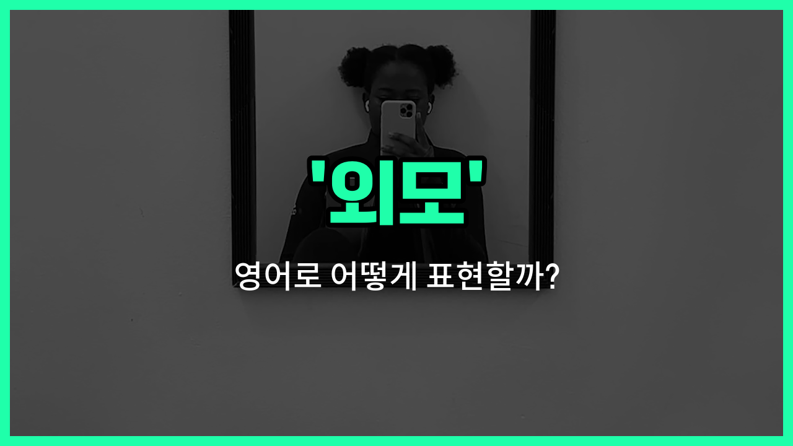

## 🌟 영어 표현 - looks

안녕하세요 👋 오늘은 우리가 자주 쓰는 단어인 '**외모**'를 영어로 어떻게 표현하는지 알아볼 거예요. 바로 '**looks**'라는 단어를 사용할 수 있어요. 이 단어는 사람의 얼굴이나 전체적인 생김새, 즉 **겉모습**을 의미해요.

'**looks**'는 주로 복수형으로 쓰이며, 누군가의 외적인 매력이나 인상을 이야기할 때 자주 사용돼요. 예를 들어, "그 사람은 외모가 정말 좋아요."라고 말하고 싶을 때 "He has good looks."라고 표현할 수 있어요.

또한, 'looks'는 단순히 잘생기거나 예쁜 것뿐만 아니라, 전체적인 인상이나 분위기를 말할 때도 쓸 수 있어요. 그래서 친구끼리 "오늘 멋져 보여!"라고 할 때도 자연스럽게 쓸 수 있답니다.

## 📖 예문

1. "그녀는 외모뿐만 아니라 성격도 좋아요."

   "She has not only good looks but also a great personality."

2. "그는 외모에 신경을 많이 써요."

   "He cares a lot about his looks."

## 💬 연습해보기

<ul data-interactive-list>

  <li data-interactive-item>
    오늘 그녀는 정말 피곤해 보여요. 아마 어젯밤에 잠을 잘 못 잤나봐요.
    She looks really tired today. Maybe she didn't get enough sleep last night.
  </li>

  <li data-interactive-item>
    그 사람은 좀 낯이 익은데, 누구인지 잘 모르겠어요.
    That guy looks familiar, but I can't quite place him.
  </li>

  <li data-interactive-item>
    너의 새 헤어스타일이 진짜 잘 어울려. 얼굴형이랑 찰떡궁합이야.
    Your new haircut looks great on you. It really suits your face shape.
  </li>

  <li data-interactive-item>
    그는 회사에서 큰 발표를 할 것처럼 보이네.
    He looks <a href="/blog/in-english/1053.like/">like</a> he's about to give a big presentation at <a href="/blog/in-english/1064.work/">work</a>.
  </li>

  <li data-interactive-item>
    그녀는 친구들이랑 있을 때 정말 행복해 보여요.
    She looks so <a href="/blog/in-english/1322.happy/">happy</a> when she's around her friends.
  </li>

  <li data-interactive-item>
    내 강아지가 머리를 기울이면 너무 귀여워요.
    My dog looks so funny when he tilts his <a href="/blog/in-english/1211.head/">head</a> like that.
  </li>

  <li data-interactive-item>
    주말에 날씨가 정말 좋대. 소풍 가기 완전 딱이야.
    The <a href="/blog/in-english/1437.weather/">weather</a> looks amazing for the weekend, <a href="/blog/in-english/413.perfect/">perfect</a> for a picnic.
  </li>

  <li data-interactive-item>
    그의 머리카락이 희색이라서 실제 나이보다 더 늙어 보이네.
    He looks older than his age because of his gray hair.
  </li>

  <li data-interactive-item>
    곧 비가 올 것 같으니까 우산 잊지 마세요.
    It looks like it might <a href="/blog/in-english/1432.rain/">rain</a> soon, so don't forget your umbrella.
  </li>

  <li data-interactive-item>
    그 옷 정말 멋져요! 어디서 구했어?
    You look amazing in that outfit. Where did you get it?
  </li>

</ul>

## 🤝 함께 알아두면 좋은 표현들

### appearance

'appearance'는 '외모' 또는 '겉모습'을 의미해요. 주로 사람이나 사물의 첫인상이나 눈에 보이는 모습을 말할 때 사용해요. 'looks'보다 조금 더 포괄적이고 공식적인 느낌이 있어요.

- "Her appearance at the event was stunning and caught everyone's attention."
- "그녀의 행사에서의 외모는 정말 멋져서 모두의 시선을 사로잡았어요."

### physical features

'physical features'는 '신체적 특징'을 뜻해요. 얼굴이나 몸의 구체적인 부분들, 예를 들어 눈, 코, 키 등을 말할 때 주로 사용해요. 'looks'보다 더 구체적이고 세부적인 외모를 나타낼 때 좋아요.

- "He inherited his father's physical features, like sharp eyes and a strong jawline."
- "그는 날카로운 눈과 강한 턱선 같은 아버지의 신체적 특징을 물려받았어요."

### inner beauty

'inner beauty'는 '내면의 아름다움'을 의미해요. 외모와 반대되는 개념으로, 사람의 성격, 마음씨, 인품 같은 보이지 않는 아름다움을 강조할 때 사용해요.

- "She may not have the looks, but her inner beauty shines through her kindness and generosity."
- "그녀는 외모는 뛰어나지 않을지 몰라도, 친절함과 관대함에서 내면의 아름다움이 빛나요."

---

오늘은 '**외모**'라는 뜻을 가진 영어 표현 '**looks**'에 대해 알아봤어요. 누군가의 생김새나 겉모습을 이야기할 때 이 표현을 떠올려 보세요 😊

오늘 배운 표현과 예문들을 꼭 최소 3번씩 소리 내서 읽어보세요. 다음에도 더 재미있고 유익한 영어 표현으로 찾아올게요! 감사합니다!

