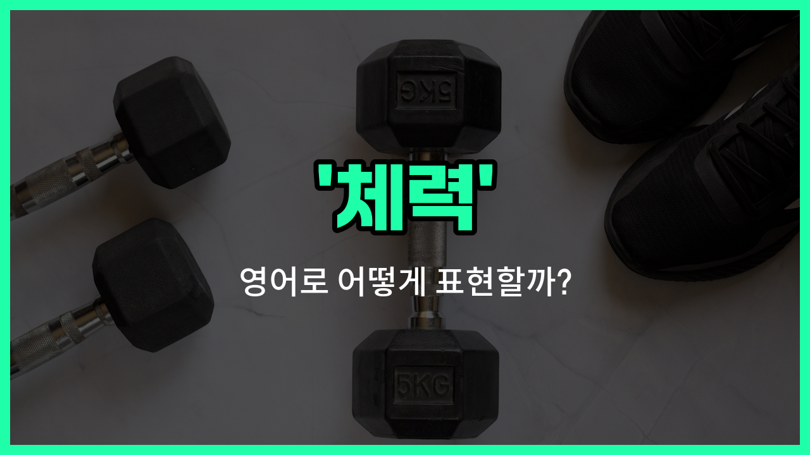

## 🌟 영어 표현 - fitness

안녕하세요 👋 오늘은 영어로 '체력'을 어떻게 표현하는지 알아보려고 해요. 바로 '**fitness**'라는 단어를 사용할 수 있어요. 'fitness'는 주로 **신체적으로 건강하고 튼튼한 상태**를 의미해요. 즉, 운동을 통해 몸이 건강해지고, 체력이 좋아진 상태를 말할 때 자주 쓰여요!

이 단어는 헬스장, 운동, 건강 관리 등 다양한 상황에서 자연스럽게 사용돼요. 예를 들어, 체력을 기르기 위해 운동을 시작할 때 "I'm [working](/blog/in-english/1064.work/) on my fitness."라고 말할 수 있어요.

또는, "Regular exercise improves your fitness."라고 하면 "규칙적인 운동은 체력을 향상시켜요."라는 의미가 돼요.

'fitness'는 건강, 운동, 체력과 관련된 대화에서 정말 자주 등장하는 단어이니 꼭 기억해 두세요!

## 📖 예문

1. "체력을 기르기 위해 매일 운동해요."

   "I exercise every day to improve my fitness."

2. "그녀는 체력이 아주 좋아요."

   "She has excellent fitness."

## 💬 연습해보기

<ul data-interactive-list>

  <li data-interactive-item>
    올해부터 헬스장 다니면서 몸 관리를 하고 있어요.
    I've been hitting the gym regularly to improve my fitness this year.
  </li>

  <li data-interactive-item>
    아침마다 조깅을 시작한 이후로 체력이 많이 좋아졌어요.
    My fitness level got better after I started jogging every morning.
  </li>

  <li data-interactive-item>
    우리가 나이가 들수록 건강을 위해 체력 관리를 해야 해요.
    We need to focus on fitness to stay healthy, especially as we get older.
  </li>

  <li data-interactive-item>
    코치님이 체력을 키우면 경기에서도 더 잘할 수 있다고 하셨어요.
    The coach said that improving our fitness will <a href="/blog/in-english/1084.help/">help</a> us perform better in the game.
  </li>

  <li data-interactive-item>
    그녀는 지난달 요가를 시작한 이후로 정말 몸이 좋아졌어요.
    Her fitness has really improved since she began yoga last month.
  </li>

  <li data-interactive-item>
    체력을 높이고 싶다면 힘 운동도 좀 해보는 게 좋아요.
    If you <a href="/blog/in-english/1060.want/">want</a> to boost your fitness, try incorporating some strength training.
  </li>

  <li data-interactive-item>
    체력 목표를 세우면서 동기 부여가 정말 중요해요.
    Staying motivated is key when working on your fitness goals.
  </li>

  <li data-interactive-item>
    쓰레기 음식을 끊고 나서 체력이 확 좋아진 걸 느꼈어요.
    I noticed a big change in my fitness after cutting out junk food.
  </li>

  <li data-interactive-item>
    좋은 체력은 스트레스 상황을 더 쉽게 이겨낼 수 있도록 도와줘요.
    Good fitness makes it easier to handle stressful situations without getting tired.
  </li>

  <li data-interactive-item>
    그 스튜디오에서는 필라테스, 스피닝, 킥복싱 같은 다양한 체육 수업을 해요.
    They offer different fitness classes <a href="/blog/in-english/1053.like/">like</a> pilates, spinning, and kickboxing at that studio.
  </li>

</ul>

## 🤝 함께 알아두면 좋은 표현들

### physical strength

'physical strength'는 '신체적 힘' 또는 '근력'을 의미해요. 체력과 비슷하게 몸의 힘과 능력을 강조하는 표현으로, 주로 근육의 힘이나 힘을 발휘하는 능력을 말할 때 사용해요.

- "Regular exercise helps improve your physical strength."
- "규칙적인 운동은 신체적 힘을 향상시키는 데 도움이 돼요."

### endurance

'endurance'는 '지구력'을 뜻해요. 체력의 한 부분으로, 오랜 시간 동안 신체 활동을 지속할 수 있는 능력을 강조할 때 쓰여요. 마라톤이나 장시간 운동할 때 중요한 요소예요.

- "Cyclists need a lot of endurance to complete [long](/blog/in-english/1077.long/) races."
- "자전거 선수들은 긴 경주를 완주하기 위해 많은 지구력이 필요해요."

### sedentary lifestyle

'sedentary lifestyle'은 '앉아서 생활하는 습관' 또는 '운동 부족한 생활 방식'을 의미해요. 체력과는 반대되는 개념으로, 신체 활동이 적어 건강에 좋지 않은 영향을 줄 수 있어요.

- "A sedentary lifestyle can [lead to](/blog/vocab-1/004.lead-to/) various health [problems](/blog/in-english/1370.problem/)."
- "앉아서 생활하는 습관은 여러 건강 문제를 일으킬 수 있어요."

---

오늘은 '체력'이라는 뜻을 가진 영어 표현 '**fitness**'에 대해 알아봤어요. 운동이나 건강에 대해 이야기할 때 이 단어를 활용해 보세요 😊

오늘 배운 표현과 예문들을 꼭 최소 3번씩 소리 내서 읽어보세요. 다음에도 더 재미있고 유익한 영어 표현으로 찾아올게요! 감사합니다!

