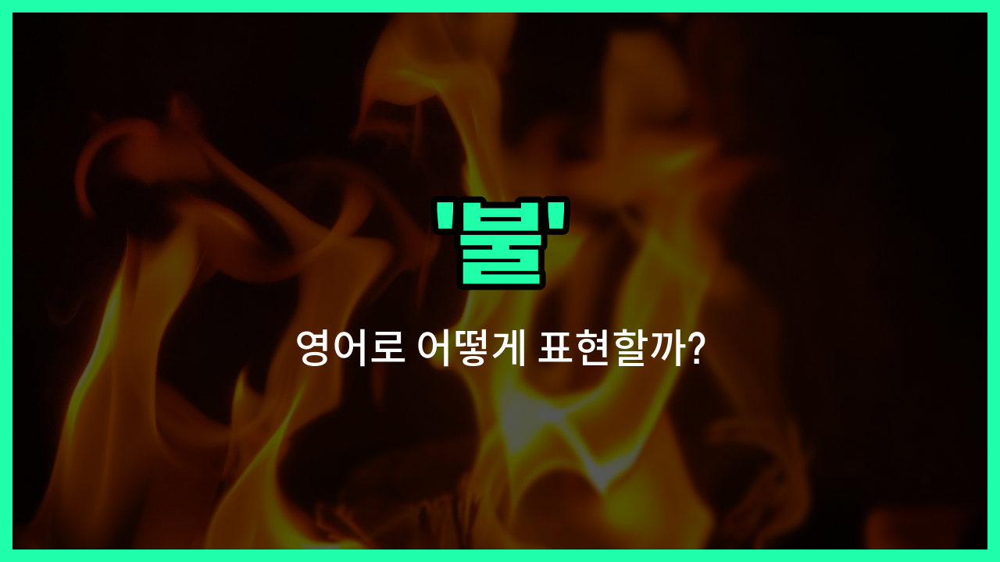

## 🌟 영어 표현 - fire

안녕하세요 👋 오늘은 일상에서 자주 쓰이는 단어인 '**불**'의 영어 표현 '**fire**'에 대해 알아보려고 해요.

'**fire**'는 우리가 흔히 알고 있는 '불'을 의미해요. 즉, 무언가가 타오르거나 연소되는 현상을 말할 때 사용해요. 또한, '화재'나 '발화'와 같이 사고나 위험 상황을 설명할 때도 자주 쓰여요!

예를 들어, 집이나 산에서 불이 났을 때 "There is a fire in the building." 또는 "A forest fire broke out."와 같이 표현할 수 있어요.

뿐만 아니라, 'fire'는 동사로도 쓰여서 '불을 붙이다' 또는 '발사하다'라는 뜻도 있어요. 하지만 오늘은 명사로서의 '불', '화재', '발화'에 집중해서 알아볼게요.

## 📖 예문

1. "불이 너무 세게 타고 있어요."

   "The fire is burning too strongly."

2. "어젯밤에 화재가 발생했어요."

   "There was a fire last night."

3. "캠프파이어를 피우고 싶어요."

   "I [want](/blog/in-english/1060.want/) to make a campfire."

## 💬 연습해보기

<ul data-interactive-list>

  <li data-interactive-item>
    모닥불 덕분에 하루 종일 따뜻하게 지냈어요. 이야기를 나누면서 더 많은 나무를 들고 와야 해요.
    The campfire kept us warm all night while we shared stories.  We need to gather more wood to keep the fire going.
  </li>

  <li data-interactive-item>
    부엌에서 불장난하지 마요, 다칠 수도 있어요. 엄마는 항상 불 안전에 대해 경고하거든요.
    Don't play with fire in the kitchen, you might burn yourself.  Mom always warns us about fire safety.
  </li>

  <li data-interactive-item>
    직장에서 화재 경고가 울려서 급하게 건물에서 나와야 했어요. 처음에는 좀 혼란스러웠어요.
    The fire alarm went off at <a href="/blog/in-english/1064.work/">work</a>, so we had to evacuate the building quickly.  It was a <a href="/blog/in-english/1309.bit/">bit</a> chaotic at first.
  </li>

  <li data-interactive-item>
    회사가 경영 구조를 바꾼 후에 그는 해고됐어요. 새 직장을 찾는 건 힘든 일이에요.
    He was fired from his job after the company restructured its management.  <a href="/blog/in-english/1083.find/">Finding</a> a new job can be tough.
  </li>

  <li data-interactive-item>
    촛불을 켜려고 하다가 실수로 종이를 태워버렸어요. 다행히도 불이 번지기 전에 잡았어요.
    I <a href="/blog/in-english/314.accidentally/">accidentally</a> set the papers on fire while <a href="/blog/in-english/1265.try/">trying</a> to light a candle.  Luckily, I caught it before it spread.
  </li>

  <li data-interactive-item>
    그들은 7월 4일 축하를 위해 엄청난 모닥불을 만들었어요. 모두가 그 주변에서 마시멜로를 굽고 있었어요.
    They built a huge bonfire for the Fourth of July celebration.  Everyone roasted marshmallows around it.
  </li>

  <li data-interactive-item>
    그녀는 거실을 아늑하게 만들기 위해 벽난로에 불을 지폈어요. 그 따스함이 그 추운 밤에 큰 차이를 만들었어요.
    She lit a fire in the fireplace to make the living room cozy.  The warmth made a big difference on that <a href="/blog/in-english/1410.cold/">cold</a> night.
  </li>

  <li data-interactive-item>
    소방관들이 아파트의 불을 끄려고 달려왔어요. 다행히 아무도 다치지 않았어요.
    The firefighters rushed in to put out the fire in the apartment.  Fortunately, no one was hurt.
  </li>

  <li data-interactive-item>
    하이킹을 한 날, 모닥불 연기 냄새가 너무 좋아요. 좋은 추억이 떠오르거든요.
    I love the smell of campfire smoke after a day of hiking.  It brings back great memories.
  </li>

  <li data-interactive-item>
    팀의 열정이 챔피언십 경기에서 불타올랐어요. 그들의 에너지가 전염되고 영감을 줬어요.
    The team's passion was on fire during the championship game.  Their energy was contagious and inspiring.
  </li>

</ul>

## 🤝 함께 알아두면 좋은 표현들

### flame (불꽃)

'flame'은 '불꽃'을 의미하며, 불이 타오르는 부분을 가리켜요. 불보다 좀 더 구체적으로 불꽃 자체를 나타낼 때 사용해요. 예를 들어 촛불이나 모닥불의 불꽃을 말할 때 쓰여요.

- "The candle's flame flickered gently in the dark room."
- "그 방 안에서 촛불의 불꽃이 부드럽게 흔들렸어요."

### extinguish (불을 끄다)

'extinguish'는 '불을 끄다'라는 뜻으로, 불을 완전히 없애거나 진화하는 행위를 나타내요. 불과는 반대되는 개념으로, 불이 타오르지 않도록 멈추는 것을 의미해요.

- "Firefighters worked hard to extinguish the wildfire before it spread further."
- "소방관들이 산불이 더 번지기 전에 진화하기 위해 열심히 노력했어요."

### burn (타다)

'burn'은 '타다'라는 뜻으로, 불이 물체를 태우는 행위를 나타내요. 불과 관련된 동작 중 하나로, 불이 어떤 것을 태우거나 연소시키는 상황에서 자주 사용돼요.

- "The wood began to burn brightly in the fireplace."
- "벽난로에서 나무가 밝게 타기 시작했어요."

---

오늘은 '불', '화재', '발화'라는 뜻을 가진 영어 표현 '**fire**'에 대해 알아봤어요. 일상에서 불이나 화재와 관련된 상황이 생기면 이 표현을 떠올려 보세요 😊

오늘 배운 표현과 예문들을 꼭 최소 3번씩 소리 내서 읽어보세요. 다음에도 더 재미있고 유익한 영어 표현으로 찾아올게요! 감사합니다!

