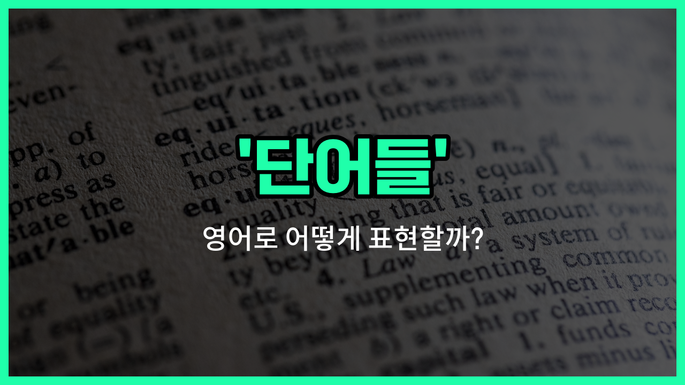

## 🌟 영어 표현 - words

안녕하세요 👋 오늘은 영어에서 자주 쓰이는 표현 '**words**'에 대해 알아보려고 해요. '단어들', '어휘', '말'과 같은 의미를 가진 단어인데요, 일상 대화나 글쓰기에서 정말 많이 사용돼요.

'**words**'는 'word'의 복수형으로, 하나 이상의 단어를 말할 때 사용해요. 예를 들어, 누군가가 쓴 글이나 말한 내용을 가리킬 때 "He used kind words."처럼 쓸 수 있어요. 여기서 'words'는 '말'이나 '표현'이라는 뜻도 함께 담고 있어요.

또한, 'words'는 단순히 '단어들'이라는 의미뿐만 아니라, 누군가의 생각이나 감정을 표현하는 '어휘'로도 자주 쓰여요. 그래서 영어를 공부할 때 'words'를 많이 접하게 되는 거예요!

## 📖 예문

1. "나는 새로운 단어들을 배우는 걸 좋아해요."

   "I [like](/blog/in-english/1053.like/) learning new words."

2. "그의 말이 정말 감동적이었어요."

   "His words were very touching."

3. "이 문장은 다섯 개의 단어로 이루어져 있어요."

   "This sentence is made up of five words."

## 💬 연습해보기

<ul data-interactive-list>

  <li data-interactive-item>
    영화에 대한 내 감정을 표현할 적절한 말을 찾으려고 했어요.
    I was trying to <a href="/blog/in-english/1083.find/">find</a> the right words to express how I felt about the movie.
  </li>

  <li data-interactive-item>
    그녀는 배운 새로운 단어들을 어휘 노트에 적었어요.
    She wrote down the new words she learned in her vocabulary notebook.
  </li>

  <li data-interactive-item>
    가끔, 누군가를 위로할 때 말이 행동보다 더 힘이 있을 수 있어요.
    Sometimes, words can be more powerful than actions when trying to comfort someone.
  </li>

  <li data-interactive-item>
    그는 발표 중 너무 긴장해서 말을 더듬었어요.
    He stumbled over his words during the presentation because he was so <a href="/blog/in-english/115.nervous/">nervous</a>.
  </li>

  <li data-interactive-item>
    선생님께서 우리에게 에세이를 더 흥미롭게 만들기 위해 더 서술적인 단어를 사용하라고 하셨어요.
    My teacher <a href="/blog/in-english/1270.tell/">told</a> us to use more descriptive words in our essays to make them more interesting.
  </li>

  <li data-interactive-item>
    몇 마디의 친절한 말이 누군가의 하루를 완전히 바꿀 수 있다는 게 신기해요.
    It's amazing how a few kind words can change someone's entire day.
  </li>

  <li data-interactive-item>
    퍼즐을 풀기 위해 단어 목록을 풀어야 했어요.
    The puzzle required us to unscramble a list of words to solve it.
  </li>

  <li data-interactive-item>
    새로운 언어를 배울 때 유용한 단어 목록을 항상 핸드폰에 저장해요.
    I always keep a list of useful words on my <a href="/blog/in-english/1408.phone/">phone</a> when learning a new language.
  </li>

  <li data-interactive-item>
    논쟁할 때 오해를 피하려면 말을 신중하게 선택하는 게 중요해요.
    When arguing, it's <a href="/blog/in-english/318.important/">important</a> to choose your words carefully to avoid misunderstandings.
  </li>

  <li data-interactive-item>
    주어진 글자들로 가능한 한 많은 단어를 만드는 게임을 했어요.
    We played a game where we had to form as many words as possible from the letters given.
  </li>

</ul>

## 🤝 함께 알아두면 좋은 표현들

### vocabulary

'vocabulary'는 특정 언어나 주제에 관련된 '어휘' 또는 '단어들의 집합'을 의미해요. 일상 대화나 학습에서 자주 쓰이는 단어들의 목록을 가리킬 때 많이 사용해요.

- "She has a wide vocabulary, which [helps](/blog/in-english/1084.help/) her express ideas clearly."
- "그녀는 폭넓은 어휘력을 가지고 있어서 생각을 명확하게 표현하는 데 도움이 돼요."

### phrases

'phrases'는 '구' 또는 '어구'를 뜻해요. 단어들이 모여서 하나의 의미를 전달하는 짧은 표현을 말하며, 단어보다 더 긴 단위로 생각할 수 있어요.

- "Learning common phrases can improve your conversational skills."
- "일상적인 구문을 배우는 것은 회화 실력을 향상시키는 데 도움이 돼요."

### silence

'silence'는 '침묵' 또는 '말이 없는 상태'를 의미해요. 'words'의 반대 개념으로, 말이나 단어가 전혀 없는 상황을 나타낼 때 사용해요.

- "After the argument, there was an uncomfortable silence in the room."
- "다툰 후에 방 안에는 불편한 침묵이 흘렀어요."

---

오늘은 '단어들', '어휘', '말'이라는 뜻을 가진 영어 표현 '**words**'에 대해 알아봤어요. 영어 공부할 때 이 단어를 자주 만나게 될 거예요~

오늘 배운 표현과 예문들을 꼭 소리 내서 여러 번 읽어보세요. 다음에도 더 유익한 영어 표현으로 찾아올게요! 감사합니다!

