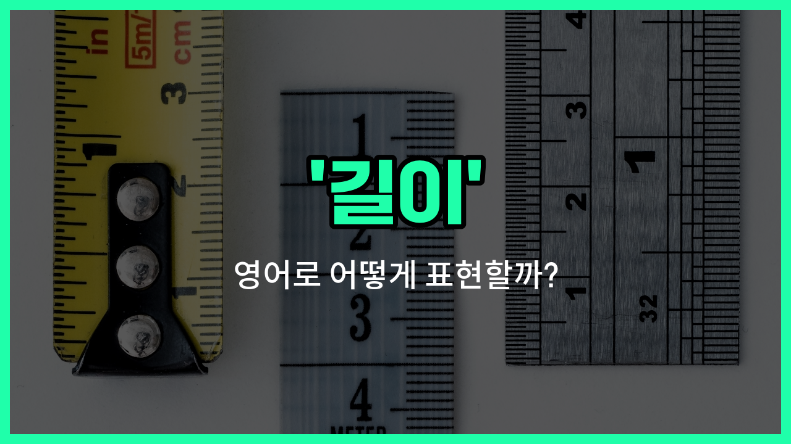

## 🌟 영어 표현 - length

안녕하세요 👋 오늘은 사물이나 공간의 '길이'를 영어로 어떻게 표현하는지 알아보려고 해요. 바로 '**length**'라는 단어를 사용해요. 'length'는 어떤 물체의 한쪽 끝에서 다른 쪽 끝까지의 **거리**나 **길이**를 나타낼 때 쓰여요.

예를 들어, 줄자의 눈금을 읽거나, 책상, 방, 도로 등 다양한 사물의 길이를 말할 때 자연스럽게 사용할 수 있어요. 또한, 'length'는 수학, 과학, 일상 대화 등 여러 상황에서 폭넓게 쓰이는 단어예요!

예를 들어, "이 책상의 길이는 2미터예요."라고 말하고 싶을 때 "The length of this desk is 2 meters."라고 표현할 수 있어요.

또한, 'length'는 '길다'라는 형용사([long](/blog/in-english/1077.long/))와도 관련이 있어서, 길이의 정도를 비교하거나 설명할 때도 자주 등장해요.

## 📖 예문

1. "이 강의 길이는 500킬로미터예요."

   "The length of this river is 500 kilometers."

2. "줄의 길이를 재고 있어요."

   "I am measuring the length of the rope."

## 💬 연습해보기

<ul data-interactive-list>

  <li data-interactive-item>
    이 로프의 길이가 약 10피트야. 정확하게 측정하려면 두 번 재는 게 좋겠어.
    The length of this rope is about 10 feet. Make sure you <a href="/blog/in-english/634.measure/">measure</a> it twice so you get it right.
  </li>

  <li data-interactive-item>
    너의 책상의 길이를 알아야 방에 들어가는지 확인할 수 있어.
    I need to know the length of your desk to see if it fits in the room.
  </li>

  <li data-interactive-item>
    그 영화의 길이는 내 취향에는 좀 길었는데, 이야기 자체는 좋았어.
    The length of the movie was a bit too long for my taste, but the story was good.
  </li>

  <li data-interactive-item>
    우리가 바느질 시작하기 전에 이 천의 길이를 재줄 수 있어?
    Can you check the length of this fabric before we start sewing?
  </li>

  <li data-interactive-item>
    수영장의 길이는 정확히 25미터야. 랩에 딱이야.
    The length of the swimming pool is exactly 25 meters, <a href="/blog/in-english/413.perfect/">perfect</a> for laps.
  </li>

  <li data-interactive-item>
    마지막에 그녀를 본 이후로 머리 길이가 많이 길어졌어.
    The length of her hair has grown since the last time I saw her.
  </li>

  <li data-interactive-item>
    새 시스템 설치 전에 전선의 길이를 고려하는 게 중요해.
    It's <a href="/blog/in-english/318.important/">important</a> to consider the length of the wires before installing the new system.
  </li>

  <li data-interactive-item>
    그들은 판의 길이를 재서 작은 조각으로 자르려고 했어.
    They measured the length of the board to <a href="/blog/vocab-1/008.cut-it/">cut it</a> into smaller pieces.
  </li>

  <li data-interactive-item>
    너의 발표 길이가 얼마나 돼? 우리 시간 충분한지 확인하고 싶어.
    What's the length of your presentation? I <a href="/blog/in-english/1060.want/">want</a> to make sure we have enough time.
  </li>

  <li data-interactive-item>
    이 책의 길이가 주말 동안 읽기 딱 좋아.
    The length of this book <a href="/blog/in-english/1209.makes/">makes</a> it a great read for a long weekend.
  </li>

</ul>

## 🤝 함께 알아두면 좋은 표현들

### width (너비)

'width'는 '길이'와 함께 물체의 크기를 나타내는 또 다른 차원으로, 물체의 좌우 방향의 길이를 의미해요. 'length'가 보통 세로 방향의 길이를 나타낸다면, 'width'는 가로 방향의 길이를 나타내는 경우가 많아요.

- "The width of the table is 80 centimeters."
- "그 탁자의 너비는 80센티미터예요."

### height (높이)

'height'는 물체의 위에서 아래까지의 길이, 즉 높이를 의미해요. 'length'가 주로 가로 또는 세로 방향의 길이를 나타낸다면, 'height'는 수직 방향의 길이를 나타내는 경우가 많아요.

- "The height of the building is 50 meters."
- "그 건물의 높이는 50미터예요."

### shortness (짧음)

'shortness'는 'length'의 반대 개념으로, 길이가 짧은 상태를 의미해요. 어떤 물체나 거리가 길지 않고 짧을 때 사용하는 표현이에요.

- "The shortness of the rope made it difficult to tie the package."
- "그 밧줄이 짧아서 소포를 묶기 어려웠어요."

---

오늘은 '길이'라는 뜻을 가진 영어 표현 '**length**'에 대해 알아봤어요. 일상에서 물건의 크기나 거리를 말할 때 이 단어를 떠올리면 좋겠어요 😊

오늘 배운 표현과 예문들을 꼭 소리 내서 여러 번 읽어보세요. 다음에도 더 유익한 영어 표현으로 찾아올게요! 감사합니다!

