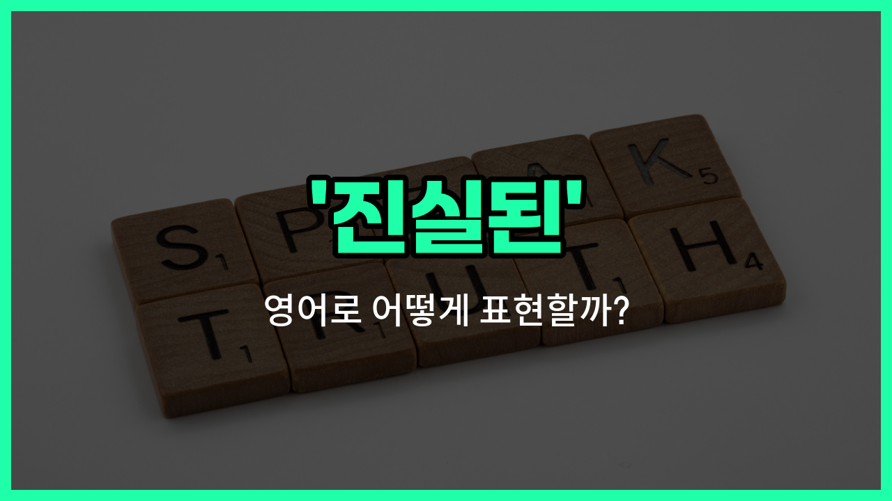

## 🌟 영어 표현 - true

안녕하세요 👋 오늘은 영어 단어 '**true**'에 대해 알아보려고 해요. '**true**'는 '진실된', '참', '정확한'이라는 뜻을 가지고 있어요. 우리가 어떤 사실이나 정보가 거짓이 아니라 실제임을 말할 때 자주 사용하는 표현이에요!

예를 들어, 누군가가 한 말이 사실임을 강조하고 싶을 때 "That's true."라고 말할 수 있어요. 또, 어떤 정보가 정확하다는 의미로도 쓸 수 있답니다. 일상 대화뿐만 아니라 시험, 업무 등 다양한 상황에서 활용할 수 있는 아주 기본적이고 중요한 단어예요.

## 📖 예문

1. "그 소문이 정말 사실이에요?"

   "Is that rumor really true?"

2. "네 말이 맞아요."

   "What you [said](/blog/in-english/1061.said/) is true."

3. "이 정보가 정확한가요?"

   "Is this information true?"

## 💬 연습해보기

<ul data-interactive-list>

  <li data-interactive-item>
    그녀는 항상 진짜 친구였어요, 힘든 순간에 진짜 의지할 수 있는 사람이죠.
    She's always been a true friend, someone you can really count on in tough times.
  </li>

  <li data-interactive-item>
    그가 프로젝트에 대해 한 말은 진실이었어요; 모든 사실이 완벽하게 맞아떨어져요.
    What he said about the project was true; all the facts check out perfectly.
  </li>

  <li data-interactive-item>
    내 의견과 다를지라도 당신의 진짜 의견에 감사해요.
    I appreciate your true opinion, even if it's different from mine.
  </li>

  <li data-interactive-item>
    그 영화는 뉴욕 시의 삶을 진짜로 잘 보여줬어요.
    That movie gave a true portrayal of life in New York City.
  </li>

  <li data-interactive-item>
    그가 눈을 피하는 모습으로 그의 진짜 감정이 드러났어요.
    His true feelings were obvious from the <a href="/blog/in-english/1062.way/">way</a> he avoided eye contact.
  </li>

  <li data-interactive-item>
    다른 사람들이 뭐라고 해도 자신에게 충실한 게 중요해요.
    It's <a href="/blog/in-english/318.important/">important</a> to stay true to yourself, no matter what others say.
  </li>

  <li data-interactive-item>
    그 그림의 진짜 의미는 몇몇 예술 전문가들만이 이해할 수 있어요.
    The true <a href="/blog/in-english/1214.mean/">meaning</a> behind the painting is only understood by a few <a href="/blog/in-english/1393.art/">art</a> experts.
  </li>

  <li data-interactive-item>
    그녀는 마감일을 맞추기 위해 매일 밤 늦게까지 일하면서 진정한 헌신을 보여줬어요.
    She showed true dedication by <a href="/blog/in-english/1064.work/">working</a> late every night to meet the deadline.
  </li>

  <li data-interactive-item>
    그녀가 서프라이즈 선물을 열었을 때 진정한 기쁨이 얼굴에 나타나는 걸 볼 수 있었어요.
    I could see the true joy on her face when she opened the surprise gift.
  </li>

  <li data-interactive-item>
    우리는 자신의 이익만 생각하는 게 아니라, 지역 사회를 걱정하는 진정한 리더가 필요해요.
    We need true leaders who care about the community, not just their own interests.
  </li>

</ul>

## 🤝 함께 알아두면 좋은 표현들

### genuine (진짜의, 진실된)

'genuine'은 "진짜의" 또는 "진실된"이라는 뜻으로, 거짓이나 위조가 없는 진정한 상태를 나타내요. 사람의 감정이나 태도, 물건의 진품 여부를 말할 때 자주 사용해요.

- "She gave a genuine smile when she saw her old friend."
- "그녀는 오랜 친구를 보았을 때 진실된 미소를 지었어요."

### authentic (진짜의, 진실된)

'authentic'은 "진짜의" 또는 "진실된"이라는 의미로, 특히 물건이나 정보가 진품임을 강조할 때 쓰여요. 신뢰할 수 있고 거짓이 없다는 느낌을 줘요.

- "The museum displayed authentic artifacts from ancient Egypt."
- "박물관은 고대 이집트의 진짜 유물을 전시했어요."

### false (거짓된, 허위의)

'false'는 "거짓된" 또는 "허위의"라는 뜻으로, 진실과 반대되는 의미예요. 사실이 아니거나 속이기 위한 정보를 나타낼 때 사용해요.

- "He was accused of giving false information to the [police](/blog/in-english/1334.police/)."
- "그는 경찰에게 거짓 정보를 제공한 혐의를 받았어요."

---

오늘은 '진실된', '참', '정확한'이라는 뜻을 가진 영어 표현 '**true**'에 대해 알아봤어요. 앞으로 누군가의 말이나 정보가 사실임을 표현하고 싶을 때 이 단어를 떠올려 보세요 😊

오늘 배운 표현과 예문들을 꼭 소리 내서 여러 번 읽어보세요. 다음에도 더 유익한 영어 표현으로 찾아올게요! 감사합니다!

