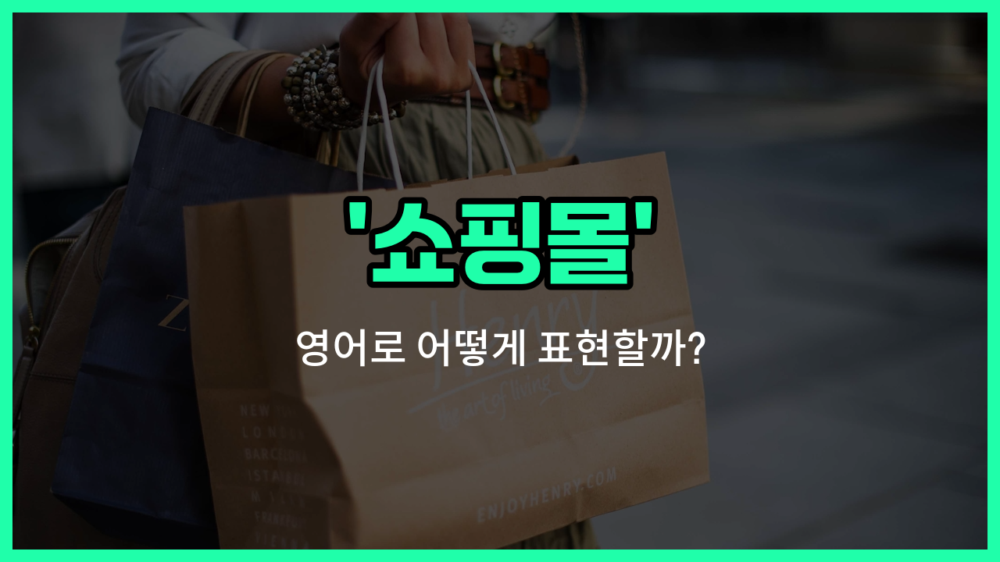

## 🌟 영어 표현 - mall

안녕하세요 👋 오늘은 우리가 자주 가는 '쇼핑몰'을 영어로 어떻게 표현하는지 알아볼 거예요. 바로 '**mall**'이라는 단어인데요. 이 단어는 '상가', '복합상업시설'이라는 뜻도 함께 가지고 있어요.

'**mall**'은 다양한 상점, 음식점, 영화관 등이 한 건물이나 구역에 모여 있는 큰 쇼핑 공간을 의미해요. 한국에서 흔히 말하는 '쇼핑몰'과 거의 같은 개념이에요. 미국이나 다른 영어권 국가에서도 사람들이 쇼핑, 식사, 여가를 즐기기 위해 'mall'에 자주 가요.

예를 들어, 친구와 주말에 쇼핑을 하러 간다고 할 때 "Let's go to the mall this weekend!"라고 자연스럽게 말할 수 있어요.

## 📖 예문

1. "나는 주말마다 쇼핑몰에 가는 걸 좋아해요."

   "I [like](/blog/in-english/1053.like/) going to the mall every weekend."

2. "이 쇼핑몰에는 다양한 음식점이 있어요."

   "There are many different restaurants in this mall."

## 💬 연습해보기

<ul data-interactive-list>

  <li data-interactive-item>
    이번 주말에 친구들이랑 쇼핑몰에 가서 새 푸드코트 구경할 거야.
    I'm meeting some friends at the mall this weekend to check out the new food court.
  </li>

  <li data-interactive-item>
    퇴근 후에 쇼핑몰 가고 싶은데? 난 생일 선물 사야 해.
    Do you <a href="/blog/in-english/1060.want/">want</a> to go to the mall after <a href="/blog/in-english/1064.work/">work</a>? I need to pick up a birthday gift.
  </li>

  <li data-interactive-item>
    내 집 근처 쇼핑몰은 토요일마다 사람 엄청 많아.
    The mall near my place always gets super <a href="/blog/in-english/393.crowded/">crowded</a> on Saturdays.
  </li>

  <li data-interactive-item>
    충전기를 잊어버려서 쇼핑몰에 가서 새로 사왔어.
    I <a href="/blog/in-english/023.forget/">forgot</a> my charger, so I stopped by the mall to grab a new one.
  </li>

  <li data-interactive-item>
    그 친구는 쇼핑몰 안 의류 매장에서 일해서, 나는 자주 잠깐 만나러 가곤 해.
    She <a href="/blog/in-english/1439.works/">works</a> at a clothing store inside the mall, so I often visit for a quick meet-up.
  </li>

  <li data-interactive-item>
    우리는 오후 내내 쇼핑몰에서 돌아다니면서 여러 가게를 구경했어.
    We spent the whole afternoon walking around the mall, looking at different shops.
  </li>

  <li data-interactive-item>
    지금 쇼핑몰에서 큰 세일을 하고 있어서 운동화 사기 딱 좋은 시점이야.
    The mall is having a big sale right now, so it's a great time to buy sneakers.
  </li>

  <li data-interactive-item>
    온라인 쇼핑보다 쇼핑몰 가는 걸 더 선호해. 직접 보고 사는 게 좋거든.
    I prefer going to the mall instead of shopping online because I like seeing things in <a href="/blog/in-english/1131.person/">person</a>.
  </li>

  <li data-interactive-item>
    최근에 다운타운에 새로 생긴 쇼핑몰 가봤어? 멋진 전자기기 가게가 많아.
    Have you been to the new mall downtown? It's got some cool tech stores.
  </li>

  <li data-interactive-item>
    휴일에는 쇼핑몰 주차하기 힘들 수 있으니까, 일찍 오는 게 좋을 거야.
    Parking at the mall can be a nightmare during the holidays, so plan to come early.
  </li>

</ul>

## 🤝 함께 알아두면 좋은 표현들

### shopping center

'shopping center'는 '쇼핑몰'과 비슷한 의미로, 여러 상점과 식당 등이 모여 있는 상업 공간을 말해요. 'mall'보다 조금 더 포괄적인 개념으로, 규모가 다양할 수 있어요.

- "The new shopping center downtown has a variety of stores and a food court."
- "도심에 새로 생긴 쇼핑센터에는 다양한 가게들과 푸드코트가 있어요."

### boutique

'boutique'는 '부티크'로, 주로 고급스럽고 개성 있는 소규모 상점을 의미해요. 쇼핑몰과는 달리 작고 전문적인 상품을 파는 곳을 말해요.

- "She prefers shopping at boutiques for unique clothing items."
- "그녀는 독특한 옷을 사기 위해 부티크에서 쇼핑하는 것을 선호해요."

### outdoor market

'outdoor market'은 '야외 시장'으로, 쇼핑몰과는 반대로 실내가 아닌 야외에서 여러 상인들이 물건을 파는 장소를 말해요. 좀 더 자유롭고 전통적인 쇼핑 환경이에요.

- "We spent the afternoon browsing stalls at the outdoor market."
- "우리는 오후 내내 야외 시장의 가판대를 구경하며 보냈어요."

---

오늘은 '쇼핑몰', '상가', '복합상업시설'이라는 뜻을 가진 영어 표현 '**mall**'에 대해 알아봤어요. 다음에 친구와 쇼핑 약속을 잡을 때 이 표현을 꼭 사용해 보세요! 😊

오늘 배운 표현과 예문들을 소리 내서 여러 번 읽어보면 더 자연스럽게 쓸 수 있을 거예요. 다음에도 더 유익한 영어 표현으로 찾아올게요! 감사합니다!

