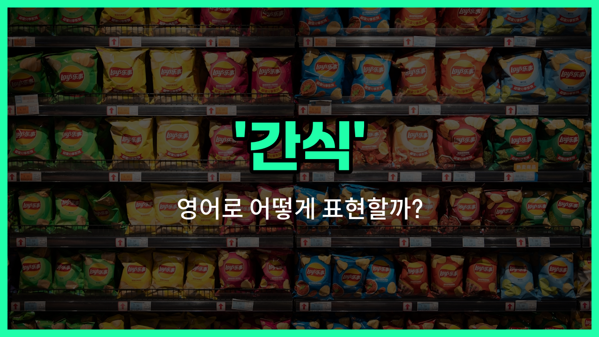

## 🌟 영어 표현 - snack

안녕하세요 👋 오늘은 일상에서 자주 쓰는 단어인 '**간식**'의 영어 표현 '**snack**'에 대해 알아보려고 해요.

'**snack**'은 식사 사이에 간단하게 먹는 음식이나 주전부리를 의미해요. 우리가 출출할 때 먹는 과자, 빵, 과일 등 모두 'snack'이라고 할 수 있어요!

이 단어는 학교, 직장, 집 등 어디서든 사용할 수 있어서 정말 유용해요. 예를 들어, 친구에게 "간식 먹을래?"라고 물어보고 싶을 때 "Do you [want](/blog/in-english/1060.want/) a snack?"이라고 말할 수 있어요.

또한, 'snack'은 명사로 '간식'이라는 뜻이지만, 동사로도 쓰여서 '간식을 먹다'라는 의미로 "Let's snack before dinner."처럼 사용할 수 있어요.

## 📖 예문

1. "나는 오후에 간식을 먹는 걸 좋아해요."

   "I [like](/blog/in-english/1053.like/) to have a snack in the afternoon."

2. "수업이 끝난 후에 간단한 간식을 먹었어요."

   "I had a quick snack after class."

## 💬 연습해보기

<ul data-interactive-list>

  <li data-interactive-item>
    점심과 저녁 사이에 배가 고파서 보통 과자 같은 간단한 걸 먹어요.
    I'm starving between meals, so I usually grab a quick snack like a granola bar.
  </li>

  <li data-interactive-item>
    학교 끝나고 애들이 숙제 시작하기 전에 간식을 즐겨 먹어요.
    After <a href="/blog/in-english/1090.school/">school</a>, the kids love to have a snack before starting their homework.
  </li>

  <li data-interactive-item>
    여행 가는 길에 건강한 간식으로 과일을 챙겼어요.
    I <a href="/blog/in-english/301.pack/">packed</a> some fruit as a healthy snack for the road trip.
  </li>

  <li data-interactive-item>
    게임 보면서 간식 먹을래?
    Do you want a snack while we watch the game <a href="/blog/in-english/1024.later/">later</a>?
  </li>

  <li data-interactive-item>
    저녁에는 간식을 많이 먹지 않으려고 노력해요. 다이어트를 유지하기 위해서요.
    I try not to eat too many snacks in the evening to keep my diet on track.
  </li>

  <li data-interactive-item>
    그녀는 일할 때 배가 고프면 바로 먹을 간식을 가방에 항상 가지고 다녀요.
    She always has a snack in her bag for when she gets hungry at <a href="/blog/in-english/1064.work/">work</a>.
  </li>

  <li data-interactive-item>
    프로젝트에 돌아가기 전에 잠시 쉬면서 간식 먹어요.
    Let's take a break and have a snack before heading back to the project.
  </li>

  <li data-interactive-item>
    달콤한 간식이 땡기는데, 아마 쿠키나 초콜릿이 좋을 것 같아요.
    I'm craving a sweet snack, maybe some cookies or chocolate.
  </li>

  <li data-interactive-item>
    그는 오늘 밤 파티를 위해 간식을 몇 개 사러 가게에 들렀어요.
    He stopped by the store to pick up a few snacks for the party tonight.
  </li>

  <li data-interactive-item>
    회의 중에 다들 힘내라고 간식을 돌렸어요.
    During the meeting, they passed around some snacks to keep everyone energized.
  </li>

</ul>

## 🤝 함께 알아두면 좋은 표현들

### light bite

'light bite'는 "가벼운 식사" 또는 "간단한 음식"을 의미해요. 주로 정식 식사 사이에 먹는 작은 양의 음식을 가리킬 때 사용해요. 간식과 비슷하지만 좀 더 가벼운 느낌을 줘요.

- "I just had a light bite before heading out to the party."
- "파티에 가기 전에 가볍게 간단히 먹었어요."

### full meal

'full meal'은 "정식 식사"를 뜻해요. 간식과는 반대로 충분한 양과 영양을 갖춘 식사를 의미해서, 배를 든든히 채우는 것을 강조할 때 사용해요.

- "After a [long](/blog/in-english/1077.long/) day, I prefer to have a full meal rather than just a snack."
- "긴 하루를 보낸 후에는 간식 대신 정식 식사를 하는 걸 더 좋아해요."

### treat

'treat'는 "특별한 간식"이나 "자신에게 주는 작은 선물 같은 음식"을 의미해요. 보통 평소보다 조금 더 맛있거나 특별한 음식을 먹을 때 쓰여요.

- "I bought myself a little treat after finishing the project."
- "프로젝트를 끝낸 후에 나에게 작은 간식을 사줬어요."

---

오늘은 '**간식**'이라는 뜻을 가진 영어 표현 '**snack**'에 대해 알아봤어요. 출출할 때나 친구와 이야기할 때 이 표현을 활용해 보세요 😊

오늘 배운 표현과 예문들을 꼭 최소 3번씩 소리 내서 읽어보세요. 다음에도 더 재미있고 유익한 영어 표현으로 찾아올게요! 감사합니다!

