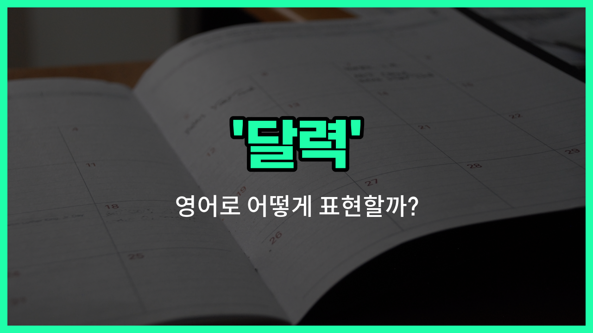

## 🌟 영어 표현 - calendar

안녕하세요 👋 오늘은 우리가 일상에서 자주 사용하는 '**달력**'이라는 단어의 영어 표현에 대해 알아보려고 해요. 바로 '**calendar**'라는 단어인데요~

'**calendar**'는 한 해의 날짜, 요일, 월 등을 한눈에 볼 수 있도록 정리해 놓은 표를 의미해요. 우리가 흔히 벽에 걸어두거나, 스마트폰에서 확인하는 그 달력이 바로 'calendar'예요~

또한, 'calendar'는 단순히 날짜만 표시하는 것이 아니라, 중요한 일정이나 기념일, 약속 등을 기록하는 '**일정표**'의 의미로도 자주 사용돼요. 그래서 회사나 학교, 개인 생활에서도 'calendar'라는 단어를 정말 많이 쓰게 되죠~

예를 들어, "캘린더에 약속을 적어둘게요."라고 할 때 "I'll put the appointment on my calendar."라고 표현할 수 있어요. 또는 "이번 달 달력을 확인해 볼게요."는 "Let me check this month's calendar."라고 할 수 있답니다~

## 📖 예문

1. "내일 중요한 일정이 달력에 있어요."

   "I have an [important](/blog/in-english/318.important/) event on my calendar tomorrow."

2. "새로운 달력을 샀어요."

   "I bought a new calendar."

## 💬 연습해보기

<ul data-interactive-list>

  <li data-interactive-item>
    내 책상에 회의랑 약속을 다 기록할 수 있도록 달력을 두고 있어요.
    I keep a calendar on my desk to track all my meetings and appointments.
  </li>

  <li data-interactive-item>
    그 금요일에 우리는 비어 있는지 달력을 한번 확인해줄 수 있어요?
    Can you check the calendar and see if we're <a href="/blog/in-english/1104.free/">free</a> that Friday?
  </li>

  <li data-interactive-item>
    내 전화에 있는 달력 앱이 생일을 알림 해줘서 잊어버리지 않아요.
    My <a href="/blog/in-english/1408.phone/">phone</a>'s calendar app reminds me about birthdays so I don't forget.
  </li>

  <li data-interactive-item>
    새 프로젝트 마감일로 달력을 업데이트해야 해요.
    We need to update the calendar with the new project deadlines.
  </li>

  <li data-interactive-item>
    그녀의 달력은 한 달 내내 이벤트로 꽉 차 있어요.
    Her calendar is <a href="/blog/in-english/301.pack/">packed</a> with events for the whole month.
  </li>

  <li data-interactive-item>
    내 달력을 확인해보고 그 날짜에 대해 다시 연락할게요.
    Let me check my calendar and get back to you about that date.
  </li>

  <li data-interactive-item>
    내 휴가 날은 달력에 표시해놔서 모두가 내가 언제 쉬는지 알 수 있어요.
    I marked the vacation days on the calendar so everyone knows when I'm off.
  </li>

  <li data-interactive-item>
    그는 자신의 일과 개인 생활을 정리하기 위해 디지털 달력을 사용해요.
    He uses a digital calendar to <a href="/blog/in-english/355.organize/">organize</a> his <a href="/blog/in-english/1064.work/">work</a> and personal life.
  </li>

  <li data-interactive-item>
    사무실 달력에는 매일 어떤 팀원이 재택근무를 하는지 나와 있어요.
    The <a href="/blog/in-english/1379.office/">office</a> calendar shows which team member is working from home each day.
  </li>

  <li data-interactive-item>
    예약하기 전에, 항상 달력을 보고 일정이 겹치지 않도록 해요.
    Before booking, I always look at the calendar to avoid scheduling conflicts.
  </li>

</ul>

## 🤝 함께 알아두면 좋은 표현들

### planner

'planner'는 '일정표' 또는 '계획표'를 의미해요. 달력과 비슷하게 날짜별로 일정을 기록하고 관리하는 데 사용되지만, 좀 더 개인적인 계획이나 할 일을 정리하는 데 초점을 맞춰요.

- "I use a planner to keep track of my daily tasks and appointments."
- "저는 매일 할 일과 약속을 기록하기 위해 일정표를 사용해요."

### schedule

'schedule'은 '일정' 또는 '스케줄'을 뜻해요. 달력과 달리 특정 시간에 해야 할 일이나 약속을 정리한 계획을 의미하며, 시간 단위로 세부적인 계획을 나타낼 때 많이 사용해요.

- "She checked her schedule before agreeing to the meeting time."
- "그녀는 회의 시간을 수락하기 전에 자신의 일정을 확인했어요."

### timeless

'timeless'는 '시간에 구애받지 않는' 또는 '영원한'이라는 뜻으로, 달력과는 반대되는 개념이에요. 특정 날짜나 시간이 정해져 있지 않고 변하지 않는 상태를 나타낼 때 사용해요.

- "The beauty of the artwork is timeless and appreciated across generations."
- "그 예술 작품의 아름다움은 시대를 초월해 여러 세대에 걸쳐 사랑받아요."

---

오늘은 '**달력**', '**캘린더**', '**일정표**'라는 뜻을 가진 영어 표현 '**calendar**'에 대해 알아봤어요. 앞으로 영어로 약속이나 일정을 이야기할 때 이 표현을 꼭 활용해 보세요~ 😊

오늘 배운 표현과 예문들을 소리 내서 여러 번 읽어보면 더 쉽게 기억할 수 있어요. 다음에도 더 유익한 영어 표현으로 찾아올게요! 감사합니다~

