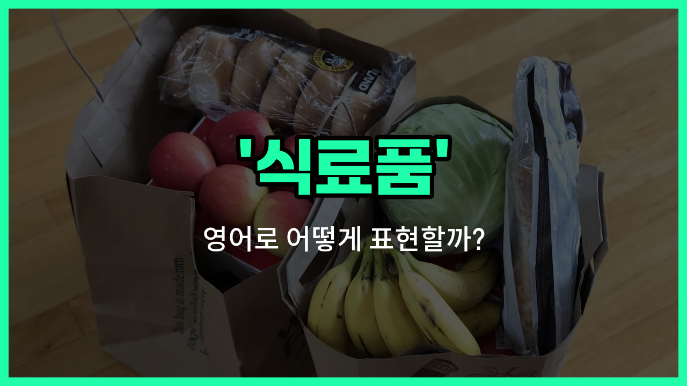

## 🌟 영어 표현 - grocery

안녕하세요 👋 오늘은 일상에서 자주 쓰이는 단어인 '**식료품**'의 영어 표현 '**grocery**'에 대해 알아보려고 해요.

'**grocery**'는 주로 우리가 먹는 음식 재료나 생활에 필요한 식품들을 통틀어 말할 때 사용해요. 예를 들어, 쌀, 채소, 과일, 우유, 빵 등 집에서 요리하거나 먹는 다양한 식품들을 모두 'grocery'라고 부를 수 있어요.

또한, 'grocery'는 '식품점'이나 '슈퍼마켓'을 의미하는 'grocery store'라는 표현으로도 자주 쓰여요. 그래서 장을 보러 간다고 할 때 "I'm going grocery shopping."이라고 자연스럽게 말할 수 있어요.

## 📖 예문

1. "저는 오늘 식료품을 사러 갈 거예요."

   "I'm going to buy groceries today."

2. "이 근처에 식품점이 있나요?"

   "Is there a grocery store near here?"

## 💬 연습해보기

<ul data-interactive-list>

  <li data-interactive-item>
    일하고 나서 마트에 들러서 우유랑 빵 사야 해요.
    I need to stop by the grocery store after <a href="/blog/in-english/1064.work/">work</a> to pick up some milk and bread.
  </li>

  <li data-interactive-item>
    계란이 다 떨어져서 내일 아침에 마트에 가볼게요.
    We ran out of eggs, so I'll <a href="/blog/in-english/1211.head/">head</a> to the grocery tomorrow morning.
  </li>

  <li data-interactive-item>
    길 건너에 새로 생긴 마트가 신선한 과일 채소가 많아요.
    There's a great new grocery down the street that has fresh produce.
  </li>

  <li data-interactive-item>
    집 가는 길에 마트에서 간식 좀 사줄 수 있어요?
    Can you grab some snacks from the grocery on your <a href="/blog/in-english/1062.way/">way</a> home?
  </li>

  <li data-interactive-item>
    나는 보통 사람들이 적은 토요일에 장을 봐요.
    I usually do my grocery shopping on Saturdays when the store is less crowded.
  </li>

  <li data-interactive-item>
    그녀는 잊지 않기 위해 마트에 가기 전에 리스트를 만들어요.
    She <a href="/blog/in-english/1209.makes/">makes</a> a list before going to the grocery to make sure she doesn't forget anything.
  </li>

  <li data-interactive-item>
    휴일 세일 때문에 마트가 진짜 붐볐어요.
    The grocery was <a href="/blog/in-english/301.pack/">packed</a> because of the holiday sale.
  </li>

  <li data-interactive-item>
    그는 장바구니를 안 가져가서 마트에서 새로 사야 했어요.
    He forgot to bring his grocery bags, so he had to buy new ones at the store.
  </li>

  <li data-interactive-item>
    새로운 요리를 해봤는데 필요한 재료 몇 개가 빠졌더라고요.
    We <a href="/blog/in-english/1265.try/">tried</a> a new recipe, but I realized I was missing a few grocery items.
  </li>

  <li data-interactive-item>
    매주 우리는 한 시간 정도 마트에서 일주일분 식사를 고르는데 시간을 써요.
    Every week, we spend about an hour at the grocery picking out food for the week.
  </li>

</ul>

## 🤝 함께 알아두면 좋은 표현들

### supermarket

'supermarket'은 '대형 식료품점'을 의미해요. 다양한 식료품과 생활용품을 한 곳에서 구매할 수 있는 큰 매장을 가리켜요. 일반적으로 'grocery'보다 더 큰 규모를 나타내고, 쇼핑할 때 많이 이용되는 장소예요.

- "I went to the supermarket to buy some fruits and vegetables."
- "나는 과일과 채소를 사러 슈퍼마켓에 갔어요."

### convenience store

'convenience store'는 '편의점'을 뜻해요. 주로 24시간 운영하며, 식료품뿐만 아니라 간단한 생활용품도 판매하는 작은 매장이에요. 'grocery'와는 다르게 규모가 작고, 빠른 쇼핑에 적합해요.

- "She stopped by the convenience store to grab a quick snack."
- "그녀는 간단한 간식을 사기 위해 편의점에 들렀어요."

### non-food items

'non-food items'는 '비식료품'을 의미해요. 식료품(grocery)과 반대되는 개념으로, 음식이 아닌 생활용품, 가전제품, 의류 등을 포함해요. 쇼핑할 때 식료품과 구분해서 사용하는 표현이에요.

- "The store sells both groceries and non-food items [like](/blog/in-english/1053.like/) cleaning supplies and toiletries."
- "그 가게는 식료품과 청소용품, 세면도구 같은 비식료품도 판매해요."

---

오늘은 '**식료품**', '**장보기**', '**식품점**'이라는 뜻을 가진 영어 표현 '**grocery**'에 대해 알아봤어요. 다음에 장을 볼 때 이 표현을 떠올려 보세요! 😊

오늘 배운 표현과 예문들을 꼭 최소 3번씩 소리 내서 읽어보세요. 다음에도 더 재미있고 유익한 영어 표현으로 찾아올게요! 감사합니다!

