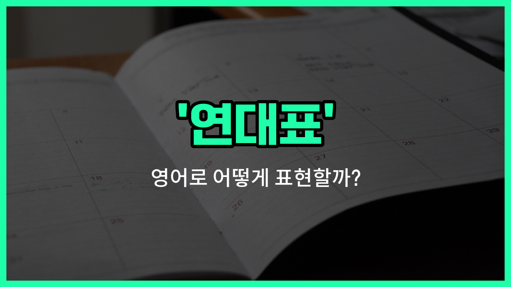

## 🌟 영어 표현 - timeline

안녕하세요 👋 오늘은 영어로 '**연대표**'를 어떻게 표현하는지 알아보려고 해요. 바로 '**timeline**'이라는 단어를 사용해요. 이 단어는 어떤 사건이나 일들이 **시간의 흐름에 따라 순서대로 정리된 표**를 의미해요.

'**timeline**'은 역사적인 사건, 프로젝트 일정, 인생의 중요한 순간 등 다양한 상황에서 사용할 수 있어요. 예를 들어, 학교에서 역사 수업을 할 때 중요한 사건들을 시간 순서대로 정리할 때 'timeline'을 만들 수 있어요. 또는 회사에서 프로젝트의 진행 상황을 한눈에 보기 위해 일정표를 만들 때도 'timeline'이라는 단어를 사용해요.

이렇게 'timeline'은 **시간의 흐름에 따라 정리된 정보**를 보여줄 때 아주 유용하게 쓰이는 표현이에요!

## 📖 예문

1. "우리는 프로젝트의 주요 단계를 연대표로 만들었어요."

   "We created a timeline of the key stages of the project."

2. "역사 수업에서 중요한 사건들을 연대표로 정리했어요."

   "We organized the important events in a timeline during history class."

## 💬 연습해보기

<ul data-interactive-list>

  <li data-interactive-item>
    내 역사 프로젝트를 위해 주요 세계 사건들의 타임라인을 만들어 봤어. 이걸 통해서 모든 게 어떻게 연결되어 있는지 알게 돼서 정말 좋더라구!
    I put together a timeline of major world events for my history project. It really <a href="/blog/in-english/1084.help/">helped</a> me see how everything is connected over the years.
  </li>

  <li data-interactive-item>
    회의 중에 그녀가 제품 개발 단계의 자세한 타임라인을 시작부터 끝까지 보여줬어.
    During the meeting, she showed us a detailed timeline of the product's development phases from start to finish.
  </li>

  <li data-interactive-item>
    우리는 지난 10년 동안 회사의 성장과 중요한 이정표를 추적하기 위한 타임라인을 만들고 있어.
    We're creating a timeline to track the important milestones in the company's growth over the <a href="/blog/in-english/1325.past/">past</a> decade.
  </li>

  <li data-interactive-item>
    그 사건을 타임라인에 추가해줄 수 있어? 시각적으로 정리하지 않으면 놓치기 쉬워서.
    Can you add that event to the timeline? It's easy to lose track without a visual guide.
  </li>

  <li data-interactive-item>
    웹사이트의 타임라인은 인터랙티브해서 각 날짜를 클릭하면 사건에 대한 더 많은 정보를 알 수 있어.
    The timeline on the website is interactive, so you can click on each date to learn more about what happened.
  </li>

  <li data-interactive-item>
    결혼식 준비를 위해 그날의 일정을 정리한 타임라인을 만들어서 모두가 제 시간에 맞출 수 있도록 했어.
    For the wedding planning, they made a timeline of the day's schedule to keep everyone on track.
  </li>

  <li data-interactive-item>
    이벤트의 순서를 기억하는 데 도움을 주니까 연구 노트 정리할 때 타임라인을 정말 좋아해!
    I love using timelines to organize my research notes because it helps me <a href="/blog/in-english/1311.remember/">remember</a> the order of events.
  </li>

  <li data-interactive-item>
    그 다큐멘터리에서는 전쟁 이전의 주요 역사적 순간들을 다룬 타임라인이 소개됐어.
    The documentary featured a timeline that covered the key historical moments leading up to the war.
  </li>

  <li data-interactive-item>
    프로젝트를 시작하기 전에 모든 마감일이 명확하도록 타임라인을 초안했어.
    Before starting our project, we drafted a timeline to make sure all the deadlines were clear.
  </li>

  <li data-interactive-item>
    선생님이 책의 플롯을 이해하기 위해 사건 순서를 알 수 있도록 타임라인을 만들라고 하셨어.
    The teacher <a href="/blog/in-english/1394.asked/">asked</a> us to create a timeline of the book's plot to better understand the sequence of events.
  </li>

</ul>

## 🤝 함께 알아두면 좋은 표현들

### schedule (일정표)

'schedule'은 특정 작업이나 이벤트가 언제 일어나는지를 정리한 계획표를 의미해요. 'timeline'과 비슷하게 시간 순서대로 정리하지만, 보통 더 구체적인 시간과 날짜를 포함해 일정을 관리할 때 사용해요.

- "We need to finalize the project schedule before the meeting next week."
- "다음 주 회의 전에 프로젝트 일정을 확정해야 해요."

### chronology (연대기)

'chronology'는 사건이나 사실을 시간 순서대로 배열한 기록을 뜻해요. 'timeline'과 유사하지만, 보통 역사적 사건이나 연구에서 시간의 흐름을 체계적으로 정리할 때 많이 사용해요.

- "The book [provides](/blog/in-english/743.provide/) a detailed chronology of the country's independence [movement](/blog/in-english/1481.movement/)."
- "그 책은 그 나라 독립운동의 자세한 연대기를 제공해요."

### timelessness (시간 초월)

'timelessness'는 시간의 제약을 받지 않는 상태를 의미해요. 'timeline'과는 반대로 시간의 흐름이나 순서에 구애받지 않는 개념을 나타낼 때 사용해요.

- "The artist's [work](/blog/in-english/1064.work/) has a sense of timelessness that appeals to all generations."
- "그 예술가의 작품은 모든 세대에 어필하는 시간 초월의 느낌을 가지고 있어요."

---

오늘은 '**연대표**', '**일정표**', '**시간 순서**'라는 뜻을 가진 영어 표현 '**timeline**'에 대해 알아봤어요. 앞으로 시간의 흐름이나 사건의 순서를 정리할 때 이 표현을 꼭 활용해 보세요! 😊

오늘 배운 표현과 예문들을 소리 내서 여러 번 읽어보면 더 쉽게 기억할 수 있어요. 다음에도 더 유익한 영어 표현으로 찾아올게요! 감사합니다!

