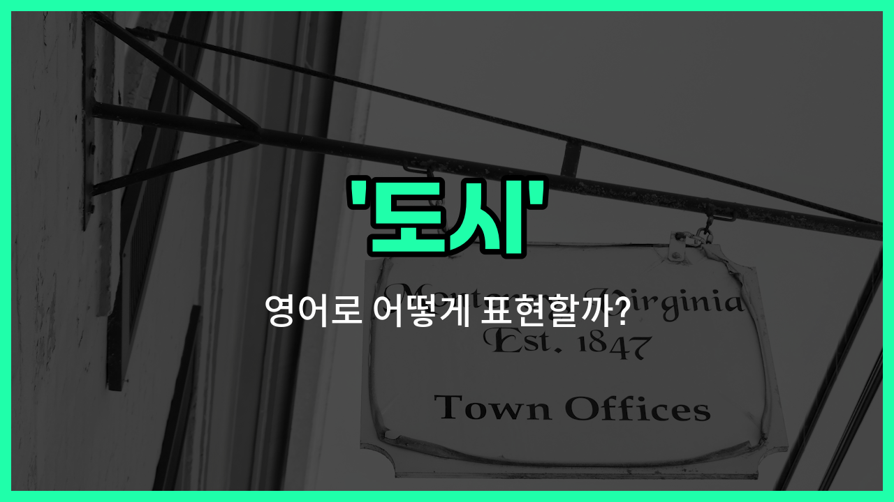

## 🌟 영어 표현 - town

안녕하세요 👋 오늘은 영어로 '도시'를 어떻게 표현하는지 알아보려고 해요. 바로 '**town**'이라는 단어인데요~

'**town**'은 일반적으로 '도시', '마을', '읍'과 같이 사람들이 모여 사는 비교적 작은 규모의 지역을 의미해요. 대도시(city)보다는 작고, 시골(village)보다는 큰 느낌이에요~

예를 들어, 우리가 사는 동네나 작은 도시를 말할 때 'town'을 쓸 수 있어요. 미국이나 영국 등 영어권 국가에서는 행정구역이나 지역을 구분할 때도 자주 사용돼요~

또한, 'go to town'처럼 관용적으로 쓰일 때는 '열심히 하다', '신나게 하다'라는 뜻도 있으니 참고해 주세요!

## 📖 예문

1. "나는 작은 도시에 살고 있어요."

   "I [live](/blog/in-english/1134.live/) in a small town."

2. "이 마을에는 유명한 시장이 있어요."

   "There is a famous market in this town."

## 💬 연습해보기

<ul data-interactive-list>

  <li data-interactive-item>
    우리는 공기 좋은 곳으로 기분 전환 겸 근처 마을로 여행 가기로 했어요.
    We decided to take a trip to the town nearby for some fresh air and a <a href="/blog/in-english/1133.change/">change</a> of scenery.
  </li>

  <li data-interactive-item>
    그 마을에는 느긋한 일요일 아침에 완전 좋은 아기자기한 카페가 있어요.
    The town has a quaint little coffee shop that's <a href="/blog/in-english/413.perfect/">perfect</a> for a lazy Sunday morning.
  </li>

  <li data-interactive-item>
    대학교 졸업 후에, 그녀는 더 나은 직장 기회를 찾으려고 작은 마을에서 대도시로 이사 갔어요.
    After college, she moved to the big city from a small town to <a href="/blog/in-english/1083.find/">find</a> better job opportunities.
  </li>

  <li data-interactive-item>
    매년 여름, 우리 가족은 아기자기한 해변 마을에 가서 편안히 쉬어요.
    Every summer, our family visits a small beach town where we relax and unwind.
  </li>

  <li data-interactive-item>
    그 마을 축제는 맛있는 음식과 음악으로 지역 곳곳에서 사람들을 끌어모아요.
    The town festival draws <a href="/blog/in-english/1057.people/">people</a> from all over the region with its food and music.
  </li>

  <li data-interactive-item>
    그는 모두가 서로의 일에 관심을 가지던 광업 마을에서 자랐어요.
    He grew up in a mining town, where everyone knew each other's business.
  </li>

  <li data-interactive-item>
    나는 매력적인 오래된 건물들이 늘어선 역사적인 마을을 걷는 걸 정말 좋아해요.
    I love walking through the historic part of town with all its charming old <a href="/blog/in-english/1401.building/">buildings</a>.
  </li>

  <li data-interactive-item>
    그 마을의 새 레스토랑은 인기가 많아졌어요. 주말마다 항상 만석이에요.
    That new restaurant in town has become really popular—it's always <a href="/blog/in-english/301.pack/">packed</a> on weekends.
  </li>

  <li data-interactive-item>
    마을의 주요 거리에는 상점들이랑 카페, 도서관이 쭉 늘어서 있어요.
    The town's main street is lined with shops, cafes, and a library.
  </li>

  <li data-interactive-item>
    그들은 모든 사람이 참여할 수 있도록 이벤트와 강의를 열 수 있는 새 커뮤니티 센터를 개관했어요.
    They opened a new community center in town to host events and classes for everyone.
  </li>

</ul>

## 🤝 함께 알아두면 좋은 표현들

### city (대도시)

'city'는 'town'보다 규모가 크고 인구가 많은 '대도시'를 의미해요. 보통 더 많은 시설과 인프라가 갖춰져 있고, 경제나 문화 활동이 활발한 곳을 가리킬 때 사용해요.

- "New York is a famous city known for its skyscrapers and vibrant culture."
- "뉴욕은 고층 빌딩과 활기찬 문화로 유명한 대도시예요."

### village (마을)

'village'는 'town'보다 훨씬 작은 규모의 '마을'을 뜻해요. 보통 시골 지역에 위치하며 인구가 적고 조용한 곳을 나타낼 때 쓰여요.

- "She grew up in a small village surrounded by nature."
- "그녀는 자연으로 둘러싸인 작은 마을에서 자랐어요."

### countryside (시골)

'countryside'는 도시나 마을과 반대되는 개념으로, 주로 농촌 지역이나 자연이 많은 '시골'을 의미해요. 도시 생활과 달리 조용하고 한적한 환경을 나타낼 때 사용해요.

- "They decided to move from the city to the countryside for a quieter life."
- "그들은 더 조용한 삶을 위해 도시에서 시골로 이사 가기로 했어요."

---

오늘은 '도시', '마을', '읍'이라는 뜻을 가진 영어 표현 '**town**'에 대해 알아봤어요. 일상에서 내 동네나 작은 도시를 말할 때 자연스럽게 써보면 좋겠어요~ 😊

오늘 배운 표현과 예문들을 꼭 소리 내서 여러 번 읽어보세요. 다음에도 더 유익한 영어 표현으로 찾아올게요! 감사합니다~

