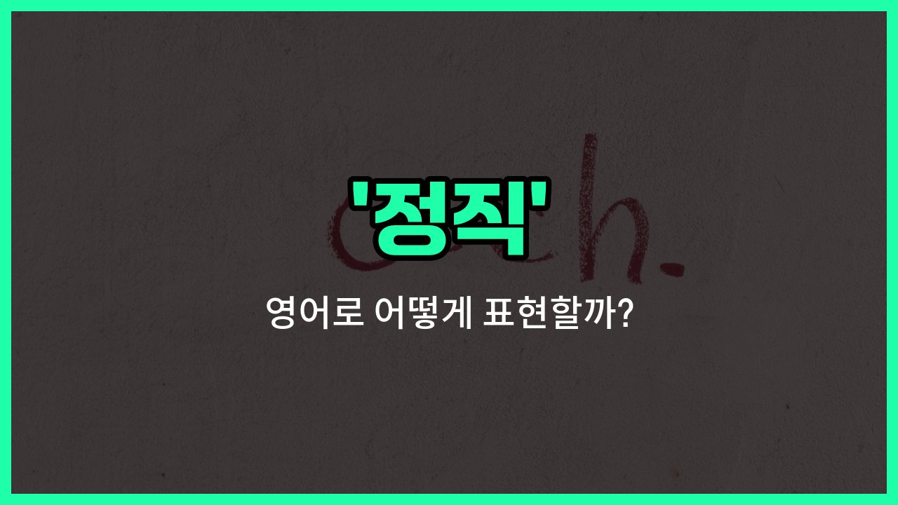

## 🌟 영어 표현 - integrity

안녕하세요 👋 오늘은 영어에서 '정직'이라는 뜻을 가진 표현, '**integrity**'에 대해 알아보려고 해요.

'**integrity**'는 단순히 거짓말을 하지 않는 '정직'뿐만 아니라, 자신의 신념과 원칙을 지키며 올바르게 행동하는 '성실', '진실성'까지 포함하는 단어예요. 즉, **도덕적으로 올바르고, 일관성 있게 행동하는 사람**을 묘사할 때 자주 쓰여요!

이 단어는 일상 대화뿐만 아니라, 자기소개서, 추천서, 직장 등 공식적인 상황에서도 정말 많이 사용돼요. 예를 들어, 누군가를 칭찬할 때 "She is a person of great integrity."라고 하면, "그녀는 정말 정직하고 성실한 사람이야."라는 의미가 돼요.

또한, 회사나 조직의 가치관을 설명할 때도 "We value integrity above all else."처럼 쓸 수 있어요. 이럴 때는 "우리는 무엇보다 정직(진실성)을 중요하게 생각해요."라는 뜻이에요.

## 📖 예문

1. "그는 항상 정직하게 행동해요."

   "He always acts with integrity."

2. "정직은 리더에게 꼭 필요한 자질이에요."

   "Integrity is an essential quality for a leader."

## 💬 연습해보기

<ul data-interactive-list>

  <li data-interactive-item>
    그는 항상 믿을 수 있는 사람이야, 왜냐하면 정직한 사람이거든. 절대 치사하게 굴거나 거짓말하지 않아.
    You can always trust him because he is a man of integrity. He never cuts corners or <a href="/blog/in-english/1270.tell/">tells</a> lies.
  </li>

  <li data-interactive-item>
    이 회사에서는 정직이 빠른 이익보다 더 중요해. 여기서는 정말로 honesty를 소중히 여겨.
    In this company, integrity is more <a href="/blog/in-english/318.important/">important</a> than making a quick profit. They really value honesty here.
  </li>

  <li data-interactive-item>
    그녀는 실수를 인정하는 데 큰 용기를 보여줬어, 비록 그게 쉽지는 않았지만.
    She showed great integrity by admitting her mistake even though it was tough to do.
  </li>

  <li data-interactive-item>
    면접에서 그는 직장에서 정직함이 얼마나 중요한지 강조했어.
    During the interview, he emphasized how much integrity matters to him in the workplace.
  </li>

  <li data-interactive-item>
    정직하게 비즈니스를 운영하면 고객과 오랫동안 지속되는 관계를 만들어.
    Managing a business with integrity builds <a href="/blog/in-english/1077.long/">long</a>-lasting <a href="/blog/in-english/1374.relationship/">relationships</a> with customers.
  </li>

  <li data-interactive-item>
    혼자 있을 때도 그는 정직하게 행동했고, 옳은 일을 했어.
    Even when no one was watching, he acted with integrity and did the right thing.
  </li>

  <li data-interactive-item>
    정직하고 약속을 지키는 사람들과 함께 일하는 건 정말 상쾌해.
    It's refreshing to <a href="/blog/in-english/1064.work/">work</a> with <a href="/blog/in-english/1057.people/">people</a> who have integrity and stand by their word.
  </li>

  <li data-interactive-item>
    코치님은 팀이 공정하게 경기를 하고 상대를 존중한 점을 높게 평가하셨어.
    The coach praised the team's integrity for playing fair and respecting their opponents.
  </li>

  <li data-interactive-item>
    정직함은 단순히 진실을 말하는 게 아니라 항상 일관되게 믿을 수 있는 사람들이 되는 거야.
    Integrity isn't just about telling the truth, it's about being consistent and trustworthy all the time.
  </li>

  <li data-interactive-item>
    나는 그녀의 정직함을 존중해, 왜냐하면 그녀는 항상 자신의 행동에 책임을 지거든.
    I respect her integrity because she always owns up to her actions and takes responsibility.
  </li>

</ul>

## 🤝 함께 알아두면 좋은 표현들

### honesty

'honesty'는 '정직함' 또는 '솔직함'을 의미해요. 자신의 생각이나 행동에 대해 거짓 없이 진실을 말하고 행동하는 태도를 나타내요. integrity와 매우 비슷한 의미로, 신뢰를 쌓는 데 중요한 덕목이에요.

- "Her honesty in admitting the mistake earned her everyone's respect."
- "그녀가 실수를 인정하는 데 있어서 정직했기 때문에 모두의 존경을 받았어요."

### dishonesty

'dishonesty'는 '부정직함' 또는 '거짓됨'을 뜻해요. 사실을 숨기거나 거짓말을 하는 등 정직하지 않은 행동을 나타내며, integrity의 반대 개념이에요.

- "Dishonesty in business can [lead to](/blog/vocab-1/004.lead-to/) serious consequences."
- "사업에서의 부정직함은 심각한 결과를 초래할 수 있어요."

### moral uprightness

'moral uprightness'는 '도덕적 청렴성' 또는 '도덕적 올바름'을 의미해요. 자신의 가치관과 원칙에 따라 올바르게 행동하는 태도를 강조하며, integrity와 밀접한 관련이 있어요.

- "He is known for his moral uprightness and fairness in all his decisions."
- "그는 모든 결정에서 도덕적 청렴성과 공정함으로 잘 알려져 있어요."

---

오늘은 '정직', '성실', '진실성'이라는 뜻을 가진 영어 표현 '**integrity**'에 대해 알아봤어요. 앞으로 누군가의 올바른 행동이나 신뢰할 수 있는 성품을 표현하고 싶을 때 이 단어를 꼭 떠올려 보세요! 😊

오늘 배운 표현과 예문들을 꼭 최소 3번씩 소리 내서 읽어보세요. 다음에도 더 재미있고 유익한 영어 표현으로 찾아올게요! 감사합니다!

