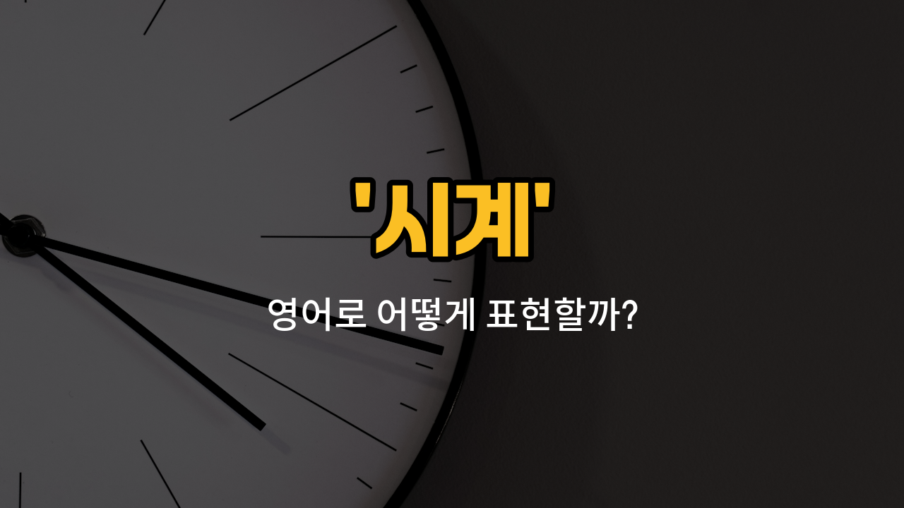

## 🌟 영어 표현 - clock

안녕하세요 👋 오늘은 일상에서 자주 쓰는 물건 중 하나인 '**시계**'의 영어 표현에 대해 알아보려고 해요. 바로 '**clock**'이라는 단어인데요~

'**clock**'은 벽에 걸거나 책상 위에 놓는 **벽시계**나 **탁상시계**를 주로 의미해요. 손목에 차는 시계는 'watch'라고 따로 부르지만, 집이나 사무실에서 시간을 확인할 때 보는 시계는 대부분 'clock'이라고 해요~

예를 들어, 집 거실에 걸려 있는 시계나 학교 교실에 있는 시계 모두 'clock'이라고 부를 수 있어요. 그리고 알람 기능이 있는 탁상시계도 'alarm clock'이라고 하죠~

## 📖 예문

1. "이 방에는 시계가 없어요."

   "There is no clock in this room."

2. "벽에 걸린 시계가 멈췄어요."

   "The clock on the wall has stopped."

## 💬 연습해보기

<ul data-interactive-list>

  <li data-interactive-item>
    버스를 기다리면서 항상 시계를 확인해요. 벌써 8시 반이라서 빨리 가야 할 것 같아요.
    I always check the clock when I'm waiting for the bus. It's already 8:30, so I better hurry up.
  </li>

  <li data-interactive-item>
    시계에서 시간이 몇 시인지 볼 수 있어요? 늦을 것 같아요.
    Can you see what time it is on the clock? I <a href="/blog/in-english/1059.think/">think</a> we're going to be late.
  </li>

  <li data-interactive-item>
    부엌에 있는 벽 시계가 소음 나게 계속 똑딱거려서 미치는 것 같아요.
    The clock on the wall in the kitchen keeps ticking loudly, and it's driving me crazy.
  </li>

  <li data-interactive-item>
    침대 방에 날씨랑 시간을 보여주는 새 시계를 방금 샀어요.
    I just bought a new clock for my bedroom that shows the <a href="/blog/in-english/1437.weather/">weather</a> and the time.
  </li>

  <li data-interactive-item>
    12시 딱 되자마자 모두가 새해 복 많이 받으라고 외쳤어요!
    When the clock struck midnight, everyone shouted <a href="/blog/in-english/1322.happy/">Happy</a> New Year!
  </li>

  <li data-interactive-item>
    엄마가 6시 되면 저녁 준비가 완료된다고 하셨어요.
    Mom <a href="/blog/in-english/1061.said/">said</a> dinner will be ready when the clock hits six.
  </li>

  <li data-interactive-item>
    그는 시계를 잠깐 봤지만, 거실의 시계는 다른 시간을 보여줬어요.
    He glanced at his watch, but the clock in the living room showed a different time.
  </li>

  <li data-interactive-item>
    내 오래된 알람 시계가 드디어 고장이 나서 새로 하나 구입했어요.
    My old alarm clock finally stopped <a href="/blog/in-english/1064.work/">working</a>, so I had to get a new one.
  </li>

  <li data-interactive-item>
    사무실 시계가 제대로 안 작동해서 모두 회의 시간에 혼란스러워요.
    The <a href="/blog/in-english/1379.office/">office</a> clock isn't working properly, so everyone is confused about the meeting time.
  </li>

  <li data-interactive-item>
    어제 밤에 시간을 한 시간 앞당겨 시계를 맞췄어요. 썸머타임 때문에요.
    I set my clock forward an hour last night because of daylight <a href="/blog/in-english/293.save/">saving</a> time.
  </li>

</ul>

## 🤝 함께 알아두면 좋은 표현들

### watch (손목시계)

'watch'는 손목에 차는 작은 시계를 의미해요. 'clock'이 벽이나 탁자 위에 놓여 시간을 알려주는 기계라면, 'watch'는 휴대가 가능해서 언제 어디서나 시간을 확인할 수 있어요.

- "She looked at her watch to check the time before the meeting started."
- "그녀는 회의가 시작되기 전에 시간을 확인하려고 손목시계를 봤어요."

### timer (타이머)

'timer'는 특정 시간 동안 시간을 재거나 알람을 울리도록 설정하는 기계예요. 'clock'이 현재 시간을 알려주는 반면, 'timer'는 시간을 측정하거나 제한할 때 주로 사용돼요.

- "I set the timer for 20 minutes to bake the cookies."
- "나는 쿠키를 굽기 위해 타이머를 20분으로 맞췄어요."

### timeless (시간이 없는, 영원한)

'timeless'는 '시간에 구애받지 않는' 또는 '영원한'이라는 뜻이에요. 'clock'이 시간을 측정하는 도구라면, 'timeless'는 시간의 흐름과 상관없는 상태를 나타내는 반대 개념이에요.

- "Her beauty is timeless and admired by everyone."
- "그녀의 아름다움은 영원해서 모두가 감탄해요."

---

오늘은 '**시계**'라는 뜻의 영어 단어 '**clock**'에 대해 알아봤어요. 집이나 학교, 사무실 등 어디서든 쉽게 볼 수 있는 시계, 이제 영어로 자신 있게 말할 수 있겠죠? 😊

오늘 배운 표현과 예문들을 꼭 소리 내서 여러 번 읽어보세요. 다음에도 더 유익한 영어 표현으로 찾아올게요! 감사합니다~

