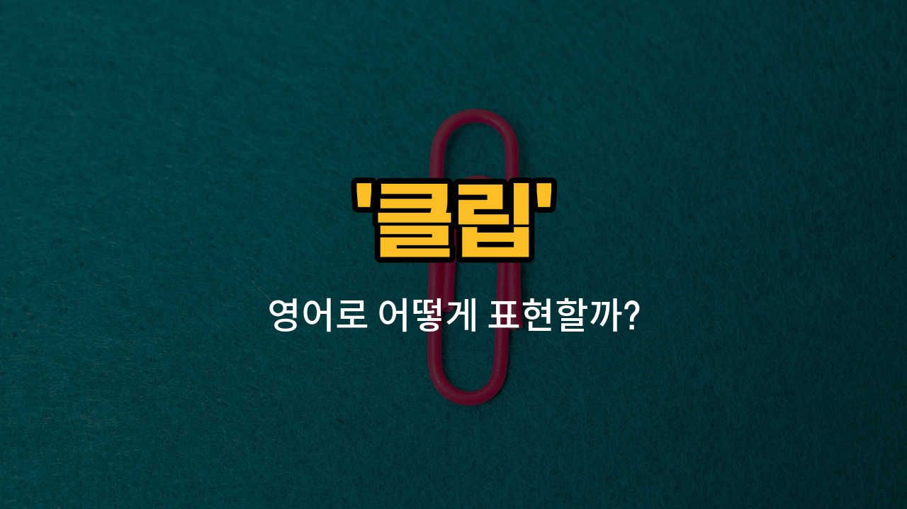

## 🌟 영어 표현 - clip

안녕하세요 👋 오늘은 우리가 일상에서 자주 사용하는 사무용품 중 하나인 '**클립**'의 영어 표현 '**clip**'에 대해 알아보려고 해요.

'**clip**'은 종이나 물건을 집거나 고정할 때 쓰는 작은 도구를 의미해요. 우리가 흔히 알고 있는 종이 클립뿐만 아니라, 머리카락을 집는 헤어 클립, 그리고 어떤 물건을 고정하는 집게 등 다양한 상황에서 사용할 수 있는 단어예요.

또한 '**clip**'은 명사로 '클립', '집게'라는 뜻이 있지만, 동사로도 많이 쓰여요. 동사로는 '고정하다', '집다', '끼우다'라는 의미로 활용할 수 있어요. 예를 들어, 종이를 클립으로 집을 때 "clip the papers together"라고 표현할 수 있어요.

## 📖 예문

1. "종이 클립으로 서류를 고정했어요."

   "I clipped the documents together with a paper clip."

2. "머리카락을 클립으로 집었어요."

   "She clipped her hair back with a clip."

3. "사진을 벽에 클립으로 고정할 수 있어요."

   "You can clip the photo to the wall."

## 💬 연습해보기

<ul data-interactive-list>

  <li data-interactive-item>
    회의 시작 전에 이 서류들을 함께 고정해야 해요.
    I need to clip these papers together before the meeting starts.
  </li>

  <li data-interactive-item>
    그녀는 앞머리를 얼굴에서 치우기 위해 헤어 클립을 사용했어요.
    She used a hair clip to keep her bangs out of her face.
  </li>

  <li data-interactive-item>
    이 쿠폰 좀 잘라줄 수 있어요? 매장에서 20% 할인받을 수 있어요.
    Can you clip this coupon for me? It's for 20% off at the store.
  </li>

  <li data-interactive-item>
    그는 매달 개의 발톱을 다듬어 주는 걸 좋아해요.
    He <a href="/blog/in-english/1053.like/">likes</a> to clip his dog's <a href="/blog/vocab-1/011.nail/">nails</a> every month to keep them tidy.
  </li>

  <li data-interactive-item>
    영수증 잘라내는 거 잊지 말고, 반품할 때를 위해 꼭 보관해 두세요.
    Don't <a href="/blog/in-english/023.forget/">forget</a> to clip the receipt and <a href="/blog/in-english/293.save/">save</a> it for returns.
  </li>

  <li data-interactive-item>
    가방 챙기면서 실수로 헤드폰을 가방에 고정해버렸어요.
    I <a href="/blog/in-english/314.accidentally/">accidentally</a> clip my headphones to my backpack while <a href="/blog/in-english/301.pack/">packing</a>.
  </li>

  <li data-interactive-item>
    배선이 엉키지 않도록 잘라야 했어요.
    She had to clip the wires so they wouldn't get tangled.
  </li>

  <li data-interactive-item>
    선생님이 우리에게 워크시트를 폴더에 고정하라고 하셨어요.
    The teacher <a href="/blog/in-english/1394.asked/">asked</a> us to clip our worksheets to a folder.
  </li>

  <li data-interactive-item>
    나가기 전에 꼭 ID 배지를 랜야드에 다시 고정하는 거 잊지 마세요.
    Before you leave, make sure to clip your ID badge back onto your lanyard.
  </li>

  <li data-interactive-item>
    그는 표를 잘라서 스캔하고 gate를 통과했어요.
    He clipped the ticket and scanned it to get through the gate.
  </li>

</ul>

## 🤝 함께 알아두면 좋은 표현들

### cut (컷)

'cut'은 '무언가를 자르다'라는 뜻으로, 'clip'과 비슷하게 물리적으로 어떤 부분을 잘라내는 행위를 나타내요. 영상 편집이나 머리카락 자르기 등 다양한 상황에서 쓰여요.

- "She cut the paper into small pieces."
- "그녀는 종이를 작은 조각들로 잘랐어요."

### attach (붙이다)

'attach'는 '무언가를 붙이다'라는 뜻으로, 'clip'과는 반대되는 의미를 가지고 있어요. 클립으로 종이를 고정하는 것과 달리, 붙이는 행위를 나타낼 때 사용해요.

- "Please attach the documents to the email before sending."
- "이메일을 보내기 전에 서류를 꼭 첨부해 주세요."

### fasten (고정하다)

'fasten'은 '무언가를 단단히 고정하다'라는 뜻으로, 'clip'과 유사한 의미를 가지고 있어요. 클립으로 종이나 물건을 고정하는 행위를 표현할 때 쓸 수 있어요.

- "She fastened the seatbelt before driving."
- "그녀는 운전하기 전에 안전벨트를 꼭 매었어요."

---

오늘은 '**클립**', '**집게**', '**고정하다**'라는 뜻을 가진 영어 표현 '**clip**'에 대해 알아봤어요. 일상에서 다양한 상황에 맞게 활용해 보세요 😊

오늘 배운 표현과 예문들을 꼭 소리 내서 여러 번 읽어보세요. 다음에도 더 유익한 영어 표현으로 찾아올게요! 감사합니다!

