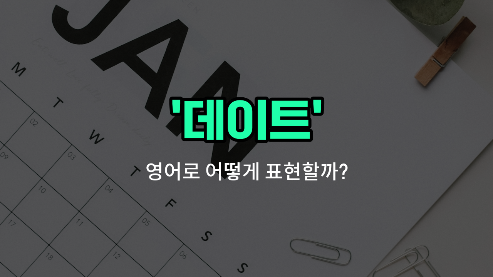

## 🌟 영어 표현 - date

안녕하세요 👋 오늘은 많은 분들이 궁금해하는 영어 표현, 바로 '**데이트**'에 대해 이야기해보려고 해요. 영어에서 '**date**'는 연인 사이에서 만나는 '데이트'라는 의미로 가장 많이 쓰여요. 하지만 이 단어는 '만남', '약속'이라는 뜻으로도 다양하게 활용된답니다.

예를 들어, 누군가와 특별한 시간을 보내기 위해 만나는 걸 'go on a date'라고 해요. 또, 친구와의 약속이나 중요한 미팅 날짜를 말할 때도 'date'라는 단어를 사용할 수 있어요.

'**date**'는 명사로 '데이트', '만남', '약속'을 의미하고, 동사로는 '데이트하다', '만나다'라는 뜻으로도 쓰여요. 상황에 따라 자연스럽게 사용할 수 있으니 꼭 기억해두세요!

## 📖 예문

1. "오늘 저녁에 데이트 있어요."

   "I have a date tonight."

2. "우리 언제 만날지 날짜를 정해야 해요."

   "We need to set a date for our meeting."

3. "그들은 3년째 데이트 중이에요."

   "They have been dating for three [years](/blog/in-english/1065.year/)."

## 💬 연습해보기

<ul data-interactive-list>

  <li data-interactive-item>
    이번 주말에 그녀를 데이트에 초대해볼까 생각 중이에요. 시내에 새로 생긴 이탈리안 레스토랑이 완전 데이트하기에 좋다고 하더라고요.
    I'm thinking of asking her out on a date this weekend. I've heard there's a new Italian restaurant downtown that's perfect for a date.
  </li>

  <li data-interactive-item>
    금요일 밤에 나랑 데이트할래? 다들 이야기하는 그 새 영화 보러 가는 거 어때?
    Do you want to go on a date with me Friday night? We could catch that new movie everyone is <a href="/blog/in-english/1294.talk/">talking</a> about.
  </li>

  <li data-interactive-item>
    데이트 전에 너무 긴장했는데, 결국 잘 진행됐어요.
    He was so nervous before the date, but it went really well in the end.
  </li>

  <li data-interactive-item>
    첫 데이트 때 그 작은 커피숍에서 만났다는 게 믿기지 않아요. 서로 알아가는 좋은 시점이었죠.
    I can't believe we met on our first date at that little coffee shop. It was a great <a href="/blog/in-english/1062.way/">way</a> to start getting to know each other.
  </li>

  <li data-interactive-item>
    벌써 6개월간 사귀고 있는데 둘 다 정말 행복해 보이네요.
    They've been dating for six months now and seem really <a href="/blog/in-english/1322.happy/">happy</a> <a href="/blog/in-english/374.together/">together</a>.
  </li>

  <li data-interactive-item>
    그녀가 그 남자의 생일을 맞아 그가 좋아하는 것들로 깜짝 데이트를 계획했어요.
    She planned a surprise date for their anniversary with all his favorite things.
  </li>

  <li data-interactive-item>
    오늘 밤 소개팅 있는 데, 기대되기도 하고 비도오고 긴장되기도 해요.
    I have a blind date tonight and I'm kind of excited but also really nervous.
  </li>

  <li data-interactive-item>
    우리는 첫 데이트는 가볍게 그냥 술 한잔하자고 했어요. 간단하게 하려고요.
    We <a href="/blog/in-english/062.decide-to/">decided to</a> keep it casual and just grab drinks on our first date to keep things simple.
  </li>

  <li data-interactive-item>
    데이트 끝나고 그는 그녀에게 좋은 시간이었고 다시 보고 싶다고 문자했어요.
    After their date, he texted her to say he had a great time and wants to see her again.
  </li>

  <li data-interactive-item>
    데이트가 막판에 취소돼서 집에서 혼자 영화를 보게 됐어요.
    My date canceled last minute, so I ended up <a href="/blog/in-english/1352.watch/">watching</a> a movie alone at home.
  </li>

</ul>

## 🤝 함께 알아두면 좋은 표현들

### go out with

'go out with'는 누군가와 함께 시간을 보내거나 데이트를 하다라는 뜻이에요. 주로 연인 관계에서 함께 외출하거나 만나는 상황을 표현할 때 사용해요.

- "They have been going out with each other for six months."
- "그들은 서로 6개월 동안 데이트를 해왔어요."

### hang out

'hang out'은 친구들이나 사람들과 편하게 시간을 보내다라는 뜻이에요. 꼭 연인 관계가 아니어도 같이 놀거나 시간을 보내는 상황에 쓸 수 있어요.

- "We usually hang out at the cafe on weekends."
- "우리는 보통 주말에 카페에서 같이 시간을 보내요."

### stay single

'stay single'은 연애를 하지 않고 혼자 있는 상태를 유지하다라는 뜻이에요. 데이트를 하지 않는 반대 의미로, 독신 생활을 선택하거나 유지하는 것을 말해요.

- "After his last relationship ended, he decided to stay single for a while."
- "지난 연애가 끝난 후에 그는 한동안 혼자 지내기로 결정했어요."

---

오늘은 '데이트', '만남', '약속'이라는 뜻을 가진 영어 표현 '**date**'에 대해 알아봤어요. 앞으로 누군가와의 약속이나 특별한 만남을 이야기할 때 이 표현을 활용해보세요 😊

오늘 배운 표현과 예문들을 꼭 소리 내서 여러 번 읽어보시고, 다음에도 더 유익한 영어 표현으로 찾아올게요! 감사합니다!

