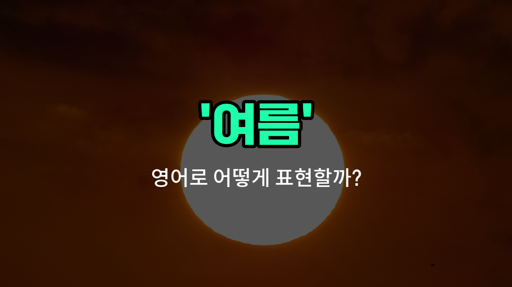

## 🌟 영어 표현 - summer

안녕하세요 👋 오늘은 계절 중 하나인 '**여름**'을 영어로 어떻게 표현하는지 알아보려고 해요. 바로 '**summer**'라는 단어를 사용해요. 이 단어는 우리가 흔히 말하는 더운 계절, 즉 **여름철**이나 **한여름**을 모두 포함해서 쓸 수 있어요!

'summer'는 1년 중 가장 더운 계절을 의미해요. 학교 방학, 바닷가 여행, 아이스크림, 그리고 햇볕이 강한 날씨 등 다양한 여름의 특징을 떠올릴 수 있죠. 영어에서도 'summer vacation(여름 방학)', 'summer heat(여름 더위)'처럼 여러 표현에 자연스럽게 쓰여요.

또한, '한여름'처럼 정말 더운 시기를 강조하고 싶을 때는 'in the middle of summer' 또는 'in midsummer'라고 표현할 수 있어요.

## 📖 예문

1. "나는 여름에 바다에 가는 걸 좋아해요."

   "I like going to the beach in summer."

2. "여름철에는 날씨가 정말 더워요."

   "The [weather](/blog/in-english/1437.weather/) is really hot in the summer."

3. "한여름에는 아이스크림이 최고예요."

   "Ice cream is the best in midsummer."

## 💬 연습해보기

<ul data-interactive-list>

  <li data-interactive-item>
    여름이 시작되길 못 기다리겠어! 매주 주말마다 해변에 가고 싶거든.
    I can't wait for summer to start so we can go to the beach every weekend.
  </li>

  <li data-interactive-item>
    여름은 새로운 아이스크림 맛을 시도하고 햇살을 즐기기에 딱 좋은 때야.
    Summer is the perfect time to try new ice cream flavors and enjoy the sunshine.
  </li>

  <li data-interactive-item>
    여름에는 우리 가족이 뒷마당에서 바비큐하는 걸 좋아해.
    During summer, my family likes to have barbecues in the backyard.
  </li>

  <li data-interactive-item>
    여름 동안 항상 조금 땀을 흘리지만, 긴 하루가 너무 좋아.
    I always get a little sweaty during summer, but I <a href="/blog/in-english/1074.love/">love</a> the long days.
  </li>

  <li data-interactive-item>
    여름 방학은 학교도 없고 재미있는 활동을 할 수 있는 시간이야.
    Summer vacation <a href="/blog/in-english/1214.mean/">means</a> no school and more time for fun activities.
  </li>

  <li data-interactive-item>
    여름에 전국을 가로지르는 로드트립을 계획했어. 국립공원도 방문할 거야.
    We planned a road <a href="/blog/in-english/1150.trip/">trip</a> across the country in the summer to visit some national parks.
  </li>

  <li data-interactive-item>
    여름에는 도시가 야외 콘서트랑 축제로 가득 차서 정말 활기차게 느껴져.
    In summer, the city feels alive with all the outdoor concerts and festivals happening.
  </li>

  <li data-interactive-item>
    대부분의 사람들은 여름이 더 가벼운 옷을 입고 외부에서 놀 수 있어서 좋아해.
    Most people prefer summer because they can wear lighter clothes and hang out outside.
  </li>

  <li data-interactive-item>
    친구들이랑 여름에 더위를 피하려고 주 2회 수영하러 가려고 해.
    My <a href="/blog/in-english/1279.friends/">friends</a> and I try to go swimming at least twice a week in the summer to beat the heat.
  </li>

  <li data-interactive-item>
    여름을 대비해서 새로 선글라스를 샀어. 태양이 정말 밝아지거든.
    I <a href="/blog/in-english/1287.buy/">bought</a> a new pair of sunglasses for the summer because the sun gets really bright.
  </li>

</ul>

## 🤝 함께 알아두면 좋은 표현들

### hot season

'hot season'은 '더운 계절'이라는 뜻으로, 여름과 비슷한 의미를 가지고 있어요. 주로 기온이 높고 날씨가 더운 시기를 가리킬 때 사용해요.

- "Many people go to the beach during the hot season to [cool off](/blog/in-english/085.cool-off/)."
- "많은 사람들이 더운 계절에 더위를 식히려고 해변에 가요."

### winter (겨울)

'winter'는 '겨울'이라는 뜻으로, 여름의 반대 계절이에요. 기온이 낮고 눈이나 추운 날씨가 특징인 시기를 말해요.

- "I prefer summer to winter because I don't like the cold."
- "저는 추운 겨울보다 여름을 더 좋아해요."

### rainy season (장마철)

'rainy season'은 '장마철' 또는 '우기'를 의미해요. 여름과 겹치는 경우가 많지만, 비가 많이 오는 시기를 강조하는 표현이에요.

- "The rainy season usually starts in June and lasts for a few months."
- "장마철은 보통 6월에 시작해서 몇 달 동안 계속돼요."

---

오늘은 '**여름**'이라는 뜻을 가진 영어 표현 '**summer**'에 대해 알아봤어요. 앞으로 계절이나 방학, 더운 날씨에 대해 이야기할 때 이 단어를 꼭 활용해 보세요 😊

오늘 배운 표현과 예문들을 소리 내서 여러 번 읽어보면 더 기억에 잘 남을 거예요. 다음에도 더 재미있고 유익한 영어 표현으로 찾아올게요! 감사합니다!

