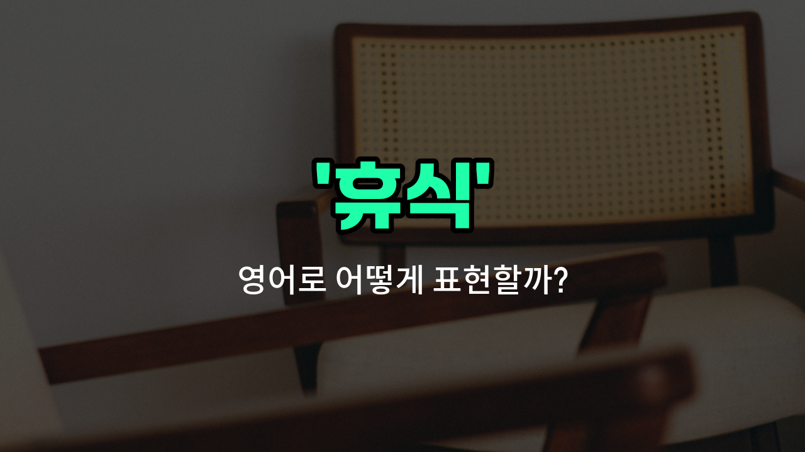

## 🌟 영어 표현 - rest

안녕하세요 👋 오늘은 일상에서 자주 쓰이는 단어인 '**휴식**'의 영어 표현 '**rest**'에 대해 알아보려고 해요.

'**rest**'는 몸이나 마음이 피곤할 때 잠시 멈추고 쉬는 것을 의미해요. 즉, **에너지를 회복하거나 피로를 풀기 위해 잠깐 멈추는 시간**을 말할 때 사용해요!

이 단어는 일상 대화, 직장, 학교 등 다양한 상황에서 자연스럽게 쓸 수 있어요. 예를 들어, 열심히 일한 후 "잠깐 쉬어야겠어"라고 말하고 싶을 때 "I need to rest for a while."라고 표현할 수 있어요.

또한, 'rest'는 명사로 '휴식', 동사로 '쉬다'라는 뜻을 모두 가지고 있어서 정말 유용하게 쓸 수 있어요. 상황에 따라 적절하게 활용해 보세요!

## 📖 예문

1. "나는 주말에 충분한 휴식이 필요해요."

   "I need plenty of rest on the weekend."

2. "잠깐 쉬었다가 다시 시작해요."

   "Let's rest for a while and start again."

## 💬 연습해보기

<ul data-interactive-list>

  <li data-interactive-item>
    퇴근하고 너무 피곤해서 저녁 먹기 전에 좀 쉬기로 했어요.
    I was <a href="/blog/in-english/1377.feeling/">feeling</a> really tired after work, so I <a href="/blog/in-english/062.decide-to/">decided to</a> rest for a while before dinner.
  </li>

  <li data-interactive-item>
    몸이 안 좋으면 무리하지 말고 쉬는 게 좋아요.
    You should rest if you're feeling unwell instead of pushing yourself too hard.
  </li>

  <li data-interactive-item>
    마라톤을 달린 후에 온 몸이 정말 푹 쉬고 싶었어요.
    After running that marathon, my whole body needed a good rest.
  </li>

  <li data-interactive-item>
    저는 보통 일요일에 영화 보고 집에서 쉬면서 시간을 보내요.
    I usually rest on Sundays by <a href="/blog/in-english/1352.watch/">watching</a> movies and relaxing at home.
  </li>

  <li data-interactive-item>
    컴퓨터 화면을 몇 시간 동안 쳐다본 후에는 눈 좀 쉬게 하는 거 잊지 마세요.
    Don't forget to rest your eyes after staring at the computer screen for hours.
  </li>

  <li data-interactive-item>
    그는 하이킹 도중 숨 고르고 경치를 즐기려고 잠깐 쉬었어요.
    He took a <a href="/blog/in-english/1399.short/">short</a> rest during the hike to catch his breath and enjoy the view.
  </li>

  <li data-interactive-item>
    생산성을 유지하려면 마음도 쉬고 쉬는 시간을 가져야 해요.
    If you want to stay <a href="/blog/in-english/287.productive/">productive</a>, you need to take breaks and rest your mind.
  </li>

  <li data-interactive-item>
    그녀는 며칠 동안 연속으로 일했는데, 정말 쉬어야 할 것 같아요.
    She's been working non-stop for days; I think she really needs some rest.
  </li>

  <li data-interactive-item>
    의사 선생님이 수술 후에 며칠 동안 완전히 쉬라고 하셨어요.
    The doctor advised him to rest completely for a few days after the <a href="/blog/in-english/572.surgery/">surgery</a>.
  </li>

  <li data-interactive-item>
    주말에는 오후에 쉬면서 다음 주를 준비해요.
    On weekends, I <a href="/blog/in-english/1053.like/">like</a> to rest in the afternoon and recharge for the week ahead.
  </li>

</ul>

## 🤝 함께 알아두면 좋은 표현들

### take a break

'take a break'은 "잠시 쉬다" 또는 "휴식을 취하다"라는 뜻이에요. 일이나 활동 중간에 잠깐 멈추고 몸과 마음을 재충전하는 상황에서 자주 사용해요.

- "After working for three hours straight, she decided to take a break and stretch her legs."
- "3시간 동안 계속 일한 후에 그녀는 잠시 쉬면서 다리를 쭉 펴기로 했어요."

### keep going

'keep going'은 "계속하다" 또는 "멈추지 않고 진행하다"라는 뜻이에요. 휴식 없이 계속해서 어떤 일을 이어가는 상황을 나타내며, 'rest'의 반대 개념으로 볼 수 있어요.

- "Even though he was tired, he kept going until he finished the project."
- "피곤했지만 그는 프로젝트를 끝낼 때까지 계속했어요."

### recharge

'recharge'는 "재충전하다"라는 의미로, 휴식을 통해 에너지를 다시 얻는 것을 말해요. 주로 몸과 마음의 피로를 풀고 활력을 되찾는 상황에서 사용돼요.

- "It's important to recharge on weekends to be productive during the week."
- "주중에 생산적으로 일하려면 주말에 재충전하는 것이 중요해요."

---

오늘은 '**휴식**', '**쉬다**', '**휴가**'라는 뜻을 가진 영어 표현 '**rest**'에 대해 알아봤어요. 피곤할 때 이 표현을 떠올리면 좋겠어요 😊

오늘 배운 표현과 예문들을 꼭 최소 3번씩 소리 내서 읽어보세요. 다음에도 더 재미있고 유익한 영어 표현으로 찾아올게요! 감사합니다!

