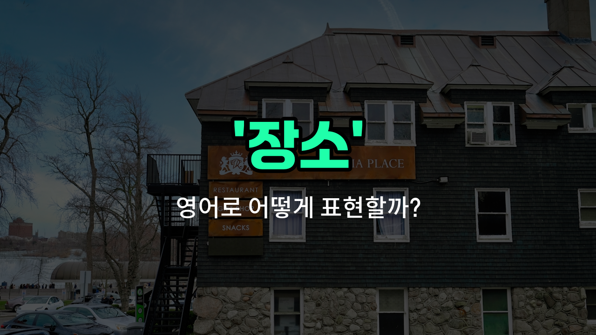

## 🌟 영어 표현 - site

안녕하세요 👋 오늘은 영어로 '장소', '현장', '부지'를 어떻게 표현하는지 알아볼 거예요. 바로 '**site**'라는 단어인데요~

'**site**'는 어떤 일이 일어나거나 특정 목적을 위해 사용되는 '장소'를 의미해요. 예를 들어, 건설 현장, 역사적인 장소, 또는 웹사이트처럼 온라인 공간까지 다양하게 쓸 수 있어요~

일상에서는 주로 '공사 현장', '사건 현장', '건물 부지' 등 실제로 무언가가 존재하거나 일어나는 곳을 말할 때 많이 사용해요. 예를 들어, "The construction site is very busy."라고 하면 "공사 현장이 매우 바빠요."라는 뜻이에요~

또한, 인터넷 주소를 말할 때도 'website'처럼 'site'가 쓰여요. 하지만 오늘은 주로 물리적인 장소에 초점을 맞춰 설명할게요!

## 📖 예문

1. "이곳이 새 학교가 들어설 부지예요."

   "This is the site for the new school."

2. "경찰이 사건 현장에 도착했어요."

   "The police arrived at the site of the incident."

## 💬 연습해보기

<ul data-interactive-list>

  <li data-interactive-item>
    우리는 이번 주말 회사 소풍을 위해 좋은 장소를 찾았어요. 공간도 넉넉하고 피크닉 테이블도 있어요.
    We found a great site for our company picnic this weekend. It's got plenty of space and some picnic tables too.
  </li>

  <li data-interactive-item>
    그 역사적인 장소는 매년 수천 명의 관광객들이 과거에 대해 배우러 오는 곳이에요.
    The historic site attracts thousands of tourists every <a href="/blog/in-english/1065.year/">year</a> eager to learn more about the past.
  </li>

  <li data-interactive-item>
    새로운 쇼핑몰을 짓기 전에, 건축가들이 현장을 방문해 측정하고 사진도 찍을 거예요.
    Before we start building the new mall, the architects will visit the site to take measurements and photographs.
  </li>

  <li data-interactive-item>
    결혼식 장소로 완전한 곳을 선택했어요. 호숫가에 아름다운 전망이 있는 곳이에요.
    They chose the perfect site for the wedding ceremony, right by the lake with a beautiful view.
  </li>

  <li data-interactive-item>
    공사팀이 새로운 학교의 기초를 놓기 위해 현장을 준비하기 위해 일찍 도착했어요.
    The construction crew arrived <a href="/blog/in-english/1283.early/">early</a> to prepare the site for laying the foundation of the new school.
  </li>

  <li data-interactive-item>
    우리 캠핑 trip을 위해 도시에서 멀리 떨어진 외진 장소를 골랐어요. 조용한 자연을 만끽하기 위해서요.
    For our camping trip, we picked a remote site far away from the city to enjoy the quiet nature.
  </li>

  <li data-interactive-item>
    밴드가 무대에 올라 최대 히트곡을 공연할 때 콘서트 현장은 팬들로 가득했어요.
    The concert site was packed with fans when the band took the stage to perform their biggest hits.
  </li>

  <li data-interactive-item>
    당국은 사고 현장을 봉쇄하고 안전하게 잔해를 조사하고 청소했어요.
    Authorities cordoned off the accident site to <a href="/blog/in-english/954.investigate/">investigate</a> and <a href="/blog/in-english/523.clean/">clean</a> up the debris safely.
  </li>

  <li data-interactive-item>
    축제의 장소는 다채로운 깃발과 조명으로 꾸며져서 주말 내내 많은 방문객을 끌어모았어요.
    The site of the festival was decorated with colorful flags and <a href="/blog/in-english/1373.light/">lights</a>, attracting many visitors throughout the weekend.
  </li>

  <li data-interactive-item>
    우리는 사람들이 채소와 꽃을 기를 수 있는 새로운 공동 정원을 위한 적절한 장소를 찾아야 해요.
    We need to find a suitable site for the new community garden where people can grow their own vegetables and flowers.
  </li>

</ul>

## 🤝 함께 알아두면 좋은 표현들

### location

'location'은 '특정한 장소나 위치'를 의미해요. 'site'와 비슷하게 어떤 일이 일어나는 지리적 지점을 가리킬 때 자주 사용돼요. 특히 공식적이거나 기술적인 문맥에서 많이 쓰여요.

- "The new store will [open](/blog/in-english/1235.open/) at a prime location downtown."
- "새 가게는 도심의 좋은 위치에 문을 열 거예요."

### venue

'venue'는 주로 행사나 모임이 열리는 '장소'를 뜻해요. 콘서트, 회의, 결혼식 등 특정 이벤트가 진행되는 장소를 가리킬 때 많이 사용돼요.

- "The wedding ceremony was held at a beautiful outdoor venue."
- "결혼식은 아름다운 야외 장소에서 열렸어요."

### nowhere

'nowhere'는 '어디에도 없는 곳' 또는 '아무 장소도 아닌 곳'을 의미해요. 'site'의 반대 개념으로, 특정한 장소가 없거나 찾을 수 없을 때 쓰여요.

- "Without a map, we were [lost](/blog/in-english/1356.lost/) in the middle of nowhere."
- "지도가 없어서 우리는 아무 데도 없는 한가운데서 길을 잃었어요."

---

오늘은 '장소', '현장', '부지'라는 뜻을 가진 영어 표현 '**site**'에 대해 알아봤어요. 앞으로 어떤 장소나 현장을 영어로 말할 때 이 단어를 떠올려 보세요~ 😊

오늘 배운 표현과 예문들을 꼭 소리 내서 여러 번 읽어보세요. 다음에도 더 유익한 영어 표현으로 찾아올게요! 감사합니다~

