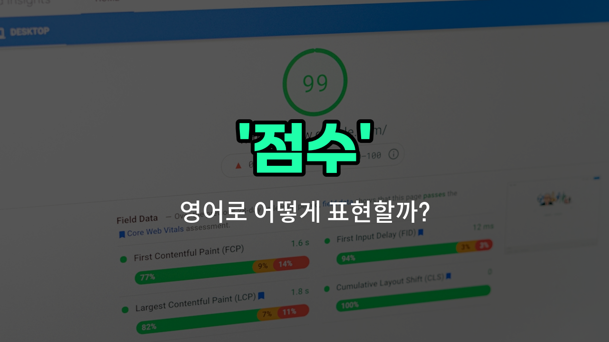

## 🌟 영어 표현 - points

안녕하세요 👋 오늘은 영어로 '점수'를 어떻게 표현하는지 알아보려고 해요. 바로 '**points**'라는 단어를 사용해요. 이 단어는 시험, 게임, 스포츠 등에서 **획득한 점수나 득점**을 나타낼 때 자주 쓰여요!

예를 들어, 농구 경기에서 한 선수가 30점을 얻었다면 "He scored 30 points in the game."라고 말할 수 있어요. 또, 시험에서 높은 점수를 받았을 때도 "I got high points on the test."라고 표현할 수 있답니다.

'points'는 '포인트'라고도 불리며, 보상 시스템이나 멤버십에서 적립되는 점수에도 사용돼요. 예를 들어, "You can earn points with every [purchase](/blog/in-english/1426.purchase/)."처럼 쓸 수 있어요.

## 📖 예문

1. "그 팀이 5점을 더 얻었어요."

   "The team scored 5 more points."

2. "이번 시험에서 몇 점 받았어요?"

   "How many points did you [get on](/blog/in-english/557.get-on/) this test?"

## 💬 연습해보기

<ul data-interactive-list>

  <li data-interactive-item>
    나는 수학 시험에서 85점 받아서 수업을 통과했어.
    I scored 85 points on my math test, which was enough to pass the <a href="/blog/in-english/1262.class/">class</a>.
  </li>

  <li data-interactive-item>
    그는 퀴즈에서 질문에 맞게 답해서 10점을 얻었어.
    He earned 10 points for answering the question correctly during the quiz.
  </li>

  <li data-interactive-item>
    그 팀은 어제 경기를 이겨서 3점을 얻었어.
    The team got three points for winning the match yesterday.
  </li>

  <li data-interactive-item>
    올해 장학금을 받으려면 최소 70점은 넘어야 해.
    You need at least 70 points to qualify for the scholarship this <a href="/blog/in-english/1065.year/">year</a>.
  </li>

  <li data-interactive-item>
    그녀는 춤 동작에서 몇 단계를 놓쳐서 5점을 잃었어.
    She <a href="/blog/in-english/1356.lost/">lost</a> five points because she missed a few steps on her dance routine.
  </li>

  <li data-interactive-item>
    우리는 이길 뻔했는데 결국 다른 팀보다 2점 차로 졌어.
    We were so close to winning, but we ended up with just two points behind the other team.
  </li>

  <li data-interactive-item>
    그는 비디오 게임에서 100점을 얻어서 자부심을 느끼고 있어.
    He's proud of the 100 points he got on his video game high score.
  </li>

  <li data-interactive-item>
    경쟁에서는 각 맞는 답이 2점이니까 기억해둬.
    In the <a href="/blog/in-english/668.competition/">competition</a>, each <a href="/blog/in-english/288.correct/">correct</a> answer is worth two points, so keep that in mind.
  </li>

  <li data-interactive-item>
    이번 과제는 모든 게 완벽하면 최대 50점을 받을 수 있어.
    For this assignment, you can get a maximum of 50 points if everything is perfect.
  </li>

  <li data-interactive-item>
    그들은 게임이 끝난 후 점수를 합산해서 우승자를 결정했어.
    They tallied the points at the end of the game to decide the winner.
  </li>

</ul>

## 🤝 함께 알아두면 좋은 표현들

### score

'score'는 '점수'를 의미하는 가장 일반적인 영어 단어예요. 시험, 경기, 게임 등에서 얻은 점수를 나타낼 때 자주 사용해요.

- "She got a high score on her math test."
- "그녀는 수학 시험에서 높은 점수를 받았어요."

### grade

'grade'는 주로 학교에서 시험이나 과제에 대해 매기는 점수나 등급을 의미해요. 점수뿐만 아니라 평가의 의미도 포함돼 있어요.

- "He received a good grade on his science project."
- "그는 과학 프로젝트에서 좋은 점수를 받았어요."

### zero

'zero'는 '0점'을 의미하는 단어로, 점수의 반대 개념이에요. 아무 점수도 받지 못했거나 실패했을 때 사용해요.

- "She got zero on the quiz because she didn't study."
- "그녀는 공부를 안 해서 퀴즈에서 0점을 받았어요."

---

오늘은 '점수', '득점', '포인트'라는 뜻을 가진 영어 표현 '**points**'에 대해 알아봤어요. 앞으로 게임이나 시험, 쇼핑할 때 이 표현을 떠올려 보세요 😊

오늘 배운 표현과 예문들을 꼭 소리 내서 여러 번 읽어보세요. 다음에도 더 유익한 영어 표현으로 찾아올게요! 감사합니다!

