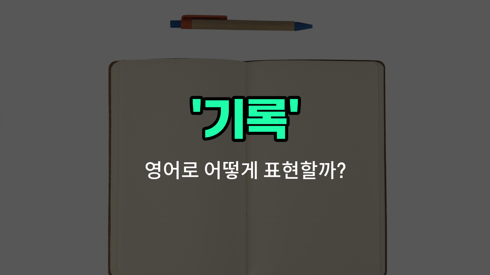

## 🌟 영어 표현 - record

안녕하세요 👋 오늘은 영어로 '기록하다', '기입하다', '녹음하다'라는 뜻을 가진 표현 '**record**'에 대해 알아보려고 해요.

'**record**'는 어떤 사실이나 정보를 **글, 사진, 소리 등 다양한 형태로 남기는 것**을 의미해요. 예를 들어, 중요한 내용을 노트에 적거나, 회의 내용을 녹음하거나, 경기 결과를 표에 적는 등 여러 상황에서 쓸 수 있어요.

이 단어는 동사로 '기록하다', '녹음하다'라는 뜻으로, 명사로는 '기록', '기입', '녹음'이라는 뜻으로 사용돼요. 그래서 상황에 따라 다양하게 활용할 수 있는 아주 유용한 단어예요!

예를 들어, "회의 내용을 녹음해 주세요."라고 할 때 "Please record the meeting."이라고 할 수 있어요. 또, "운동 기록을 남기고 있어요."는 "I am keeping a record of my workouts."라고 표현할 수 있답니다.

## 📖 예문

1. "오늘의 온도를 기록해 주세요."

   "Please record today's temperature."

2. "그는 자신의 목소리를 녹음했어요."

   "He recorded his voice."

## 💬 연습해보기

<ul data-interactive-list>

  <li data-interactive-item>
    회의 내용을 놓치지 않도록 녹음을 해야 해요.
    I need to record the meeting so that we don't miss any important <a href="/blog/in-english/1547.points/">points</a>.
  </li>

  <li data-interactive-item>
    그녀는 자신의 운동을 녹음해가며 시간에 따라 발전 상황을 체크하는 걸 좋아해요.
    She likes to record her workouts to track her progress over time.
  </li>

  <li data-interactive-item>
    오늘 밤 방송 녹화해줄 수 있어요? 놓치고 싶지 않거든요.
    Can you record the show tonight? I don't want to miss it.
  </li>

  <li data-interactive-item>
    선생님이 실험 노트에 우리의 관찰 내용을 기록하라고 하셨어요.
    The teacher <a href="/blog/in-english/1394.asked/">asked</a> us to record our observations in the lab notebook.
  </li>

  <li data-interactive-item>
    그는 휴가의 모든 순간을 사진과 영상으로 기록하려고 하고 있어요.
    He's trying to record every <a href="/blog/in-english/490.moment/">moment</a> of his vacation with photos and videos.
  </li>

  <li data-interactive-item>
    비용 정리를 위해 주행 거리는 꼭 기록해 두세요.
    <a href="/blog/in-english/1311.remember/">Remember</a> to record your mileage if you want to keep your <a href="/blog/in-english/725.expense/">expenses</a> straight.
  </li>

  <li data-interactive-item>
    그들은 행사 중 일어난 모든 것을 기록하기 위해 카메라를 설치했어요.
    They <a href="/blog/in-english/1117.set/">set</a> up cameras to record everything that happened during the event.
  </li>

  <li data-interactive-item>
    내가 좋아하는 노래의 커버를 녹음해서 온라인에 공유하고 싶어요.
    I want to record a cover of my favorite song and share it online.
  </li>

  <li data-interactive-item>
    문서에 날짜를 기록하는 걸 잊지 마세요, 나중에 참고해야 하니까요.
    Make sure to record the <a href="/blog/in-english/1541.date/">date</a> on the document for future reference.
  </li>

  <li data-interactive-item>
    회사는 모든 거래를 정확하게 기록하기 위해 기록을 유지하고 있어요.
    The company keeps records to record all the transactions accurately.
  </li>

</ul>

## 🤝 함께 알아두면 좋은 표현들

### document

'document'는 "문서로 기록하다" 또는 "증거로 남기다"라는 뜻이에요. 어떤 사실이나 정보를 공식적으로 남기거나 증명할 때 주로 사용해요. 'record'보다 좀 더 공식적이고 체계적인 기록을 의미할 때 쓰여요.

- "The researchers documented every step of the experiment carefully."
- "연구원들은 실험의 모든 단계를 꼼꼼히 문서로 남겼어요."

### erase

'erase'는 "지우다"라는 뜻으로, 기록된 내용을 없애거나 삭제하는 것을 의미해요. 'record'의 반대 개념으로, 이미 남겨진 기록을 제거할 때 사용해요.

- "He accidentally erased the important files from his computer."
- "그는 실수로 컴퓨터에서 중요한 파일들을 지워버렸어요."

### log

'log'는 "일지에 기록하다" 또는 "체계적으로 기록하다"라는 뜻이에요. 주로 시간 순서대로 사건이나 활동을 기록할 때 사용하며, 'record'와 비슷하지만 좀 더 일상적이고 구체적인 상황에서 많이 쓰여요.

- "The pilot logged every flight detail in the cockpit logbook."
- "조종사는 조종실 일지에 모든 비행 세부사항을 기록했어요."

---

오늘은 '기록하다', '기입하다', '녹음하다'라는 뜻을 가진 영어 표현 '**record**'에 대해 알아봤어요. 일상에서 중요한 순간이나 정보를 남길 때 이 표현을 떠올려 보세요 😊

오늘 배운 표현과 예문들을 꼭 최소 3번씩 소리 내서 읽어보세요. 다음에도 더 재미있고 유익한 영어 표현으로 찾아올게요! 감사합니다!

