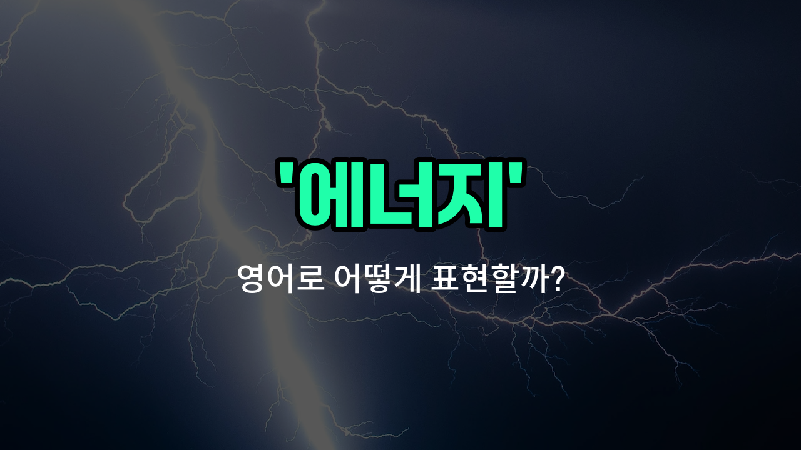

## 🌟 영어 표현 - energy

안녕하세요 👋 오늘은 우리가 자주 쓰는 단어인 '**에너지**'의 영어 표현 '**energy**'에 대해 알아보려고 해요.

'**energy**'는 기본적으로 **힘**, **활력**, **기운**을 의미해요. 즉, 사람이 활동할 수 있게 해주는 원동력이나, 사물이나 자연에서 발생하는 힘을 모두 포함하는 단어예요.

일상 대화에서는 "오늘 에너지가 넘친다!"처럼 **활력**이나 **기운**을 표현할 때 자주 사용해요. 또, 과학적으로는 전기 에너지, 태양 에너지처럼 **물리적인 힘**을 나타낼 때도 쓰여요.

예를 들어, "She has a lot of energy."라고 하면 "그녀는 활력이 넘쳐요."라는 뜻이에요. 또는 "We need to [save](/blog/in-english/293.save/) energy."라고 하면 "우리는 에너지를 절약해야 해요."라는 의미가 돼요.

## 📖 예문

1. "나는 오늘 에너지가 부족해요."

   "I don't have much energy today."

2. "아이들은 항상 에너지가 넘쳐요."

   "Children are always full of energy."

3. "우리는 에너지를 절약해야 해요."

   "We need to save energy."

## 💬 연습해보기

<ul data-interactive-list>

  <li data-interactive-item>
    운동하고 나서는 완전히 지쳐 있었지만, 저녁을 먹으니까 다시 힘이 솟았어.
    I was totally drained after the gym, but once I had dinner, I got my energy back.
  </li>

  <li data-interactive-item>
    그녀는 에너지가 넘쳐서 정말 절대 지치는 것 같지 않아.
    She's got so much energy; she never seems to get tired.
  </li>

  <li data-interactive-item>
    마감까지 그 프로젝트를 끝내려면 많은 에너지가 필요할 거야.
    You're going to need a lot of energy to finish that project before the deadline.
  </li>

  <li data-interactive-item>
    나는 보통 아침에 커피를 마셔서 에너지를 높여.
    I usually drink coffee in the <a href="/blog/in-english/1351.morning/">morning</a> to boost my energy.
  </li>

  <li data-interactive-item>
    아이들은 끝없는 에너지를 가지고 마냥 뛰어다녀.
    The kids just keep running around with endless energy.
  </li>

  <li data-interactive-item>
    그는 밤새 지새우고 나서 에너지를 다 잃어버렸어.
    He <a href="/blog/in-english/1356.lost/">lost</a> all his energy after staying up all night.
  </li>

  <li data-interactive-item>
    밖에서 시간을 보내면 안에서 있는 것보다 항상 더 에너지가 생겨.
    <a href="/blog/in-english/1470.spending/">Spending</a> time outside always gives me more energy than sitting <a href="/blog/in-english/973.inside/">inside</a>.
  </li>

  <li data-interactive-item>
    지금 이 문제를 처리할 힘이 없으니까, 나중에 이야기하자.
    I don't have the energy to deal with this right now, let's <a href="/blog/in-english/1294.talk/">talk</a> later.
  </li>

  <li data-interactive-item>
    요가는 나의 에너지를 균형 있게 하고 마음을 편안하게 해줘.
    Yoga really helps me balance my energy and relax my mind.
  </li>

  <li data-interactive-item>
    게임 날 팀의 에너지는 정말 전염성이 있어.
    The team's energy on game day is always infectious.
  </li>

</ul>

## 🤝 함께 알아두면 좋은 표현들

### power (파워)

'power'는 '에너지'와 비슷하게 '힘'이나 '동력'을 의미해요. 특히 기계나 전기에서 동작을 가능하게 하는 힘을 말할 때 자주 사용돼요.

- "The power generated by the wind turbines is enough to supply electricity to the entire village."
- "풍력 터빈이 생성하는 전력은 마을 전체에 전기를 공급하기에 충분해요."

### fatigue (피로)

'fatigue'는 '피로'라는 뜻으로, 몸이나 마음이 지쳐서 에너지가 부족한 상태를 나타내요. 에너지의 반대 개념으로 볼 수 있어요.

- "After working for 12 hours straight, she felt extreme fatigue and needed to [rest](/blog/in-english/1544.rest/)."
- "12시간 연속으로 일한 후에 그녀는 극심한 피로를 느껴서 휴식이 필요했어요."

### vitality (활력)

'vitality'는 '생기'나 '활력'을 의미하며, 에너지가 넘치고 활기찬 상태를 나타내요. 건강하고 힘찬 느낌을 줄 때 많이 사용돼요.

- "Regular exercise helps to increase your vitality and overall well-being."
- "규칙적인 운동은 당신의 활력과 전반적인 건강을 증진하는 데 도움이 돼요."

---

오늘은 '**에너지**', '**활력**', '**기운**'이라는 뜻을 가진 영어 표현 '**energy**'에 대해 알아봤어요. 일상에서 힘이 필요할 때, 또는 활력을 표현하고 싶을 때 이 단어를 떠올려 보세요 😊

오늘 배운 표현과 예문들을 꼭 소리 내서 여러 번 읽어보세요. 다음에도 더 유익한 영어 표현으로 찾아올게요! 감사합니다!

