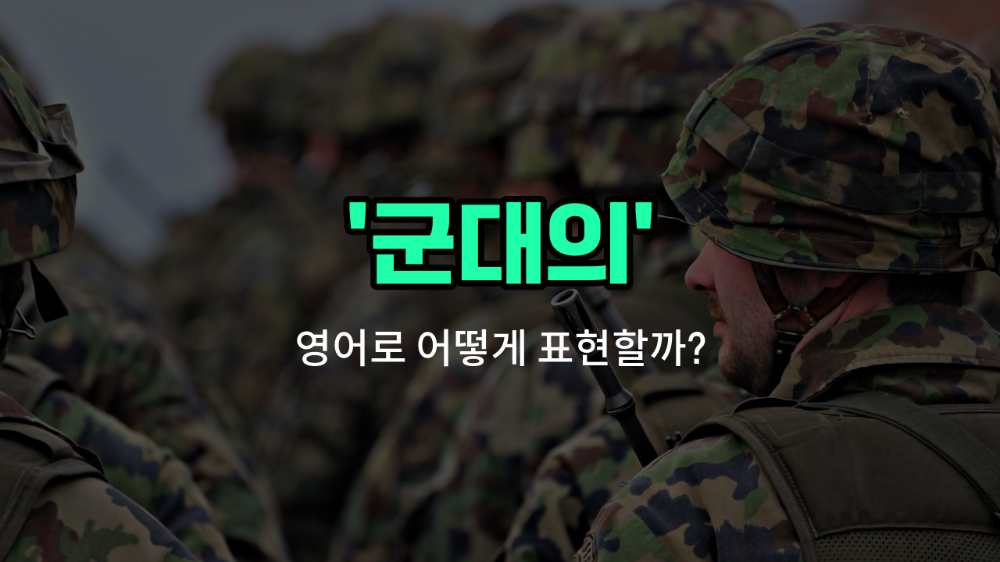

## 🌟 영어 표현 - military

안녕하세요 👋 오늘은 '군대의', '군사적인'이라는 뜻을 가진 영어 표현 '**military**'에 대해 알아보려고 해요.

'**military**'는 주로 군대와 관련된 것, 즉 군사나 무력과 연관된 상황에서 자주 쓰이는 단어예요. 예를 들어, 군대 조직, 군사 작전, 군사 장비 등과 같이 군대와 직접적으로 연결된 모든 것에 사용할 수 있어요.

이 단어는 형용사로 '군대의', '군사적인'이라는 뜻으로 많이 쓰이고, 때로는 명사로 '군대' 자체를 의미하기도 해요. 그래서 상황에 따라 다양하게 활용할 수 있는 단어랍니다!

## 📖 예문

1. "군대 훈련은 매우 힘들어요."

   "Military training is very tough."

2. "그 도시는 군사 기지 근처에 있어요."

   "The [city](/blog/in-english/1108.city/) is near a military base."

3. "그는 군대 생활을 했어요."

   "He served in the military."

## 💬 연습해보기

<ul data-interactive-list>

  <li data-interactive-item>
    할아버지는 제2차 세계대전 때의 군 복무 이야기를 자주 해주셨어요.
    My grandfather used to tell stories about his military service during World War II.
  </li>

  <li data-interactive-item>
    어제 군사 박물관에 갔더니 탱크랑 오래된 군복도 보고 왔어요.
    We visited a military museum yesterday and saw tanks and old uniforms.
  </li>

  <li data-interactive-item>
    군 기지가 마을 바로 밖에 있어서 가끔 전투기가 하늘을 날아다니는 소리를 들을 수 있어요.
    The military base is just <a href="/blog/in-english/974.outside/">outside</a> of <a href="/blog/in-english/1517.town/">town</a>, and you'll hear jets flying overhead sometimes.
  </li>

  <li data-interactive-item>
    그 친구는 군사 역사에 관심이 많아서 유명한 전투에 관한 책을 많이 읽어요.
    She's <a href="/blog/in-english/979.interested-in/">interested in</a> military history and reads lots of books about famous battles.
  </li>

  <li data-interactive-item>
    정부가 다음 해 군비 증가를 발표했어요.
    The government announced an increase in military spending for the next year.
  </li>

  <li data-interactive-item>
    그는 고등학교 졸업하자마자 나라를 위해 군대에 입대하기로 결정했어요.
    He <a href="/blog/in-english/062.decide-to/">decided to</a> join the military right after high school to serve his country.
  </li>

  <li data-interactive-item>
    다음 주에 이 지역에서 군사 훈련이 실시되니까 도로 통제가 있을 거예요.
    Military exercises will be held in the area next <a href="/blog/in-english/1129.week/">week</a>, so expect some road closures.
  </li>

  <li data-interactive-item>
    그들은 응급 구조에 필요한 새로운 통신 시스템을 만들기 위해 군사 기술을 사용했어요.
    They used military technology to build the new communication system for emergency responders.
  </li>

  <li data-interactive-item>
    군사 퍼레이드에 도시 곳곳에서 수천 명의 관중이 모였어요.
    The military parade attracted thousands of spectators from all over the city.
  </li>

  <li data-interactive-item>
    우리 마을은 매년 재향군인을 기리기 위해 재향군인의 날에 특별한 군사 의식을 열어요.
    Our town honors veterans every year with a special military ceremony on Veterans Day.
  </li>

</ul>

## 🤝 함께 알아두면 좋은 표현들

### armed forces

'armed forces'는 '군대' 또는 '무장 세력'을 의미해요. 군대의 공식적인 집합체를 가리키며, 육군, 해군, 공군 등 모든 군사 조직을 포함해요.

- "The armed forces are conducting joint exercises this month."
- "군대가 이번 달에 합동 훈련을 진행하고 있어요."

### civilian

'civilian'은 '민간인'을 뜻해요. 군대와 반대되는 개념으로, 군사 조직에 속하지 않은 일반 사람들을 가리킬 때 사용해요.

- "The area was cleared of civilians before the military operation began."
- "군사 작전이 시작되기 전에 그 지역에서 민간인들이 대피했어요."

### martial

'martial'은 '군사적인' 또는 '전쟁의'라는 뜻이에요. 'military'와 비슷하지만, 주로 전쟁과 관련된 분위기나 특성을 강조할 때 쓰여요.

- "Martial [law](/blog/in-english/619.law/) was declared during the crisis to maintain order."
- "위기 상황에서 질서를 유지하기 위해 계엄령이 선포되었어요."

---

오늘은 '군대의', '군사적인', '무력의'라는 뜻을 가진 영어 표현 '**military**'에 대해 알아봤어요. 군대와 관련된 상황에서 이 단어를 떠올리면 도움이 될 거예요 😊

오늘 배운 표현과 예문들을 꼭 소리 내서 여러 번 읽어보세요. 다음에도 더 유익한 영어 표현으로 찾아올게요! 감사합니다!

