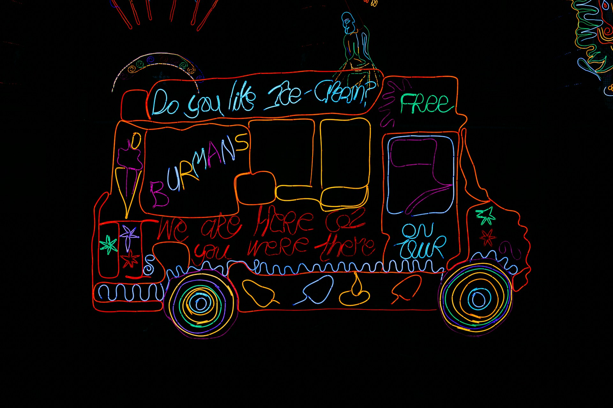

## 🌟 영어 표현 - non-stop

안녕하세요! 👋 오늘은 **'쉬지 않고', '계속해서'** 라는 의미를 가진 **"non-stop"** 표현에 대해 알아볼게요.

"non-stop"은 **중단 없이 계속되는 상태나 행동**을 설명할 때 사용하는 표현이에요. 🏃‍♀️ 특히 어떤 활동이나 움직임이 **멈추지 않고 연속적으로 진행될 때** 자주 사용되죠.

이 표현은 다양한 상황에서 활용할 수 있어요. 예를 들어, "I worked non-stop for 8 hours." (8시간 동안 쉬지 않고 일했어요.) 처럼 사용할 수 있죠. 또는 "The music played non-stop all night." (음악이 밤새도록 계속 나왔어요.) 이렇게도 표현할 수 있어요.

"non-stop"은 형용사나 부사로 모두 사용이 가능해요! 🔄 그리고 주로 **긴 시간 동안 지속되는 활동**을 강조할 때 쓰인답니다.

## 📖 예문

"비행기가 중간 경유 없이 바로 가요."

"The plane flies non-stop to Paris."

"그는 하루 종일 쉬지 않고 이야기해요."

"He talks non-stop all day."

자, 이제 "non-stop"을 사용한 예문들을 살펴봤어요. 직접 소리 내어 연습해보세요! 🎯

## 💬 연습해보기

우리는 뉴욕에서 마이애미까지 쉬지 않고 운전했어. 정말 힘들었어.

We drove non-stop from New York to Miami. It was exhausting.

아이들은 캠프에서 돌아온 이후로 계속 떠들고 있어.

The kids have been talking non-stop since they got back from camp.

내 전화는 아침 내내 계속 울리고 있어.

My phone's been ringing non-stop all morning.

나 좀 쉬어야 해. 10시간 내내 일했어.

I need a break. I've been working non-stop for <a href="/blog/in-english/050.n-days-straight/">ten hours straight</a>.

비가 3일째 멈추지 않고 내리고 있어.

It's been raining non-stop for three days now.

내 이웃은 끊임없이 큰 소리로 음악을 틀어. 나 미치겠어.

My neighbor plays loud music non-stop. It's <a href="/blog/in-english/089.drive-someone-crazy/">driving me crazy</a>.

이 기계들은 24시간 내내 돌아가.

These machines run non-stop <a href="/blog/in-english/138.24-7/">24/7</a>.

이제 LA에서 도쿄로 가는 직항이 있어.

They offer non-stop flights from LA to Tokyo now.

## 🤝 함께 알아두면 좋은 표현들

### take a break

'[take a break](/blog/in-english/202.take-a-break/)'은 **"휴식을 취하다" 또는 "잠시 쉬다"** 라는 뜻이에요. 계속해서 뭔가를 하는 것에서 벗어나 잠깐의 휴식을 갖는 상황을 나타내며, **피로를 회복하거나 집중력을 높이기 위해 잠시 멈추는 것**을 강조해요. 일이나 학습 중에 자주 사용됩니다.

"After studying for [three hours straight](/blog/in-english/050.n-days-straight/), I [decided to](/blog/in-english/062.decide-to/) take a break and grab a snack."

"3시간 동안 계속 공부한 후, 나는 잠시 쉬고 간식을 먹기로 결정했습니다."

### pause for a moment

'pause for a moment'은 **"잠시 멈추다"** 라는 뜻이에요. 어떤 행동이나 대화 중에 일시적으로 중단하는 것을 나타내며, **생각을 정리하거나 상황을 재고하는 시간을 갖는 것**을 강조해요. 대화나 작업 중에 자주 사용됩니다.

"Let's pause for a moment to consider our options before [making a decision](/blog/vocab-1/010.make-a-decision/)."

"결정을 내리기 전에 선택지를 고려하기 위해 잠시 멈추자."

### all day long

'all day long'은 **"하루 종일"** 이라는 뜻이에요. 어떤 일이 지속적으로 하루 동안 계속되는 상황을 나타내며, **지속성과 끈기를 강조하는 표현**으로 사용됩니다. 주로 일이나 활동의 시간을 나타낼 때 사용해요.

"I listened to music all day long while I worked on my project."

"나는 프로젝트 작업을 하면서 하루 종일 음악을 들었습니다."

---

오늘은 **'쉬지 않고', '계속해서'** 를 의미하는 **'non-stop'** 에 대해 배워봤어요. 일상생활에서 정말 유용한 표현이죠? 여러분도 이제 무언가가 계속 이어지는 상황을 설명할 때 "non-stop"을 사용해보세요! 😊

다음에 또 새로운 표현으로 만나요! 화이팅! 💪
