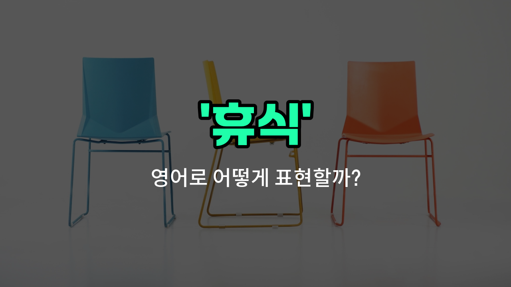

## 🌟 영어 표현 - break

안녕하세요 👋 오늘은 일상에서 자주 쓰이는 영어 표현 '**break**'에 대해 알아보려고 해요. 'break'는 '휴식', '잠깐 멈춤', '쉬는 시간'이라는 뜻을 가지고 있어요.

이 단어는 우리가 공부하거나 일할 때, 잠시 쉬는 시간을 가질 때 자주 사용돼요. 예를 들어, 수업 중간에 쉬는 시간을 'break time'이라고 부르기도 해요. 또, "Let's [take a break](/blog/in-english/202.take-a-break/)."라고 하면 "우리 잠깐 쉬자."라는 의미가 돼요.

'break'는 명사로도, 동사로도 쓰일 수 있지만, 오늘은 주로 '휴식'이라는 명사로 쓰이는 경우를 중심으로 설명할게요. 일상 대화, 학교, 회사 등 다양한 상황에서 자연스럽게 쓸 수 있는 표현이에요!

## 📖 예문

1. "10분만 휴식할까요?"

   "Shall we take a 10-minute break?"

2. "점심시간 전에 짧은 쉬는 시간이 있어요."

   "There is a short break before lunchtime."

## 💬 연습해보기

<ul data-interactive-list>

  <li data-interactive-item>
    하루 종일 일만 하다 보니 정신 차릴 겸 잠깐 쉬어야 할 것 같아.
    I've been working non-<a href="/blog/in-english/1240.stop/">stop</a> all <a href="/blog/in-english/1067.day/">day</a>. I really need to take a break and clear my mind.
  </li>

  <li data-interactive-item>
    회의 중에 다리가 아프니까 잠깐 휴식 좀 가질 수 있는지 물어봤어.
    During the meeting, I asked if we could break for a few minutes to stretch our legs.
  </li>

  <li data-interactive-item>
    3시간 공부한 후에 커피 한 잔 하러 잠깐 쉬기로 했어.
    After three hours of studying, I <a href="/blog/in-english/062.decide-to/">decided to</a> break and grab some coffee.
  </li>

  <li data-interactive-item>
    점심 시간이라서 잠깐 쉬고 오후에 나머지 프로젝트를 진행하자.
    Let's break for lunch and then tackle the rest of the project this afternoon.
  </li>

  <li data-interactive-item>
    모두 피곤해지고 집중이 안 되니까 지금 쉴 것을 제안했어.
    She suggested we break now because everyone was getting tired and unfocused.
  </li>

  <li data-interactive-item>
    선생님이 시험 끝나면 다들 편하게 쉴 수 있도록 휴식할 수 있다고 하셨어.
    The teacher said we could break once we finished the test so everyone could relax.
  </li>

  <li data-interactive-item>
    긴 시간 동안 일할 때는 짧게라도 쉬는 게 생산성을 유지하는 데 중요해.
    It's <a href="/blog/in-english/318.important/">important</a> to take short breaks during long work sessions to stay productive.
  </li>

  <li data-interactive-item>
    우린 보통 3시에 간단한 간식과 수다를 위해 잠깐 쉬어.
    We usually break at 3 p.m. for a quick snack and casual chat.
  </li>

  <li data-interactive-item>
    과중한 느낌이 들어도 잠깐 일을 쉬고 거리를 두는 건 괜찮아.
    If you feel overwhelmed, it's okay to break and step away from your work for a bit.
  </li>

  <li data-interactive-item>
    그가 다음 작업을 계속하기 전에 재충전할 겸 쉬고 싶다고 했어.
    He told me he needed to break to recharge before continuing with the next <a href="/blog/in-english/793.task/">task</a>.
  </li>

</ul>

## 🤝 함께 알아두면 좋은 표현들

### take a break

'take a break'은 "잠시 휴식을 취하다"라는 뜻이에요. 일이나 공부 중간에 잠깐 쉬면서 재충전하는 상황에서 자주 사용해요.

- "Let's take a break and grab some coffee."
- "잠깐 쉬면서 커피 한 잔 마시러 가요."

### keep working

'keep working'은 "계속 일하다"라는 뜻으로, 휴식을 취하지 않고 계속해서 일을 이어가는 상황을 나타내요. 'break'의 반대 개념이에요.

- "Even though it was late, she decided to keep working until the project was done."
- "늦었지만 그녀는 프로젝트가 끝날 때까지 계속 일하기로 했어요."

### rest up

'rest up'은 "충분히 쉬다"라는 의미로, 특히 피곤하거나 지친 상태에서 몸과 마음을 회복하기 위해 휴식을 취하는 것을 강조해요.

- "You should rest up before the [big](/blog/in-english/1095.big/) game tomorrow."
- "내일 중요한 경기를 위해 충분히 쉬어야 해요."

---

오늘은 '휴식', '잠깐 멈춤', '쉬는 시간'이라는 뜻을 가진 영어 표현 'break'에 대해 알아봤어요. 다음에 잠깐 쉬고 싶을 때 이 표현을 꼭 사용해 보세요! 😊

오늘 배운 표현과 예문들을 소리 내서 여러 번 읽어보면 더 자연스럽게 쓸 수 있을 거예요. 다음에도 더 유익한 영어 표현으로 찾아올게요! 감사합니다!

