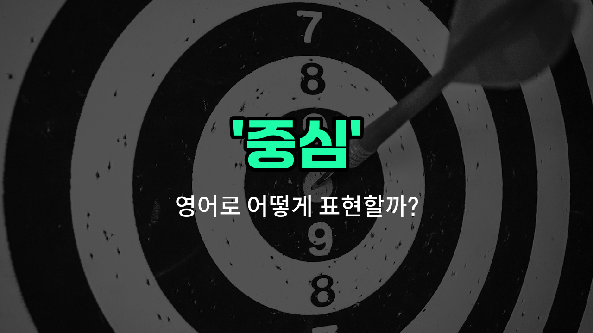

## 🌟 영어 표현 - center

안녕하세요 👋 오늘은 우리가 자주 쓰는 단어인 '**중심**'을 영어로 어떻게 표현하는지 알아볼 거예요. 바로 '**center**'라는 단어를 사용해요. 이 단어는 어떤 것의 한가운데, 또는 가장 중요한 부분을 의미해요.

'center'는 위치적으로도, 의미적으로도 '중앙', '중심지'와 같은 뜻으로 다양하게 쓰여요. 예를 들어, 도시의 중심을 말할 때도, 어떤 논의의 핵심을 말할 때도 모두 사용할 수 있어요!

예를 들어, "서울의 중심에 위치해 있어요."라고 말하고 싶을 때 "It is located in the center of Seoul."이라고 표현할 수 있어요.

또한, "이 문제의 중심에는 신뢰가 있어요."처럼 비유적으로도 쓸 수 있어요. 영어로는 "At the center of this issue is trust."라고 할 수 있답니다.

## 📖 예문

1. "회의실은 건물의 중심에 있어요."

   "The meeting [room](/blog/in-english/1490.room/) is in the center of the building."

2. "그 도시는 문화의 중심지예요."

   "The [city](/blog/in-english/1108.city/) is the center of culture."

## 💬 연습해보기

<ul data-interactive-list>

  <li data-interactive-item>
    도심은 보통 가게와 식당이 많아서 제일 분주한 곳이에요.
    The center of the city is usually the busiest place with lots of shops and restaurants.
  </li>

  <li data-interactive-item>
    그녀는 모두가 그녀를 잘 볼 수 있도록 방의 중앙으로 갔어요.
    She moved to the center of the room so everyone could see her clearly.
  </li>

  <li data-interactive-item>
    우리는 파티의 중심이 되도록 식탁을 중앙에 놓았어요.
    We set up the dining table right in the center to <a href="/blog/in-english/244.make-it/">make it</a> the focal point of the party.
  </li>

  <li data-interactive-item>
    그 미술작품은 벽의 중앙에 걸려서 주목받고 있어요.
    The art piece hangs in the center of the wall to draw attention.
  </li>

  <li data-interactive-item>
    그는 군중의 가운데에서 친구가 자신을 찾기를 기다리고 있었어요.
    He stood in the center of the crowd, waiting for his friend to spot him.
  </li>

  <li data-interactive-item>
    공원 중앙에는 사람들이 모여 쉬는 큰 분수가 있어요.
    The park has a <a href="/blog/in-english/1095.big/">big</a> fountain in the center where people gather to relax.
  </li>

  <li data-interactive-item>
    요가 수업 중에 강사가 우리에게 호흡에 집중하고 중심을 잡으라고 했어요.
    During yoga class, the instructor told us to <a href="/blog/in-english/186.focus-on/">focus on</a> our breathing and center ourselves.
  </li>

  <li data-interactive-item>
    아이들이 게임을 시작하기 위해 한 아이를 중앙에 두고 원을 만들었어요.
    The children formed a circle with one kid in the center to <a href="/blog/in-english/1127.start/">start</a> the game.
  </li>

  <li data-interactive-item>
    새로운 쇼핑몰이 동네의 중심에 지어져서 접근성이 좋아요.
    The new shopping mall was built at the center of the neighborhood for easy <a href="/blog/vocab-1/041.access/">access</a>.
  </li>

  <li data-interactive-item>
    그녀는 모두가 쉽게 먹을 수 있도록 케이크를 테이블 중앙에 놓았어요.
    She placed the cake in the center of the table so everyone could reach it easily.
  </li>

</ul>

## 🤝 함께 알아두면 좋은 표현들

### core (핵심)

'core'는 어떤 것의 가장 중요한 부분이나 중심을 의미해요. 'center'와 비슷하게 중심적인 위치나 역할을 강조할 때 사용해요.

- "The core of the problem lies in communication issues."
- "문제의 핵심은 의사소통 문제에 있어요."

### periphery (주변부)

'periphery'는 중심에서 멀리 떨어진 가장자리나 주변 부분을 뜻해요. 'center'의 반대 개념으로, 중심이 아닌 바깥쪽 영역을 나타낼 때 쓰여요.

- "The shops are located on the periphery of the city."
- "가게들은 도시의 주변부에 위치해 있어요."

### middle (중간)

'middle'은 두 끝 사이의 중간 지점을 의미해요. 'center'와 비슷하지만, 좀 더 일반적이고 일상적인 상황에서 중심을 나타낼 때 자주 사용돼요.

- "She sat in the middle of the room."
- "그녀는 방 한가운데에 앉았어요."

---

오늘은 '중심', '중앙', '중심지'라는 뜻을 가진 영어 표현 '**center**'에 대해 알아봤어요. 일상에서 중심을 표현할 때 이 단어를 떠올려 보세요 😊

오늘 배운 표현과 예문들을 꼭 소리 내서 여러 번 읽어보세요. 다음에도 더 유익한 영어 표현으로 찾아올게요! 감사합니다!

