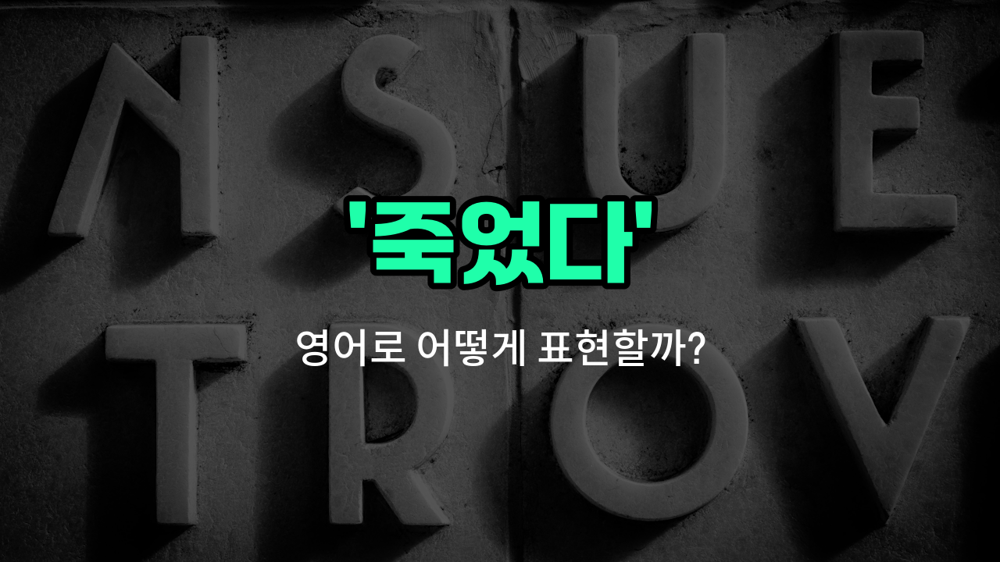

## 🌟 영어 표현 - died

안녕하세요 👋 오늘은 '죽었다'라는 뜻을 가진 영어 표현에 대해 알아보려고 해요. 바로 '**died**'라는 단어인데요. 이 단어는 사람이든 동물이든 생명이 더 이상 존재하지 않게 되었을 때 사용하는 표현이에요.

예를 들어, 누군가의 가족이나 반려동물이 세상을 떠났을 때 'He died.' 또는 'My cat died.'처럼 쓸 수 있어요. 'died'는 과거형이기 때문에 이미 일어난 일을 말할 때 사용해요.

또한, '사망했다', '숨졌다'와 같이 공식적이거나 조금 더 완곡하게 표현하고 싶을 때는 'passed away'라는 표현도 자주 사용돼요. 하지만 오늘은 가장 기본적인 'died'에 집중해서 설명드릴게요!

## 📖 예문

1. "그의 할아버지는 작년에 돌아가셨어요."

   "His grandfather died last [year](/blog/in-english/1065.year/)."

2. "그 강아지는 나이가 많아서 죽었어요."

   "The dog died of old [age](/blog/in-english/1342.age/)."

## 💬 연습해보기

<ul data-interactive-list>

  <li data-interactive-item>
    내 오래된 휴대폰이 몇 년 만에 드디어 고장 났어. 이제 업그레이드할 때인 것 같아.
    My old <a href="/blog/in-english/1408.phone/">phone</a> finally died after years of <a href="/blog/in-english/1079.use/">use</a>. I guess it's time for an upgrade.
  </li>

  <li data-interactive-item>
    식물을 몇 주 동안 물을 주는 걸 잊어서 죽게 했어. 정말 기분이 안 좋아.
    The plant died because I forgot to water it for <a href="/blog/in-english/1129.week/">weeks</a>. I feel so bad about it.
  </li>

  <li data-interactive-item>
    그 사람의 전화가 도움이 필요할 때 고장났어. 다행히 근처에 충전기가 있었어.
    His phone died right before he could call for help. Luckily, he <a href="/blog/in-english/1083.find/">found</a> a charger nearby.
  </li>

  <li data-interactive-item>
    프레젠테이션 도중에 내 노트북 배터리가 꺼졌어. 동료에게 하나 빌려야 했어.
    The battery died on my laptop in the middle of the presentation. I had to borrow one from a colleague.
  </li>

  <li data-interactive-item>
    그녀가 마지막 에피소드에서 제일 좋아하는 캐릭터가 죽었다고 하면서 눈물을 멈출 수가 없었어.
    She said her favorite character died in the last episode, and she couldn't <a href="/blog/in-english/1240.stop/">stop</a> crying.
  </li>

  <li data-interactive-item>
    우리가 산을 지나가던 중에 엔진이 고장이 났어. 우리는 견인차를 불러야 했어.
    The engine died while we were driving through the mountains. We had to call a tow truck.
  </li>

  <li data-interactive-item>
    시험에서 계속 실패하면서 내 의욕이 사라졌어. 재충전할 시간이 필요했어.
    My motivation died after I kept failing those exams. I needed a break to recharge.
  </li>

  <li data-interactive-item>
    소원을 비려는 순간 촛불이 꺼졌어. 우리는 웃으면서 다른 촛불을 켰어.
    The candle died out just as we were about to make a wish. We laughed and lit another one.
  </li>

  <li data-interactive-item>
    그 사람은 괜찮아 보여서 그러더니 그날 밤 갑자기 죽었어. 모두에게 충격이었어.
    He seemed fine, but then he suddenly died that night. It was a shock to everyone.
  </li>

  <li data-interactive-item>
    생일 케이크의 촛불이 그녀가 소원을 비기 전에 꺼졌어. 그녀는 그냥 미소 지으면서 다시 시도했어.
    The candle on the birthday cake died before she could make a wish. She just smiled and tried again.
  </li>

</ul>

## 🤝 함께 알아두면 좋은 표현들

### passed away

'passed away'는 '조용히 세상을 떠나다'라는 뜻으로, 'died'보다 좀 더 부드럽고 공손한 표현이에요. 주로 슬픔이나 애도를 표현할 때 사용해요.

- "My grandfather passed away peacefully last night."
- "우리 할아버지는 어젯밤 평화롭게 돌아가셨어요."

### alive

'alive'는 '살아 있는'이라는 뜻으로, 'died'의 반대말이에요. 사람이 아직 생존해 있음을 나타낼 때 쓰여요.

- "She is still alive and doing well after the surgery."
- "그녀는 수술 후에도 아직 살아 있고 잘 지내고 있어요."

### perished

'perished'는 '죽었다'라는 뜻으로, 특히 사고나 재난 등으로 갑작스럽게 사망했을 때 주로 쓰이는 좀 더 엄숙한 표현이에요.

- "Many soldiers perished during the battle."
- "많은 군인들이 전투 중에 목숨을 잃었어요."

---

오늘은 '죽었다'라는 뜻을 가진 영어 표현 '**died**'에 대해 알아봤어요. 상황에 따라 'passed away'처럼 더 부드러운 표현도 있으니 참고해두면 좋아요 😊

오늘 배운 표현과 예문들을 꼭 소리 내서 여러 번 읽어보세요. 다음에도 더 유익한 영어 표현으로 찾아올게요! 감사합니다!

